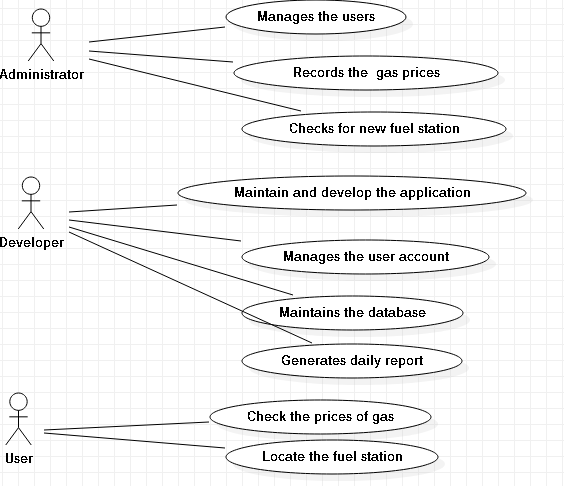
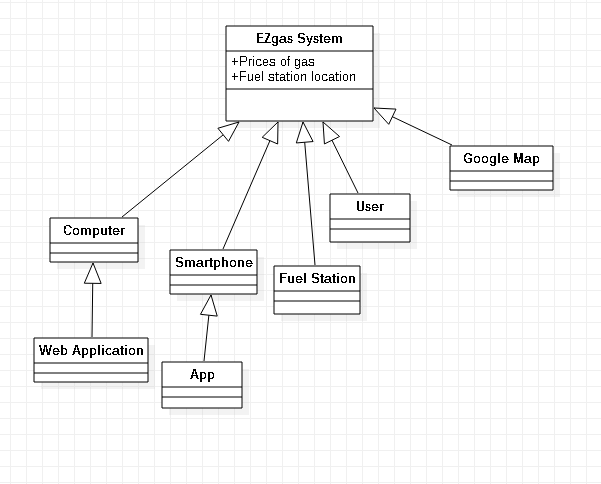
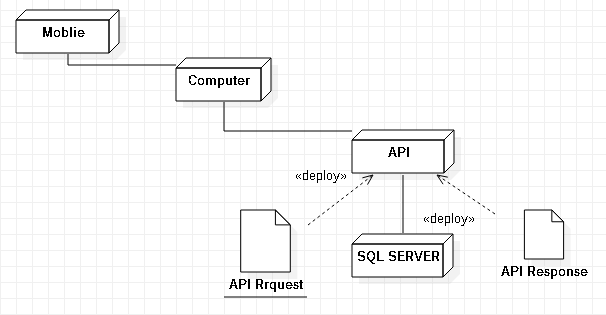

# Official Requirements Document

Authors: Maurizio Morisio, Luca Ardito, Riccardo Coppola

Date: 29/05/2019

Version: 5

Change history

| Version | Changes | 
| ----------------- |:-----------|
| 2 | Fixed defect in [scenario 2](#scenario-2): precondition was wrong  |
| | Fixed defect in scenario [format](#relevant-scenarios): added post conditions |
| | Fixed defect in [use case 2](#use-cases): variants text canceled |
| 3 | Fixed defect in [use case 3]: recharge only positive|
| |  Added Non functional requirement NFR5 |
| 4 | Fixed defect in [use case 3]: post condition is on Colleague account, and LaTazza|
| | Fixed defect in [use case 1]: post condition is on Colleague account, not LaTazza|
| 5 | Fized defect in [use case 4]: precondition modified |

# Contents
- [Abstract](#abstract)
- [Stakeholders](#stakeholders)
- [Context Diagram and interfaces](#context-diagram-and-interfaces)
	+ [Context Diagram](#context-diagram)
	+ [Interfaces](#interfaces) 
	
- [Stories and personas](#stories-and-personas)
- [Functional and non functional requirements](#functional-and-non-functional-requirements)
	+ [Functional Requirements](#functional-requirements)
	+ [Non functional requirements](#non-functional-requirements)
- [Use case diagram and use cases](#use-case-diagram-and-use-cases)
	+ [Use case diagram](#use-case-diagram)
	+ [Use cases](#use-cases)
	+ [Relevant scenarios](#relevant-scenarios)
- [Glossary](#glossary)
- [System design](#system-design)
- [Deployment diagram](#deployment-diagram)

# Abstract

As we know different types of gases offer different prices at different fuel station. This application basically simplifies the procedure as we can check the prices of the gas at the own comfort of the user.

This app will intregate the prices of different of gases at different fuel station and show you on one platform. A user can check the price and decides what suits best. Additionally it also got service to locate the fuel station which is nearest.


# Stakeholders

| Stakeholder name  | Description | 
| ----------------- |:-----------:|
| Administrator     |Uses the application to manage the business.| 
| Users             |They uses the appplication directly. They are interested in  collecting the prices of fuels in different workstation. |
| Developer         |Develops the web application| 

# Context Diagram and interfaces

## Context Diagram


## Interfaces
| Actor | Logical Interface | Physical Interface  |
| ------------- |:-------------:| -----:|
|User |Web Service |PC,Phone,Internet|
|Web Application|GUI |PC,Internet|
|Location Tracker |Google Map |PC,Internet|
# Stories and personas
The CEO develops a web application through which the users can check the prices of the fuels in different work station.
Mr.Harry got a transport company. The Sundays of every weekend he was to put fuel to his 3 trucks so that they can start working from Monday again. 

He opens the web application from his smartphones.He checks the prices of fuels of different gas station. He decides to use Q8 as finds out that the price of Q8 is less then others for example repsol. He informs his workers and share the location of the gas station in whatsapp and ask him to go there and fill the fuel to the trunk. 

Sometimes it even happens that while the worker are on their work the gas finishes the workers can quickly login in the platform of EZgas and compare the prices of the gases in different fuels and decide the one they prefer. The google Map will easily help to locate the nearest fuel station.


# Functional and non functional requirements

## Functional Requirements

| ID        | Description  |
| ------------- |:-------------:| 
|  FR1     | Manage the types of gases and price |  
|  FR2     | Record the number of users using the application |
|  FR3     | Record the new fuel stations built |
|  FR4     | Develops the application |
|  FR5     | Produce a report about daily traffic of users |
|  FR7     | Manage users and accounts|


## Non Functional Requirements

| ID        | Type (efficiency, reliability, .. see iso 9126)           | Description  | Refers to |
| ------------- |:-------------:| :-----:| -----:|
|  NFR1     | Usability | Application should be used with no training by any users in the office  | All FR |
|  NFR2     | Performance | All functions should complete in < 1 sec  | All FR |
|  NFR3     | Portability | The application runs on MS Windows (7 and more recent) and andriod smartphones  | All FR |
|  NFR4     | Efficieny   | The application should always show the uptodate prices.|


# Use case diagram and use cases

## Use case diagram


## Use Cases

### Use case 1, UC1 - FR1  Manage the type of gases and prices
| Actors Involved        | Administrator |
| ------------- |:-------------:| 
|  Precondition     | Gases G exists, Prices P exists differently in each fuel station |  
|  Post condition     | Gases and prices of each fuel station in one platfoem |
|  Nominal Scenario     | Administrator checks each day|
|  Variants     | Some days it may show no change. |

### Use case 2, UC2 - FR2 Record the number of users using the application
| Actors Involved        | Administrator |
| ------------- |:-------------:| 
|  Precondition     | Gases G exists, Prices P exists, user has no account |  
|  Post condition     | User got an account |
|  Nominal Scenario     | Administrator checks daily the amount of traffic on the account to add more features.|
|  Variants     |  |

### Use case 3, UC3 - FR3 Record the new fuel stations built

| Actors Involved        | Administrator |
| ------------- |:-------------:| 
|  Precondition     | Fuels station are added users unaware |  
|  Post condition     | Users getting aware of new fuel station |
|  Nominal Scenario     | Administrator informs the developer on addition of new fuel station.|
|  Variants     |  |

### Use case 4, UC4 - FR4 Develops the application

| Actors Involved        | Developer|
| ------------- |:-------------:| 
|  Precondition     | No application before|  
|  Post condition     | A web application  |
|  Nominal Scenario     | The developer maintains the application and develop new features. |
|  Variants     |  |

### Use case 5, FR5 Produce a report about daily traffic of users

| Actors Involved        | Developer  |
| ------------- |:-------------:| 
|  Precondition     | No report of number of users  |  
|  Post condition     |  Daily report of the previous registered active and new register users |
|  Nominal Scenario     | Developer keeps tracks for the activity of the application.|
|  Variants     | |

### Use case 6, FR6  Manage users and accounts

| Actors Involved        | Developer |
| ------------- |:-------------:| 
|  Precondition     | No accounts previously |  
|  Post condition     | Accounts of users and the data is store in the database |
|  Nominal Scenario     | The user accounts details are stored each day and there preferences are saved so they dont have to put their details each day.  |
|  Variants     | |


# Relevant scenarios

## Scenario 1

| Scenario ID: SC1        | Corresponds to UC4  |
| ------------- |:-------------| 
| Description | Development of the web application|
| Precondition |  Users dont know about the various gas prices in different outstation|
| Postcondition | Users know  |
| Step#        |  Step description   |
|  1     | User select the type of gas G|  
|  2     | User choose the preffered location L |
|  3     | User visit that location to fill the gas |


## Scenario 2

| Scenario ID: SC2        | Corresponds to UC6  |
| ------------- |:-------------| 
| Description | Manage users and accounts|
|Precondition |  User needs to provide its details each time of location etc|
|Postcondition | The details are stored in the database.  |
| Step#        | Step description  |
|  1     | Preffered Gas type G of the user is shownen.|  
|  2     | Preffered Location L of the user is shownen. |
|  3     | The user can change any of them if needed. |
|  4     | The most nearest station from the user will be shown.  |


# Glossary

```plantuml
class LaTazza
class Colleague {
+ name
+ surname
}

class PersonalAccount {
+ balance
}

class CapsuleType {
+ name
+ price
+ quantity
}

class LaTazzaAccount {
+ balance
}

class BoxPurchase {
+ quantity
}

class Transaction {
+ date
+ amount
}

class Recharge
class Consumption


LaTazza -- "*" Colleague
LaTazza -- "*" CapsuleType
LaTazza -- LaTazzaAccount

LaTazzaAccount -- "*" BoxPurchase
LaTazzaAccount -- "*" Consumption

CapsuleType -- "*" Consumption
CapsuleType -- "*" BoxPurchase

Colleague -- PersonalAccount
PersonalAccount -- "*" Transaction

Transaction <|-- Recharge
Transaction <|-- Consumption
Transaction <|-- BoxPurchase

```

# System Design


# Deployment Diagram


