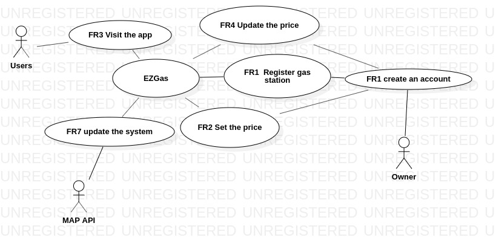

# Official Requirements Document

Authors: Giuseppe Petraglia, Manuel Sabelli

Date: 29/05/2019

Version: 5
# Contents
- [Abstract](#abstract)
- [Stakeholders](#stakeholders)
- [Context Diagram and interfaces](#context-diagram-and-interfaces)
	+ [Context Diagram](#context-diagram)
	+ [Interfaces](#interfaces) 
	
- [Stories and personas](#stories-and-personas)
- [Functional and non functional requirements](#functional-and-non-functional-requirements)
	+ [Functional Requirements](#functional-requirements)
	+ [Non functional requirements](#non-functional-requirements)
- [Use case diagram and use cases](#use-case-diagram-and-use-cases)
	+ [Use case diagram](#use-case-diagram)
	+ [Use cases](#use-cases)
	+ [Relevant scenarios](#relevant-scenarios)

# Abstract

A map with all the price of the gas station to inform the people which is the nearest and cheapest gas station around theirs. Both the people and the owner of gas station can share the location and the price of a gas station if they want.

# Stakeholders

| Stakeholder name  | Description | 
| ----------------- |:-----------:|
| Owners    |The person who owns the gas station and who can add or remove his gas stations. He also set and update the price of gas station| 
| Users        |Use the application directly. They are interested where the stations are and the prices of gas station| 
| Developer       |Impacted in case the product to be developed is too complicated, or untestable, or with poorly written requirements|
|    MAP API    |Changes the API of the app|

# Context Diagram and interfaces

## Context Diagram

## Interfaces
| Actor | Logical Interface | Physical Interface  |
| ---------- |:-------------:|:-----:|
|Users|Screen| Touch Screen|
|Owner|Screen| Touch Screen|
|Map API|Web Services (A function used to take Google Maps and to upload the gas station)| Internet Connection(API)|
|Developer|Screen|Touch Screen|

# Stories and personas
Aldo is going to the sea in a beautiful summer day with his family: Ramona his wife, Giacomino and Andrè his sons. During the trip the gas of his machine is going to finish and he checks on EZGas app the nearest and the cheapest gas station to full his machine. Without this app he should probably go to an other gas station and he probably pay more money than the gas station find on the app. In unlucky way he could finish the gas in his machine and he must find a gas station on foot.

Jonh buy a gas station and he registers his self on EZGas to put his gas station on the app and set the price of gas to rase money and to get noticed by peolpe that want buy gas for theirs machine. Every day he uodates ,if necessary, the price of gas of his gas station.

# Functional and non functional requirements

## Functional Requirements

| ID        | Description  |
| ------------- |:-------------:| 
|  FR1     | The owner shall be able to registers his self on the app|  
|  FR2     | The owner shall be able to set the price of gas on his gas station the first time that he registers his gas station |
|  FR3     | The user shall be able to visit the map on the app |
|  FR4     | The owner shall be able to update the price of FR1 every day  |
|  FR5     | When FR1 the system will put the gas station on the MAP |
|  FR6     | When FR3 the system will show him all the gas stations on the map |
|FR7|The Developer shall be able to update the system when he wants|

## Non Functional Requirements

| ID        | Type (efficiency, reliability, .. see iso 9126)           | Description  | Refers to |
| ------------- |:-------------:| :-----:| -----:|
|  NFR1     | Usability | Application should be used with no training by Users  | FR3 FR6 |
|  NFR2     | Performance | All functions should complete in < 0.5 sec  | All FR |
|  NFR3     | Portability | The application runs on Android and IOS  | All FR |
|  NFR4     | Portability | The application can be downloaded by the store | All FR |
|  NFR5     | Localisation | Decimal numbers use . (dot) as decimal separator ||

# Use case diagram and use cases

## Use case diagram

## Use Cases

### Use case 1, UC1 - FR1  Register Station

| Actors Involved        | Owner |
| ------------- |:-------------:| 
|  Precondition     | Station S exists, Owner O exists |  
|  Post condition     | S registered on the system |
|  Nominal Scenario     | Owner registers his gas station on the system|
|  Variants     | Owner O has not enough money to buy a station |

### Use case 2, UC2 - FR2 Set Price

| Actors Involved        | Owner |
| ------------- |:-------------:| 
|  Precondition     | Station S exists, station has no price |  
|  Post condition     | S price is set|
|  Nominal Scenario     | Owner sets the price of his gas station|
|  Variants     |  |

### Use case 3, UC3 - FR3 Visit the app

| Actors Involved        | User |
| ------------- |:-------------:| 
|  Precondition     | User U exists, he want refull his maschine |  
|  Post condition     | User has refull the machine |
|  Nominal Scenario     | The User use the app to look the map|
|  Variants     |  |

### Use case 4, UC4 - FR4 Updte the price

| Actors Involved        | Owner |
| ------------- |:-------------:| 
|  Precondition     |   Station S exists, the price of his station is changed |
|Post condition|S price is updated|
|  Nominal Scenario     | When aprice changing is noticed, the Owner updates the price of his gas station|
|  Variants     |  |

### Use case 5, FR7 Update the system

| Actors Involved        | Developer  |
| ------------- |:-------------:| 
|  Precondition     | System S exists |  
|  Post condition     | S is updated |
|  Nominal Scenario     | Developer updates the System|
|  Variants     | |

# Relevant scenarios

## Scenario 1

| Scenario ID: SC1        | Corresponds to UC1  |
| ------------- |:-------------| 
| Description | The User use the app|
| Precondition | He want refull the tank of his gas car |
| Postcondition | The Users known where is the nearest gas station |
| Step#        |  Step description   |
|  1     | The user visit the app |  
|  2     |  The user activates his geolocation on his mobile |
|  3     | The Map shows him all the gas station near him |

## Scenario 2

| Scenario ID: SC2        | Corresponds to UC1  |
| ------------- |:-------------| 
| Description | The owner registers his gas station |
|Precondition |  The owner wants let know his gas station|
|Postcondition |  The gas station in on the map of the app |
| Step#        | Step description  |
|  1     | The owner visit the app  |  
|  2     | The owner registers the data of his gas station and set the price of gas  |
|  3     | The gas station in on the map  |

