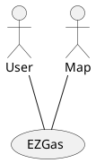

# Lab2 - Requirements

# Contents
- [Abstract](#abstract)
- [Stakeholders](#stakeholders)
- [Context Diagram and interfaces](#context-diagram-and-interfaces)
	+ [Context Diagram](#context-diagram)
	+ [Interfaces](#interfaces) 
- [Stories and personas](#stories-and-personas)
- [Use case diagram and use cases](#use-case-diagram-and-use-cases)
	+ [Use case diagram](#use-case-diagram)
	+ [Use cases](#use-cases)
	+ [Relevant scenarios](#relevant-scenarios)
- [Functional and non functional requirements](#functional-and-non-functional-requirements)
	+ [Functional Requirements](#functional-requirements)
	+ [Non functional requirements](#non-functional-requirements)

# Abstract

The EXGas application is a crowdfunding service that can collect prices of fuel in different gas stations and also locate gas stations in a defined area, showing the prices offered by said gas stations.

# Stakeholders

| Stakeholder name  | Description | 
| ----------------- |-----------|
| Developer | Manages development of the application, fixes eventual bugs |
| Users | Use the application's functions (looking for gas stations, checking and comparing prices, inserting gas stations, updating offered prices) |
| External Map Service | Provides the application with the needed maps |

# Context Diagram and Interfaces

## Context Diagram

## Interfaces

| Actor | Logical Interface | Physical Interface  |
| ------------- |-------------| -----|
| User | GUI | Smartphone, Personal Computer |
| Map | API | Internet |

# Stories and Personas

Antonio is driving in town when he realizes his car is low on fuel.
He opens up EZGas, browsing the gas stations close to him and decides to go to the one that has the best prices around him.

Giovanni knows of a gas station and its prices in the city where he lives.
He opens up EZGas to check the already registered stations, and notices that the gas station he knows about is missing or that its prices are outdated.
He then updates EZGas inserting the informations about the station and the prices it offers.

Michele is the owner of a gas station.
He opens up EZGas to add his gas station to the list of registered ones or to  keep his prices updated if he already registered it, hoping that it could get him some new clients and give him increased visibility.
If he wants, he can also check the prices offered by other gas stations, to see how he fares regarding to the competition.

# Functional and Non Functional Requirements

## Functional Requirements

| ID | Description |
| ------------- |:-------------:| 
| FR1 | Add a gas station in a given location and the prices said gas station offers |
| FR2 | Update the prices of an already registered gas station |
| FR3 | Get the position of the user |
| FR4 | Show the gas stations in a defined range centered around the user |

## Non Functional Requirements

| ID | Type | Description | Refers to |
| ------------- |:-------------:| :-----:| -----:|
| NFR1 | Usability | Application should be usable with no particular training (any user can easliy understand how the application works)  | All FR |
| NFR2 | Performance | All implemented functions should complete in no more than 3-4 seconds | All FR |
| NFR3 | Portability | The application run the same way on every Operating System (Android, iOS, Windows Phone) | All FR |

# Use Case Diagram and Use Cases

## Use Case Diagram

soler

## Use Cases

### Use case 1, UC1 - FR1 Add a gas station in a given location and the prices said gas station offers

| Actors Involved | User |
| ------------- |:-------------:| 
| Precondition | Gas station exists in a physical location and is not already present in the EZGas database |  
| Postcondition | Gas station is registered in the EZGas database |
| Nominal Scenario | User inserts the gas station into the system, its location is correct and verified, Gas station is not already present in the database |
| Variants | Gas station is already present in the database, the location is wrong or illogical (inside a private property, in the sea, there's already another activity in the same place) |

### Use case 2, UC2 - FR2 Update the prices of an already registered gas station

| Actors Involved | User |
| ------------- |:-------------:| 
| Precondition | Gas station is already registered in the EZGas database, the prices offered by the gas station registered on the application have been verified to be outdated |  
| Postcondition | Prices offered by the gas station have been updated |
| Nominal Scenario | User inserts new prices in the database |
| Variants | The gas station was not already registered in the database |

### Use case 3, UC3 - FR4 Show the gas station in a defined range centered around the user

| Actors Involved | User |
| ------------- |:-------------:| 
| Precondition | User wants to see the gas stations in the area close to him |  
| Postcondition | EZGas displays the gas stations in the area |
| Nominal Scenario | User asks the list of gas stations, EZGas displays them |
| Variants | EZGas is not able to determine the location of the user |

# Relevant Scenarios

## Scenario 1

| Scenario ID: SC1 | Corresponds to UC1 |
| ------------- |:-------------| 
| Description | User adds a gas system to the database |
| Precondition | Gas station exists in a physical location and is not already present in the EZGas database |
| Postcondition | Gas station is registered in the EZGas database |
| Step# |  Step description |
| 1 | User inserts the data about the gas station (physical location, prices offered) |  
| 2 | EZGas checks whether the data is valid and if the gas station is not already present in its database |
| 3 | If everything is correctly verified the gas station is added to the database, otherwise an error is displayed to the user explaining the inconsistencies |

## Scenario 2

| Scenario ID: SC2 | Corresponds to UC2 |
| ------------- |:-------------| 
| Description | Update the prices of a given gas station |
| Precondition |  Gas station is already registered in the EZGas database, the prices offered by the gas station registered on the application have been verified to be outdated |
| Postcondition | Prices offered by the gas station have been updated |
| Step# | Step description   |
| 1 | User specifies which gas station he wants to update the offered prices |  
| 2 | EZGas checks whether the gas station exists in its database |
| 3 | If it exist, it asks the user to input the updated prices |
| 4 | User inputs the price |
| 5 | The offered prices are then updated in the database |

## Scenario 3

| Scenario ID: SC3 | Corresponds to UC3  |
| ------------- |:-------------| 
| Description | Display a map of a given location with all the gas stations |
| Precondition | User wants to see the gas stations in the area close to him |
| Postcondition | EZGas displays the gas stations in the area |
| Step# | Step description |
| 1 | User specifies which area he wants to know about (default area is centered around the user's physical location) |  
| 2 | EZGas pulls the map data from the map service and the data about gas stations from its database |
| 3 | EZGas puts the gas stations on the obtained map in their registered position |
| 4 | EZgas shows to the user the map with the gas stations close to him |

