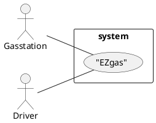
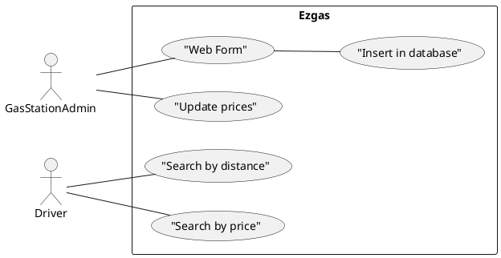

# Official Requirements Document

Author: Kristina Rogacheva

Date: 24/03/2020

Version: 1

# Contents
- [Abstract](#abstract)
- [Stakeholders](#stakeholders)
- [Context Diagram and interfaces](#context-diagram-and-interfaces)
	+ [Context Diagram](#context-diagram)
	+ [Interfaces](#interfaces)
  
- [Stories and personas](#stories-and-personas)
- [Functional and non functional requirements](#functional-and-non-functional-requirements)
	+ [Functional Requirements](#functional-requirements)
	+ [Non functional requirements](#non-functional-requirements)  
- [Use case diagram and use cases](#use-case-diagram-and-use-cases)
	+ [Use case diagram](#use-case-diagram)
	+ [Use cases](#use-cases)
	+ [Relevant scenarios](#relevant-scenarios)

# Abstract

A group of students obsessed with their cars moved to another city to study engineering. They all love their cars and use them every weekend. But like all students they don't have much money, so they try to save it by choosing the cheapest gas stations. 
One of them, who studies management, tries to keep track of the prices of the different gas stations, but his system has a lot of issues, the info are often incomplete and not updated.

So the computer engineering student had the brilliant idea to create not only a database where keep track of the prices, but also a website, so it may be useful not only for the group of friends, but for everyone. This application is used by gas station managers to promote their stations, and by drivers who want to find the nearest or the cheapest gas station.

# Stakeholders

| Stakeholder name  | Description |
| ----------------- |:-----------|
| Developer    |Who develops and maintains the application |
| Gas station manager     |Uses the application to promote his station |
| Drivers       |Uses the application to check the different prices of fuel and find the nearest/cheapest station |

# Context Diagram and interfaces

## Context Diagram

## Interfaces
| Actor | Logical Interface | Physical Interface  |
| ------------- |:-------------:| :-----:|
|Administrator|WEB Application |Screen, keyboard, smartphone|
|Drivers|WEB Application |Screen, keyboard, smartphone|

# Stories and personas

Jack is a brilliant computer engineering student who really loves his car. He has to save money on fuel or he won't afford  a beer with his friends on the weekends (of course he is responsible enough to drink only when he is not driving). He needs to know where is the cheapest gas station, so he creates the EZgas application with a database with all the stations and their prices. He is also new in the city so he thought that he may include a map of all the gas stations in his application so everyone could find the nearest one.

The application is very easy to use, so it may be used even by the people with no experience.

Armando is a gas station manager. His station has good prices, but unfortunately it is located far from the main roads of the city. Since he started using the application his income has increased. He is so thankful that he decided to sponsor Jack, and every Christmas he sends him a present.

Tina is a girl who really hates driving - she had a driver license just because her parents forced her to take it. She rarely uses her car, because she prefers traveling by bus or on foot. This is why her car is often without fuel. She uses the application to find the nearest gas station so she can leave as soon as possible - she is already late!

# Functional and non functional requirements

## Functional Requirements

| ID        | Description  |
| ------------- |:-------------:| 
|  FR1     | Record a gas station in the database |  
|  FR2     | User interface for the insertion of the gas station |
|  FR3     | Record of the price of the fuel |
|  FR4     | Search by distance |
|  FR5     | Search by price |

## Non Functional Requirements

| ID        | Type (efficiency, reliability, .. see iso 9126)           | Description  | Refers to |
| ------------- |:-------------:| :-----:| -----:|
|  NFR1     | Usability | Application should be used with no training by anyone  | All FR |
|  NFR2     | Usability | User-Friendly interface  | All FR |
|  NFR3     | Performance | All functions should complete in < 1 sec  | All FR |
|  NFR4     | Portability | The application runs on all browsers  | All FR |
|  NFR5     | Portability | The application runs on both desktop and mobile interface | All FR |

# Use case diagram and use cases

## Use case diagram

## Use Cases

### Use case 1, UC1 - FR1  Record new gas station in the database

| Actors Involved        | Administrator |
| ------------- |:-------------:| 
|  Precondition     | Gas station G doesn't exist in the database |  
|  Post condition     | Gas station exists in the database |
|  Nominal Scenario     | Administrator adds a new gas station to the database, writes down the fuel prices and locates the station on the map.|
|  Variants     | the form is not complete: warning |

### Use case 2, UC2 - FR2 User interface for the insertion of the gas station

| Actors Involved        | Administrator |
| ------------- |:-------------:| 
|  Precondition     | Database D exists without interface |  
|  Post condition     | Database D exists without interface |
|  Nominal Scenario     | Administrator creates a user-friendly interface, a form to insert new stations and prices|
|  Variants     |  |

### Use case 3, UC3 - FR3 Record of the price of the fuel

| Actors Involved        | Administrator |
| ------------- |:-------------:| 
|  Precondition     | Gas station G exists |  
|  Post condition     | for each gas station insert and update the prices |
|  Nominal Scenario     | Administrator selects a gas station and inserts the prices|
|  Variants     |  |

### Use case 4, UC4 - FR4 Search by distance

| Actors Involved        | Administrator |
| ------------- |:-------------:| 
|  Precondition     | some gas stations exist, GPS localization active|  
|  Post condition     | user finds the best gas station  |
|  Nominal Scenario     | user should be able to set the max distance in which searching the gas station |
|  Variants     |  |

### Use case 5, FR5 Search by price

| Actors Involved        | Administrator  |
| ------------- |:-------------:| 
|  Precondition     | gas station exists |  
|  Post condition     | user finds the best gas station  |
|  Nominal Scenario     | user should be able to set the max price and see the gas stations with these prices|
|  Variants     | |

# Relevant scenarios

## Scenario 1

| Scenario ID: SC1        | Corresponds to UC1  |
| ------------- |:-------------| 
| Description | Administrator inserts a new gas station|
| Precondition | all data inserted|
| Postcondition |  added a new gas station to the database |
| Step#        |  Step description   |
|  1     | Administrator adds a new gas station |  
|  2     |  Administrator compiles all the info referring to the gas station |

## Scenario 2

| Scenario ID: SC2        | Corresponds to UC1  |
| ------------- |:-------------| 
| Description | Administrator inserts a new gas station, form not complete|
|Precondition | data partially inserted |
|Postcondition |  warning message |
| Step#        | Step description  |
|  1     | Administrator adds a new gas station|  
|  2     | Administrator compiles partially the info referring to the gas station |

