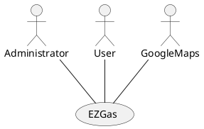
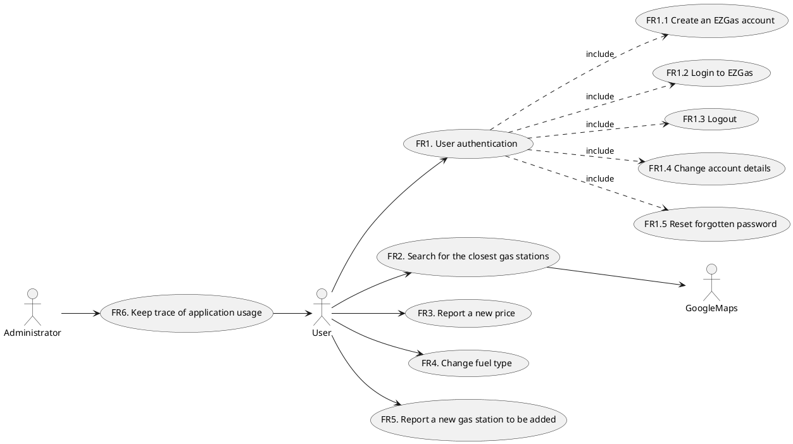
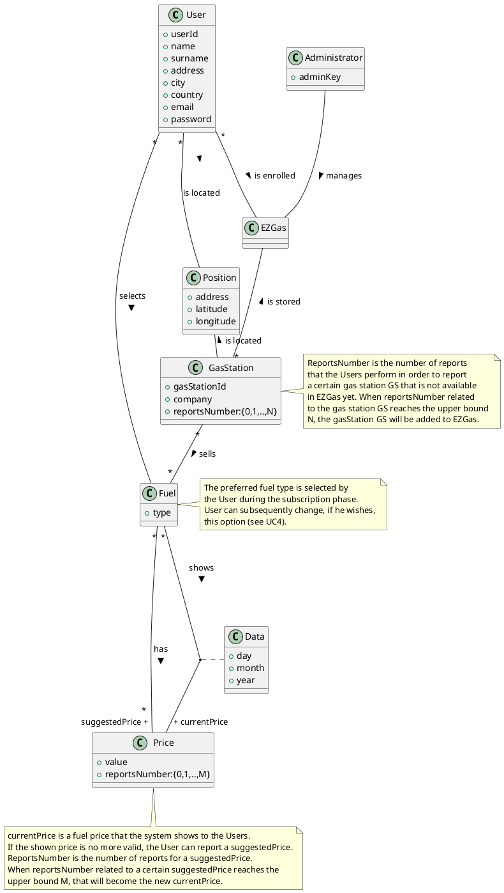
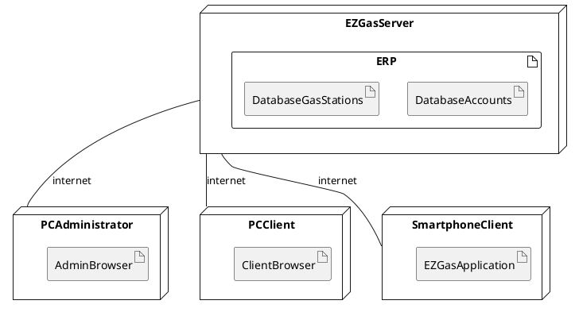

# Requirements Document 

Authors: Cao Peng, Finocchiaro Loredana, Marino Matteo, Mc Mahon Shannon

Date: 19/04/2020

Version: 1

# Contents

- [Abstract](#abstract)
- [Stakeholders](#stakeholders)
- [Context Diagram and interfaces](#context-diagram-and-interfaces)
	+ [Context Diagram](#context-diagram)
	+ [Interfaces](#interfaces) 
	
- [Stories and personas](#stories-and-personas)
- [Functional and non functional requirements](#functional-and-non-functional-requirements)
	+ [Functional Requirements](#functional-requirements)
	+ [Non functional requirements](#non-functional-requirements)
- [Use case diagram and use cases](#use-case-diagram-and-use-cases)
	+ [Use case diagram](#use-case-diagram)
	+ [Use cases](#use-cases)
    	+ [Relevant scenarios](#relevant-scenarios)
- [Glossary](#glossary)
- [System design](#system-design)
- [Deployment diagram](#deployment-diagram)

# Abstract

EZGas is a crowdsourcing service that allows users to:

* Perform searches for gas stations in their area by selecting the interested fuel type. The search can be based on the price of fuel or on the distance to reach the gas stations;
* Report a new price of a certain type of fuel in a gas station;
* Report a new gas station not already available in EZGas.

EZGas is supported by a web application (accessible both via smartphone or PC).
The gas stations are localized thanks to a specific API of Google Maps.

In order to be able to use the application, users must set up a (free) EZGas account and be logged in.
He must also activate the GPS position on their smartphone.

# Stakeholders

| Stakeholder name  | Description | 
| ----------------- |:-----------:|
| Developer | Develops the application and checks periodically for possible raising issues. |
| Administrator | Works closely with the application developer to tune and troubleshoot the application. Leads and participates in efforts to implement application updates to include upgrades, patches, and new releases with the goal of meeting the end users' needs. He is fully responsible for daily monitoring and maintanance activities (monitors and, if necessary, can ban users, stop hackers, fix accounts). | 
| User | Uses the application directly, because he is interesting in finding the closest gas stations (or the most convenient one) and in keeping prices up to date. |
| GoogleMaps | Provides an Application Program Interface (API) to the application, so that gas stations can be easily localized. |

# Context Diagram and interfaces

## Context Diagram

## Interfaces

| Actor | Logical Interface | Physical Interface  |
| ------------- |:-------------:| -----:|
| Administrator | GUI | Screen, keyboard |
| User | GUI | Smartphone (or pc), Internet connection |
| GoogleMaps | API | Internet connection |

# Stories and personas

Alice, Susan and Ally are a group of friends that love to travel by car. Since they visit new places, one of the challenges they face during their trips is finding gas stations to refill their car when they are running low on fuel. They've often had to ask the local people for information for the nearest gas stations. They would like to have a simpler way of locating gas stations with respect to their position.

Larry is a truck driver.
Everyday he travels long distances through areas that most of the time he is not familiar with. It would be very useful for him to know where gas stations near him are located when he needs to refill, especially the most convenient one.

Abigail has always believed that knowledge is power.
That’s why when she sees an offer, she thinks everyone should know about it. She works an hour from home and knows first-hand how expensive fuel can be as she relies on her car to get her there. For this reason, when she comes across a gas station with good fuel prices, she would love to be able to share this information with whoever could benefit from it.

Sara is a nature lover. In order to avoid polluting, she has bought an electric car.
However it can be difficult for her to find gas stations that allow her to charge the battery. She recently found one, and noted it down to share this information with those friends of hers which also have an electric car. 
Sara would like to have a simple way of locating the nearest gas stations that recharges electrical cars, and share this information with others.

John is the administrator of EzGas. Aside from working on application updates and fixing possible bugs, he is responsible for the daily monitoring of users.

# Functional and non functional requirements

## Functional Requirements

| ID        |  | Description  |
| ------------- | ------: |:-------------:| 
|  FR1     |  | User authentication |
|   	   | FR1.1 | Create an EZGas account  |
|  	 	   | FR1.2 | Login to EZGas |
|   	   | FR1.3 | Logout |
|   	   | FR1.4 | Change account details |
|   	   | FR1.5 | Reset forgotten password |
| FR2	   |  | Search for the closest gas stations (optionally based on maximum distance and/or price) |
| FR3	   |  | Report a new price |
| FR4	   |  | Change fuel type |
| FR5	   |  | Report a new gas station to be added |
| FR6    |  | Keep trace of application usage |

## Non Functional Requirements

| ID        | Type (efficiency, reliability, ..)           | Description  | Refers to |
| ------------- |:-------------:| :-----:| -----:|
|  NFR1     |  Usability | The user interface of the application is simple and intuitive, no training is necessary | All FR |
|  NFR2     | Performance | The application should react with a maximum delay of 1 sec | FR2 |
|  NFR3     | Performance | The application should react with a maximum delay of 0.5 sec | All FR (except FR2) |
|  NFR4     | Reliability | The downtime of the application should be not higher than 1 hour per year | All FR |
|  NFR5     | Portability | The application runs on Android (from 7.0 to 10.0 version) and iOS (from 9.3.6 to 13.4 version) | All FR |
|  NFR6     | Portability | The web application runs on Chrome (80.0.3987 version), Firefox (from 58 to 75 version) and Safari (from 10.1.2 to 13.1 version) | All FR |
|  NFR7     | Privacy | The application must satisfy all the GDPR rules | All FR |
|  NFR8     | Domain | Currency (euro, dollar, ...) and units (liter, gallon, ...) depend on the country the user is in | All FR |
|  NFR9     | Localisation | Decimal numbers use . (dot) as decimal separator | |

# Use case diagram and use cases

## Use case diagram

### Use case 1, UC1 - FR1.1 Create an EZGas account
| Actors Involved        | User |
| ------------- |:-------------:| 
|  Precondition     | User U is not enrolled to EZGas |  
|  Post condition     | User U is enrolled to EZGas |
|  Nominal Scenario     | User U compiles a form, providing the required information (personal details like name, surname, ...) and specifying the preferred fuel type; subsequently, he will receive an e-mail with a link to be clicked in order to confirm the subscription. |
|  Variant 1     | The inserted e-mail address is not in the valid format, issue warning |
|  Variant 2     | The inserted e-mail address is already associated to an EZGas account, issue warning |
|  Variant 3     | User U doesn't accept the terms of service and privacy policy, issue warning |

### Use case 2, UC2 - FR1.2 Login to EZGas 
| Actors Involved        | User |
| ------------- |:-------------:| 
|  Precondition     | User U is enrolled to EZGas |  
|  Post condition     | User U is logged in |
|  Nominal Scenario     | User U inserts his e-mail and password: if these are correct, he will be successfully logged in. |
|  Variants     | E-mail or password (or both of them) is not correct, issue warning |

### Use case 3, UC3 - FR1.3 Logout
| Actors Involved        | User |
| ------------- |:-------------:| 
|  Precondition     | User U is logged in with EZGas |  
|  Post condition     | User U is logged out from EZGas |
|  Nominal Scenario     | User U selects the option "Logout" from the application. |
|  Variants     |  |

### Use case 4, UC4 - FR1.4 Change account details
| Actors Involved        | User |
| ------------- |:-------------:| 
|  Precondition     | User U is logged in with EZGas |  
|  Post condition     | Account details of User U are updated|
|  Nominal Scenario     | User U modifies some personal information (name, address, e-mail, ...) and then inserts the password in order to make changes permanent. |
|  Variants     | The inserted password is not correct, issue warning |

### Use case 5, UC5 - FR1.5 Reset forgotten password
| Actors Involved        | User |
| ------------- |:-------------:| 
|  Precondition     | User U is enrolled to EZGas |  
|  Post condition     | Password of User U is reset |
|  Nominal Scenario     | User U inserts his e-mail address; he will receive an e-mail with a temporary password to be used in order to log in. |
|  Variants     |  |

### Use case 6, FR2 Search for the closest gas stations (optionally based on maximum distance and/or price)

| Actors Involved        | User, GoogleMaps |
| ------------- |:-------------:| 
|  Precondition     | User U is logged in with EZGas, GPS position is activated |  
|  Post condition     | EZGas returns a list of gas stations that sell the preferred fuel type F (specified by the User U when he signed up, see UC1) |
|  Nominal Scenario   | User U inserts a maximum distance and/or maximum price in order to filter the results based on these constraints; the application, thanks to GoogleMaps API, will provide a list of gas stations (with respective price for fuel type F and distance from the User U's position) that satisfies the request. |
|  Variant 1	 | There are no gas stations in the area that satisfy the constraints (the resulted list is empty), issue warning |
|  Variant 2     | User U inserts as maximum distance a value that is higher than the maximum value predefined in the application, issue warning |
|  Variant 3     | User U doesn't insert any preference in terms of maximum distance and/or maximum price: the application will apply default parameters |

##### Scenario 6.1

| Scenario ID: SC6.1        | Corresponds to UC6  |
| ------------- |:-------------| 
| Description | User U performs a search that produces no results |
| Precondition |  |
| Postcondition | |
| Step#        |  Step description   |
|  1	 | GoogleMaps detects the GPS position of the User U and sends that to EZGas | 
|  2     | User U performs a search (with or without filter parameters set) |
|  3     | EZGas does not find any gas stations, User U is notified|

##### Scenario 6.2

| Scenario ID: SC6.2        | Corresponds to UC6  |
| ------------- |:-------------| 
| Description | User U inserts as maximum distance a value that is higher than the maximum value predefined in the application |
| Precondition |  |
| Postcondition |  |
| Step#        |  Step description   |
|  1	 | GoogleMaps detects the GPS position of the User U and sends that to EZGas | 
|  2   | User U inserts a maximum distance that is higher than the maximum value predefined in the application, issue warning |

##### Scenario 6.3

| Scenario ID: SC6.3        | Corresponds to UC6  |
| ------------- |:-------------| 
| Description | User U performs a search for the closest gas stations (filter parameters are set) that sell the preferred fuel type F (specified by the User U when he signed up, see UC1) |
| Precondition |  |
| Postcondition | List of gas stations provided based on the GPS position and filter parameters |
| Step#        |  Step description   | 
|  1	 | GoogleMaps detects the GPS position of the User U and sends that to EZGas | 
|  2     | User U inserts a maximum distance in order to filter the results |
|  3     | User U inserts (optionally) a maximum price in order to apply a second filter to the results |
|  4 	 | User U starts the search |
|  5	 | EZGas provides a list of gas stations based on the GPS position and ordered by distance and, possibly, by price |

##### Scenario 6.4

| Scenario ID: SC6.4        | Corresponds to UC6  |
| ------------- |:-------------| 
| Description | User U performs a search for the closest gas stations (no filter parameter is set) that sell the preferred fuel type F (specified by the User U when he signed up, see UC1) |
| Precondition |  |
| Postcondition | List of gas stations provided based only on the GPS position |
| Step#        |  Step description   |  
|  1	 | GoogleMaps detects the GPS position of the User U and sends that to EZGas | 
|  2     | "Maximum distance" field is left empty (default value will be used) |
|  3     | "Maximum price" field is left empty (default: no upper bound to the price) |
|  4 	 | User U starts the search |
|  5	 | EZGas provides a list of gas stations based only on the GPS position, using a default value (e.g. 5 km) as maximum distance of gas stations from the User's position and ordered by distance. |

### Use case 7, UC7 - FR3 Report a new price

| Actors Involved        | User |
| ------------- |:-------------:| 
|  Precondition     | User U is logged in with EZGas, User U has performed the search S, list of the results is not empty | 
|  Post condition     | The reportsNumber RN for the suggestedPrice P' of fuel type F for the gas station GS is incremented by 1 |
|  Nominal Scenario     | User U selects a specific gas station GS (from the results of the search S) and inserts a suggestedPrice P' for the fuel type F. The suggestedPrice P' will be effectively visible as currentPrice only when the reportsNumber RN related to P' will be at least equal to a certain quantity M. |
|  Variant 1     | The suggestedPrice P' inserted by the User U is equal to the currentPrice P (that is currently shown), issue warning |
|  Variant 2     | The report sent by the User U is the 1st one related to the suggestedPrice P', suggestedPrice P' will be stored internally with reportsNumber RN equal to 1 |
|  Variant 3	 | The report sent by the User U is the Mth one related to the suggestedPrice P', suggestedPrice P' will be shown as the new currentPrice |
|  Variant 4   | User U has already reported a suggestedPrice P' for the gas station GS in the space of a day, issue warning |

##### Scenario 7.1

| Scenario ID: SC7.1        | Corresponds to UC7  |
| ------------- |:-------------| 
| Description | User U reports a suggestedPrice P' of fuel type F for the gas station GS, P' is equal to the currentPrice P (that is currently shown) |
| Precondition |  |
| Postcondition |  |
| Step#        |  Step description   | 
|  1     | User U selects a gas stations GS among those resulted from a search |
|  2     | User U inserts a suggestedPrice P' for fuel type F |
|  3 	 | User U confirms and sends the report |
|  4	 | The suggestedPrice P' is equal to the currentPrice P, issue warning |

##### Scenario 7.2

| Scenario ID: SC7.2        | Corresponds to UC7  |
| ------------- |:-------------| 
| Description | User U reports a suggestedPrice P'' of fuel type F for the gas station GS |
| Precondition | At least one suggestedPrice P' with reportsNumber RN less than M-1 exists |
| Postcondition | The reportsNumber RN of the suggestedPrice P'' of fuel type F for the gas station GS is incremented by 1 |
| Step#        |  Step description   | 
|  1     | User U selects a gas station GS among those resulted from a search |
|  2     | User U inserts a new price P'' for fuel type F and P'' is equal to a certain suggestedPrice P' |
|  3 	 | User U confirms and sends the report |

##### Scenario 7.3

| Scenario ID: SC7.3        | Corresponds to UC7  |
| ------------- |:-------------| 
| Description | User U reports a suggestedPrice P'' of fuel type F for the gas station GS (Mth report for the suggestedPrice P'') |
| Precondition | At least one suggestedPrice P' with reportsNumber RN equal to M-1 exists |
| Postcondition | The reportsNumber RN of the suggestedPrice P'' of fuel type F for the gas station GS is incremented by 1, reaching the upper bound M. The currentPrice is updated with the suggestedPrice P'', suggestedPrice list is emptied |
| Step#        |  Step description   | 
|  1     | User U selects a gas station GS among those resulted from a search |
|  2     | User U inserts a new price P'' for fuel type F and P'' is equal to a certain suggestedPrice P' |
|  3 	 | User U confirms and sends the report |

### Use case 8, UC8 - FR4 Change fuel type

| Actors Involved        | User |
| ------------- |:-------------:| 
|  Precondition     | User U is logged in with EZGas, fuel type F is set |  
|  Post condition     | New fuel type F' is set|
|  Nominal Scenario     | User U selects a new preferred fuel type F' and then confirms the choice. |
|  Variants    | |

### Use case 9, UC9 - FR5 Report a new gas station to be added

| Actors Involved        | User |
| ------------- |:-------------:| 
|  Precondition     | User U is logged in with EZGas |  
|  Post condition     | ReportsNumber RN for the gas station GS is incremented by 1 |
|  Nominal Scenario     | User U reports a gas station GS to EZGas. The gas station GS will be effectively added when its reportsNumber RN will be at least equal to a certain quantity N. |
|  Variant 1     | Gas station GS is already available in EZGas, issue warning |
|  Variant 2     | The report sent by the User U is the 1st one related to the gas station GS, the gas station GS will be stored internally with reportsNumber RN equal to 1 |
|  Variant 3 	 | The report sent by the User U is the Nth one related to the gas station GS, GS will be added |
|  Variant 4   | User U has already reported the gas station GS, issue warning |

##### Scenario 9.1

| Scenario ID: SC9.1        | Corresponds to UC9  |
| ------------- |:-------------| 
| Description | User U reports a gas station GS that is already available in EZGas |
| Precondition |  |
| Postcondition |  |
| Step#        |  Step description   |
|  1     | User U inserts required information about the gas station GS |
|  2     | User U confirms and sends the report |
|  3	 | Gas station GS is already available in EZGas, issue warning |

##### Scenario 9.2

| Scenario ID: SC9.2        | Corresponds to UC9  |
| ------------- |:-------------| 
| Description | User U reports a gas station GS |
| Precondition | At least one gas station GS' whose reportsNumber is less than N-1 exists |
| Postcondition | The reportsNumber RN of gas station GS is incremented by 1 |
| Step#        |  Step description   |
|  1     | User U inserts required information about the gas station GS that is equal to a certain gas station GS' |
|  2     | User U confirms and sends the report |

##### Scenario 9.3

| Scenario ID: SC9.3        | Corresponds to UC9  |
| ------------- |:-------------| 
| Description | User U reports a gas station GS (Nth report for the gas station GS) |
| Precondition | At least one gas station GS' whose reportsNumber is equal to N-1 exists |
| Postcondition | The reportsNumber RN of gas station GS is incremented by 1. RN is equal to N, gas station GS is added among the available ones |
| Step#        | Step description  |
|  1     | User U inserts required information about the gas station GS that is equal to a certain gas station GS' |  
|  2     | User U confirms and sends the report |

### Use case 10, UC10 - FR6. Keep trace of application usage

| Actors Involved        | Administrator, User |
| ------------- |:-------------:| 
|  Precondition     | Each User U is enrolled to EZGas (and so he has accepted terms of service and privacy policy of EZGas) | 
|  Post condition     | Each activity performed by each User U in EZGas is recorded in the system |
|  Nominal Scenario     | Administrator keeps trace of application usage by analyzing the activities perfomed by each User U, in order to obtain useful statistics about his daily/monthly behaviour. |
|  Variants     |  |

# Glossary

# System Design
Not meaningful in this case, since EZGas has no hardware components.

# Deployment Diagram

