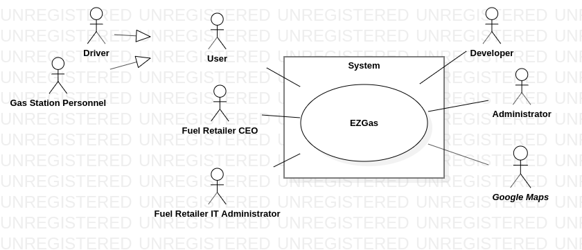
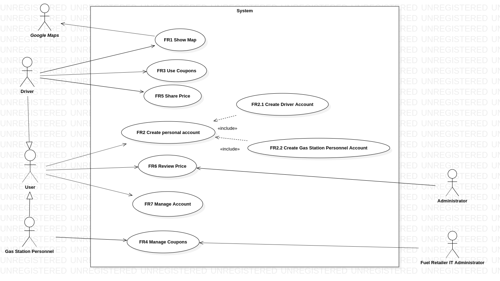
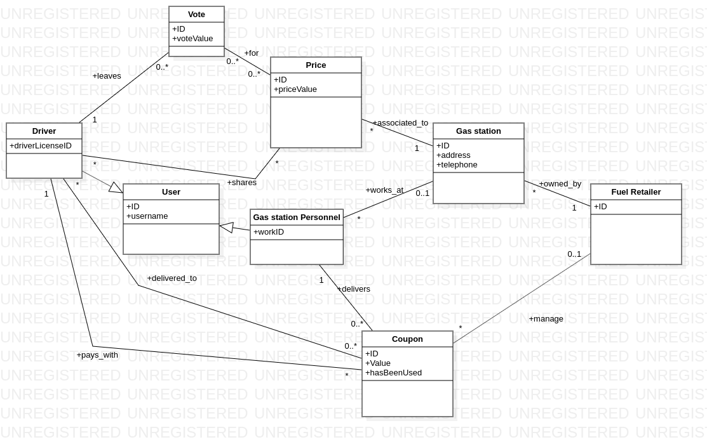

# EZGas: Official Requirements Document

Author: Nicolò Bianco

Date: 27/03/2020

Version: 2

Change history

| Version | Changes |
| ----------------- |:-----------|
| 2 | Fixed Stakeholders, Functional and Non Functional Requirements. Added Glossary diagram |

## Contents

- [Abstract](##abstract)
- [Stakeholders](##stakeholders)
- [Context Diagram and interfaces](##context-diagram-and-interfaces)
  - [Context Diagram](###context-diagram)
  - [Interfaces](###interfaces)
- [Stories and personas](##stories-and-personas)
- [Functional and non functional requirements](##functional-and-non-functional-requirements)
  - [Functional Requirements](###functional-requirements)
  - [Non functional requirements](###non-functional-requirements)
- [Use case diagram and use cases](##use-case-diagram-and-use-cases)
  - [Use case diagram](###use-case-diagram)
    - [Use cases](###use-cases)
    - [Relevant scenarios](###relevant-scenarios)
- [Glossary](##Glossary)

## Abstract

Modern life forces us to be constantly in motion, and living in a city implies to do so relatively fast. Basically, we can choose between two choices: using the public transportation system or driving a vehicle. If we go for the second, our car, motorcycle or whatever it is will need sooner or later to be refueled, but can we in some way optimize this process?

The goal of this application is to give to common drivers the possibility to choose the right gas station on the base of two main factors: the gas price and distance from our position. Each driver can share these informations with others to create a community, where the user is the core of the process.

## Stakeholders

| Stakeholder name | Description |
| -----------------|:-----------:|
| User | Has an active personal account in the app. Could be a Driver or a Gas Station Personnel. |
| Driver                | Uses the application to find the right gas station for its needs. Also is able to share informations about gas stations and reviewing those of other users. |
| Gas Station Personnel | Cannot share informations about his/her gas station, but can review what users share about it. Giving him/her the possibility to share informations like prices could lead to false advertisement. |
| Fuel Retailer CEO     | Makes aggregments with the app developers to erogate coupons if a driver uses their Gas Station |
| Fuel Retailer IT Administrator | Manages the coupon aviability |
| Developer             | Develops the application, and is in charge of maintaining the platform over time. |
| Administrator | Is in charge of managing the reports and the possible conflicts. |
| Google Maps           | Adds to the application a consistent set of maps to display the gas stations |

## Context Diagram and interfaces

### Context Diagram

### Interfaces

| Actor | Logical Interface | Physical Interface  |
|:-------------:|:-------------:|:-----:|
| Driver | GUI | Touch screen |
| Gas Station Personnel | GUI | Touch screen |
| Fuel Retailer IT Administrator | GUI | Screen, keyboard |
| Administrator | GUI, Source Code | Screen, keyboard |
| Google Maps | Web Services | Internet Connection |

## Stories and personas

Luke is a salesman, he works for a coffee distributor, and every day delivers products all across the city, so he drives a lot. His company refunds only a limited amount of the gas that he actually uses for his job. Until now he refuels his truck at the gas station near his office, but their prices aren't always the lowest. Since he moves a lot, the app could help him to find the best prices near his clients, and to share this information with other co-workers.

Anna works in an office that is in the city center, while she lives in the suburbs. In the trip to work, she encounters a lot of gas stations, but she can't know which one has the lower price during that day. With the EZGas app, she could find it and also gain discount prices with the coupons she receives.

Charlotte is the CEO of a new local fuel retailer, and so she's in search of market opportunities. Since her company has just started, nobody knows them. Having the possibility to show themself on the EZGas App may lead to a lot of new clients.

## Functional and non functional requirements

### Functional Requirements

| ID  | Description              |
|-----|:-------------------------|
| FR1 | Show a map with the nearest (radius 500m) gas stations. |
| FR2 | Let users create a personal account
| FR2.1 | Let drivers create a personal account |
| FR2.2 | Let Gas Station Personnel create a personal account |
| FR 3 | Let drivers use coupons to pay the gasoline|
| FR4 | Manage coupons |
| FR4.1 | Let Fuel Retailer CEO to manage the prices/quantities of deliverable coupons |
| FR4.2 | Let Gas Station Personnel to manage the transaction with coupons |
| FR5 | Let drivers share gasoline prices of a specific gas station |
| FR6 | Let Users review and/or report the prices that other users have shared |
| FR6.1 | Let Gas Station Personnel review and/or report the prices that other users have shared |
| FR6.2 | Let drivers review and/or report the prices that other users have shared |
| FR7 | Let users to manage their accounts |
| FR8 | Don't let the Gas Station Personnel nor the Fuel Retailer CEO share price information about their Gas Station |

### Non Functional Requirements

| ID   | Type          | Description             | Refers to |
|------|:-------------:|:------------------------|:----------|
| NFR1 | Usability | The application should be used with no training by the drivers | All FR|
| NFR2 | Usability | The application should be used with no training by the Gas Station Personnel| All FR |
| NFR3 | Reliability | The coupon transaction should work fine every time in standard conditions (No connections problem) | FR4.1 |
| NFR4 | Perfomance | The app should react with a maximum delay of 0.5 sec | All FR |
| NFR5 | Functionality | The information sharing should be kept under control to avoid fake prices |  FR10 |
| NFR6 | Portability | The app should work on these web browsers: Firefox, Chrome, Safari, IE | All FR |

## Use case diagram and use cases

### Use case diagram

#### Use case 1, UC1 - FR1 View the gas stations on the map

| Actors Involved        | Driver |
| ------------- |:-------------:|
|  Precondition     | this.findAccount(Driver) == true |  
|  Post condition     |  
|  Nominal Scenario     | Driver needs to refuel, opens the app, views the nearest gas station|
|  Variants     | Explore the whole map |

#### Use case 2, UC2 - FR2 Driver or Gas Station personnel creates a personal account

| Actors Involved        | Driver or Gas Station personnel|
| ------------- |:-------------:|
|  Precondition     | The app has been installed |  
|  Post condition     | this.findAccount(Driver OR Gas_Station_Personnel) == true
|  Nominal Scenario     | Driver opens the app for the first time, follows the personal account creation procedure, logs in the new personal account|
|  Variants     | The same procedure is done by the Gas Station personnel |

#### Use case 3, UC3 - FR4 Gas Station personnel delivers coupons after a refueling

| Actors Involved        | Driver, Gas Station personnel|
| ------------- |:-------------:|
|  Precondition     | this.findAccount(Driver) && this.findAccount(Gas_Station_Personnel) == true |  
|  Post condition     | Driver.coupon_quantity_post > Driver.coupon_quantity_pre  
|  Nominal Scenario     | Driver finds the right gas station, refuels, pays, Gas Station personnel upload to the Driver account a new coupon which value depends on the quantity of gasoline acquired  |
|  Variants     | The driver doesn't buy enough gasoline to claim a coupon |

#### Use case 4, UC4 - FR3 Driver uses coupons to pay the gas

| Actors Involved        | Driver, Gas Station personnel|
| ------------- |:-------------:|  
|  Precondition     | this.findAccount(Driver) && this.findAccount(Gas_Station_Personnel) == true |  
| |  Driver.coupon_quantity_pre != 0|
|  Post condition     | Driver.coupon_quantity_post < Driver.coupon_quantity_pre  
|  Nominal Scenario     | Driver finds the right gas station, refuels, shows to Gas Station Personnel the coupon, pays gasPrice - couponValue*numberOfCouponsUsed  |
|  Variants     |  |

#### Use case 5, UC5 - FR5 Driver shares prices of a gas station

| Actors Involved        | Driver|
| ------------- |:-------------:|  
|  Precondition     | this.findAccount(Driver) == true |  
|  Post condition     |  this.findGasStation(gas_station).today_prices != NULL
|  Nominal Scenario     | Driver goes to a gas station, opens the app, select on the map the current gas station, uploads the prices  |
|  Variants     |  |

#### Use case 6, UC6 - FR6/FR8 Driver reviews prices

| Actors Involved        | Driver, Gas Station personnel|
| ------------- |:-------------:|  
|  Precondition   | this.findAccount(Driver) OR this.findAccount(Gas_Station_Personnel) == true|
|  Post condition     |  | |
|  Nominal Scenario     | Driver opens the app, select a gas station, views a price review, votes positive or negative |
|  Variants     | Gas station personnel opens the app, select his/her gas station, views a price review, reports fake informations |

#### Use case 7, UC7 - FR9 Driver manages his/her personal account

| Actors Involved        | Driver, Gas Station personnel|
| ------------- |:-------------:|  
|  Precondition   | this.findAccount(Driver) OR this.findAccount(Gas_Station_Personnel) == true|
|  Post condition     |  | |
|  Nominal Scenario     | Driver opens the app, select his/her personal account, changes some records, saves the changes |
|  Variants     | Same operation but performed by Gas Station personnel |

#### Use case 8, UC8 - FR4 Fuel retailer CEO manages coupons

| Actors Involved        | Fuel retailer CEO, Fuel Retailer IT Administrator|
| ------------- |:-------------:|  
|  Precondition   | this.findPartnership(Fuel_retailer) == true|
|  Post condition     |  | |
|  Nominal Scenario     | CEO tells to the IT Administrator what to change, IT Administrator opens the web application, log in with his/her credentials, select criterias for coupons delivering |
|  Variants     |  |

## Relevant scenarios

### Scenario 1

| Scenario ID: SC1        | Corresponds to UC1, UC5 and UC6  |
| ------------- |:-------------|
| Description | A driver opens the app to find a gas station |
| Precondition | The driver has a personal account on the app|
| Postcondition | The driver correctly sees the map with all gas stations|
| Step#        |  Step description   |
|  1     | Driver opens the app|  
|  2     | Explore the map in search for the best gas station for its needs |
|  3     | Select one gas station|
|  4     | Drives to that gas station|
|  5     | Looks at the effective prices of the gasoline |
| 6 | Reviews the last prices on the app |

### Scenario 2

| Scenario ID: SC2        | Corresponds to UC4  |
| ------------- |:-------------|
| Description | A driver uses coupons accumulated in its account to pay the gasoline |
| Precondition | The driver has a personal account, and has just refueled its vehicle |
| Postcondition | The driver has less coupons than before the transaction |
| Step# | Step description |
| 1 | Driver opens the app |
| 2 | Driver shows to the Gas Station personnel the coupons (QR Code) |
| 3 | The Gas Station personnel opens its account |
| 4 | The Gas Station personnel scans the coupon with its smartphone |
| 5 | The Driver pays the gasoline with a discount |

### Scenario 3

| Scenario ID: SC2        | Corresponds to UC8  |
| ------------- |:-------------|
| Description | The CEO of a Fuel Retailer manages the coupons value and aviability by its office |
| Precondition | The Fuel Retailer has a partnership with the developers of the app |
| Postcondition | |
| Step# | Step description |
| 1 | The Fuel Retailer CEO speaks with its IT Administrator |
| 2 | IT Administrator logs in with the credentials given by the developers |
| 3 | Opens the Manage Coupons tab
| 4 | Changes the quantity and/or the value of coupons avaiable that day|
| 5 | Saves the settings |

## Glossary

