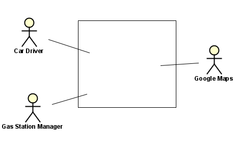

# Requirements Document

Author: Fabio Bertone

Date: 29/03/2019

Version: 1

# Contents
- [Abstract](#abstract)
- [Stakeholders](#stakeholders)
- [Context Diagram and interfaces](#context-diagram-and-interfaces)
	+ [Context Diagram](#context-diagram)
	+ [Interfaces](#interfaces) 
	
- [Stories and personas](#stories-and-personas)
- [Functional and non functional requirements](#functional-and-non-functional-requirements)
	+ [Functional Requirements](#functional-requirements)
	+ [Non functional requirements](#non-functional-requirements)
- [Use case diagram and use cases](#use-case-diagram-and-use-cases)
	+ [Use case diagram](#use-case-diagram)
	+ [Use cases](#use-cases)
	+ [Relevant scenarios](#relevant-scenarios)
- [Glossary](#glossary)
- [System design](#system-design)
- [Deployment diagram](#deployment-diagram)

# Abstract
Car driver want to have a way to know what is the best price gas station in their surrounding while travelling in order to save money or what is the nearest one for getting fuel as quick as possible in case of need.
For meeting this need the EZgas mobile application will be developed. In this application there is a GoogleMaps interface that shows all the gas station in a default radius (that can be set to a different value by the user) with the relative price for the different kind of fuel.

Everytime the fuel price of a gas station change, an employee has to update the application with the new price. There could also be application without prices.

# Stakeholders

| Stakeholder name  | Description | 
| ----------------- |:-----------:|
| Car Driver | Has the interest in purchasing fuel at the lowest price possible |
| Gas Station | Has the interest to 'advertise' itself as a competitive alternative |
| GPS system | Locates the driver |
| GoogleMaps | Show what is in the surrounding |
| DataBase   | Record all current prices for fuel |

# Context Diagram and interfaces

## Context Diagram

## Interfaces

| Actor | Logical Interface | Physical Interface  |
| ------------- |:-------------:| -----:|
|Car Driver| GUI |Screen|
|Gas Station| GUI |Screen|
|GoogleMaps| GoogleMaps API | Internet |
|GPS system | GPS API | Geolocation system |
|DataBase| SQL | Interntet |

# Stories and personas

Mr. Smith is driving to go to the sea. He has enough fuel to complete most of it's long trip, so it is possible for him to skip some gas station an waiting for the cheapest one. Hence he starts its EZgas application by tapping on the icon. He has no need to sets the parameters (gas and radius), nor to login as "car driver" role, since is not the first time he use the app. By a quick look to the screen he discover that the third station, as the bird fly, in the defined radius is the most convenient, so he decide to skip the first two along its route.

Mark is a freshman just hired in a big company after completing its studies as computer engineer. Being the first days he is a little nervous, so lately he forget to have a look to the fuel level indicator of is car. He is in a hurry but it's fuel is not at all sufficient to reach his new office. So he tap on the EZgas icon and set the radius parameter to the same value of the remaining kilometers he can travel, without caring about the price. Luckily, EZgas discover an appropriate station, and Mark won't be late.

Harry is the manager of a gas station. It's duty, among others, it's to update everymorining the price of the gas station he works for in the EZgas application. In order to do this he open the EZgas app, select the profile "gas station owner", and type the price in the apposite window of his gas station.

# Functional and non functional requirements

## Functional Requirements

| ID        | Description  |
| ----------|:------------:|
|  FR0     | Log the user |
|  FR0.0   | Log the user in the role of "car driver" |
|  FR0.1   | Log the user in the role of "gas station owner" |
|  FR0.2   | Remember the user for the next time |
|  FR0.3   | Log out the use |
|  FR1     | Display the gas stations and relative price whithin a certain radius that sell the desired kind of fuel | 
|  FR1.1   | Display the gas stations and relative price outside the radius if none is within it |
|  FR2     | Display the stations (with prices) according to the *coloring rules* while car driver is moving |
|  FR2.1   | Compute the nearest station |
|  FR2.2   | Compute the cheapest station |
|  FR3     | Compute and Display the best path toward the gas station selected by the user |
|  FR4     | Keep prices up to date |
|  FR4.1   | Record and updates price when gas stations manager enter it in the application |

#### *coloring rules for gas stations*
- green : the chepest
- blue : the nearest
- grey : station with no price indication
- yellow : all other stations 

## Non Functional Requirements

| ID        | Type            | Description  | Refers to |
| ----------|:---------------:| :-----------:| ---------:|
|  NFR1     | Usability | Application should be used with no training by any car driver  | All FR |
|  NFR2     | Performance | All functions should complete in < 0.5 sec  | All FR |
|  NFR3     | Portability | The application runs on Android (from KitKat on) and iOS (from 12 on)  | All FR |

# Use case diagram and use cases

## Use case diagram

## Use Cases

### Use case 1, UC1 - FR0.0  Log the user and acquires parameters - FR0.2  Remember the user for the next time

| Actors Involved        | Car Driver |
| ------------- |:-------------:| 
|  Precondition     | The user has installed the EZgas app |  
|  Post condition     | The user role and eventually parameters are initialized, the user role is in the cache memory of the application |
|  Nominal Scenario     | The app request the type of role, the user select "car driver", the app request radius and kind of fuel (step that the user can skip). The app save in its portion of cache memory user's data |
|  Variants     | No internet connection available, process stalled |

### Use case 2, UC2 - FR0.0  Log the user in role of "gas station owner" - FR0.2  Remember the user for the next time

| Actors Involved        | Gas station manager |
| ------------- |:-------------:| 
|  Precondition     | The user has installed the EZgas app |  
|  Post condition     | The user role and parameters are initialized, the user role is in the cache memory of the application |
|  Nominal Scenario     | The app request the type of role, the user select "gas station owner", the app request to select among the existing gas station. An out of band verification is performed. The app save in its portion of cache memory user's data |
|  Variants     | No internet connection available -> process stalled, No confirmation OOB -> process pending |

### Use case 3, UC3 - FR0.3  Log out the user

| Actors Involved        | Car Driver/Gas station manager |
| ------------- |:-------------:| 
|  Precondition     | The user has installed the EZgas app and logged in any role |  
|  Post condition     | The user is logged out |
|  Nominal Scenario     | The user tap on the log out button |
|  Variants     | No internet connection available -> process stalled |

### Use case 4, UC4 - FR1,FR1.1 Display gas stations and prices

| Actors Involved        | Car Driver, GPS, GoogleMaps |
| ------------- |:-------------:| 
|  Precondition     | The user has installed the EZgas app, the user has tapped on the app icon|  
|  Post condition     | Station(s) and price(s) are displayed |
|  Nominal Scenario     | The search for the station withing the given radius through the joint use of the GPS and GoogleMaps API and then display results|
|  Variants     | No station in the radius->search for the nearest station outside the radius , No internet connection available, process stalled |

### Use case 5, UC5 - FR2.2 Compute the cheapest station 

| Actors Involved        | Car Driver, GPS, GoogleMaps |
| ------------- |:-------------:| 
|  Precondition     | The user has installed the EZgas app, the user has tapped on the app icon |  
|  Post condition     | Station(s) and price(s) are displayed |
|  Nominal Scenario     | The search for the station within the given radius through the joint use of the GPS and GoogleMaps API, then sort just the one with price in ascending order, finally returns the cheapest one|
|  Variants     | No station in the radius->search for the nearest station outside the radius, All stations lack the price indication->return the nearest with a proper warning message, No internet connection available, process stalled |

### Use case 6, UC6 - FR2.1 Compute the nearest station 

| Actors Involved        | Car Driver, GPS, GoogleMaps |
| ------------- |:-------------:| 
|  Precondition     | The user has installed the EZgas app, the user has tapped on the app icon |  
|  Post condition     | Station(s) and price(s) are displayed |
|  Nominal Scenario     | The search for the station within the given radius through the joint use of the GPS and GoogleMaps API, then sort them in ascending order of distance, finally returns the nearest one|
|  Variants     | No station in the radius->search for the nearest station outside the radius, No internet connection available, process stalled |

### Use case 7, UC7 - FR2 Display the station (with prices) according to the *coloring rules* while car driving is moving

| Actors Involved        | Car Driver, GPS, GoogleMaps |
| ------------- |:-------------:| 
|  Precondition     | The user has installed the EZgas app, the computation for the *cheapest* has been done, the computation for the *nearest* has been done |  
|  Post condition     | Station(s) and price(s) are displayed colored |
|  Nominal Scenario     | After the app return the cheapest and nearest station indication it also colors it in green and blue respectively, others (with price) in yellow and the remaining (without price) in grey. Each time a new station enter in the radius the computation is performed again and the result updated and displayed |
|  Variants     | No internet connection -> process stalled |

### Use case 8, UC8 - FR3   Compute and Display the best path toward the gas station selected by the user

| Actors Involved        | Car Driver, GPS, GoogleMaps |
| ------------- |:-------------:| 
|  Precondition     | The user has installed the EZgas app, the co tapped the EZgap app icon, Stations have been displayed (an user can also choose a station before searching for nearest or cheapest) |  
|  Post condition     | Best path/route with indications are displayed |
|  Nominal Scenario     | The user tap on a gas station icon and the system compute the best path from its position to the station, taking into account current traffic conditions |
|  Variants     | No internet connection -> process stall |

### Use case 9, UC9 - FR4 Keep prices up to date, FR4.1   Record and updates price when gas stations manager enter it in the application

| Actors Involved        | Gas station Manager |
| ------------- |:-------------:| 
|  Precondition     | The manager has installed the EZgas app, it's role has been verified, the manager has tapped on the EZgas app icon |  
|  Post condition     | Gas station price updated |
|  Nominal Scenario     | The manager enter the daily price for fuel |
|  Variants     | No internet connection -> process stall |

## Relevant scenarios

### Scenario 1 - UC2 

| Scenario ID: SC1        | Corresponds to UC2 |
| ------------- |:-------------| 
| Description | Log the user in role of "gas station owner" |
|Precondition | The user has installed the EZgas app and tapped on the corresponding icon|
|Postcondition |  Account created |
| Step#        | Step description  |
|  1     | The app request the type of role |  
|  2     | The user select "gas station owner" |
|  3     | The app request to select among the existing gas station  |
|  4     | The app display a TextForm for the city to search in  |
|  5     | The user enter the city and get result displayed in a map formato  |
|  6     | The user select the gas station he is the manager of |
|  7     | The app ask the user, displaying another TextForm, an "official email" of the gas station for sending a OOB confirmation code |
|  8     | The user enter the email address |
|  9     | The user receive the code by email |
|  10    | The app show a PasswordForm where to put the received secret code |
|  11    | The user enter the code |
|  12a   | If the code is corret the user is logged as "gas station" user |
|  12b   | If the code is not correct the app ask to enter in again up to a maximum of 5 times, then it close itself |

### Scenario 2 - UC5 

| Scenario ID: SC2       | Corresponds to UC5 |
| ------------- |:-------------| 
| Description | Compute the cheapest station |
|Precondition | The user has installed the EZgas app, the user has tapped on the app icon |
|Postcondition |  The cheapest station is displayed in green |
| Step#        | Step description  |
|  1     | The app search for all the gas station within the user defined radius or in the default radius if the latter is not defined |  
|  2     | The app discard for its computation all the station without prices or that doesn't sell the fuel type defined by the car driver |
|  3b    | If all stations are priceless the procedure ends here and no station is colored |
|  3     | The app get all the prices for the type of fuel of interest and sort them in ascending order   |
|  4     | The app colors in green the icon of the cheapest gas station |
|  5     | Each time a new station enter in the radius the computation is performed again |

### Scenario 3 - UC6 

| Scenario ID: SC3        | Corresponds to UC6 |
| ------------- |:-------------| 
| Description | Compute the nearest station |
|Precondition | The user has installed the EZgas app, the user has tapped on the app icon |
|Postcondition |  The nearest station is displayed in blue |
| Step#        | Step description  |
|  1     | The app search for all the gas station within the user defined radius or in the default radius if the latter is not defined |  
|  2     | The app discard for its computation all the station that doesn't sell the fuel type defined by the car driver |
|  3b    | If all stations are doesn't sell that fuel type the procedure end here and no station is colored |
|  3     | The app compute the distance towards all of the filtered stations and sort them in ascending order   |
|  4     | The app colors in blue the icon of the nearest gas station |
|  5     | Each time a new station enter in the radius the computation is performed again |

### Scenario 4 - UC9 

| Scenario ID: SC4        | Corresponds to UC9 |
| ------------- |:-------------| 
| Description | Record and updates price when gas stations manager enter it in the application |
|Precondition | The gas station manager has installed the EZgas app, he has tapped on the app icon and entered is profile |
|Postcondition |  The price is updated |
| Step#        | Step description  |
|  1    | The user tap on the UpdatePrice Button |
|  2    | The app shows a TextForm in wich to insert the new price|
|  3    | The manager enter the new price |
|  4    | The EZgas application update its database |
|  5    | The new price is displayed on the maps of all users |

# Glossary

# System Design 

- GPS system is in the hardware device in wich the app runs
- The Database is kept and managed internally by the application
