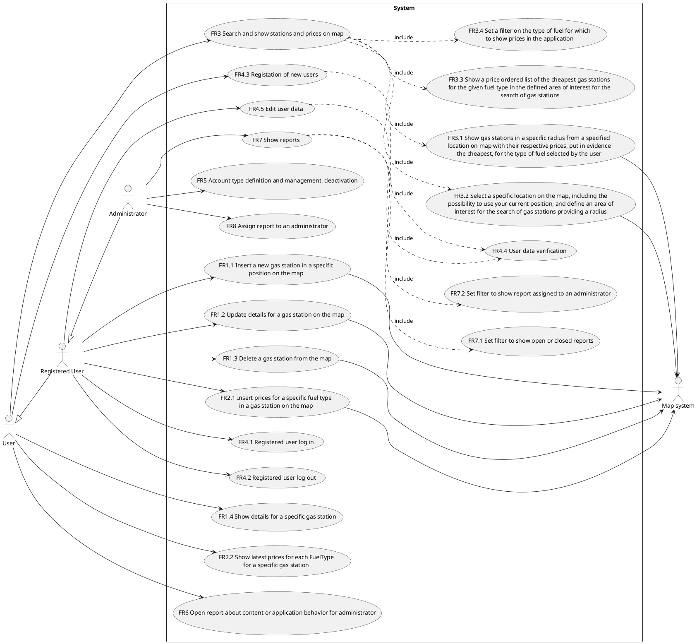
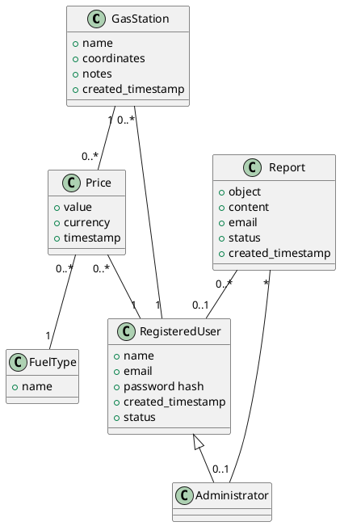
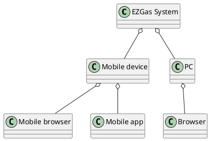
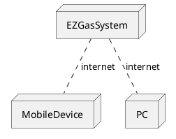

# Official Requirements Document

Author: Luca Rinelli

Date: 28/03/2020

Version: 0

Change history

| Version | Changes | 
| ----------------- |:-----------|
| 0 | First version of the document  |

# Contents
- [Abstract](#abstract)
- [Stakeholders](#stakeholders)
- [Context Diagram and interfaces](#context-diagram-and-interfaces)
	+ [Context Diagram](#context-diagram)
	+ [Interfaces](#interfaces) 
	
- [Stories and personas](#stories-and-personas)
- [Functional and non functional requirements](#functional-and-non-functional-requirements)
	+ [Functional Requirements](#functional-requirements)
	+ [Non functional requirements](#non-functional-requirements)
- [Use case diagram and use cases](#use-case-diagram-and-use-cases)
	+ [Use case diagram](#use-case-diagram)
	+ [Use cases](#use-cases)
	+ [Relevant scenarios](#relevant-scenarios)
- [Glossary](#glossary)
- [System design](#system-design)
- [Deployment diagram](#deployment-diagram)

# Abstract

EZGas is a crowdsourcing service that allows users to:

- collect prices of fuels in different gas stations
- locate gas stations in an area, along with the prices they practice

<!--Some colleagues share a coffee machine in a common space for breaks. Capsules are left aside the machine. Whoever uses a capsule writes this down in a notebook left aside the coffee machine. One of the colleagues (called *€˜administrator*€™) copies consumptions in an excel sheet and collects money from colleagues to (re)order capsules.

One of the colleagues, the *€˜hacker*™, volunteers to develop a simple application to support the administrator. To keep things simple the application is standalone, and is meant to be used only by the administrator. Possibly the administrator role is taken by different colleagues over time. Instead of the notebook, the hacker sets up a WhatsApp group. Whenever a colleague uses a capsule, he sends a message to the group.-->


# Stakeholders

| Stakeholder name     | Description | 
| -------------------- |:-----------:|
| Developers           | Develop and maintain the application. They want the application to be popular and used. May also use the application. They would like it not to be too complex while being very useful and accurate. |
| Administrators       | Are responsible for the correct operation of the application and for data and contents in it. They handle reports from users and public about the content and the behaviour of the application.
| Users                | Use the application to find the best prices among the gas stations nearby. May contribute inserting or updating gas stations and prices. |
| Gas stations' owners | Do not necessarily use the application directly. They are interested in attract as many drivers as they can. |

# Context Diagram and interfaces

## Context Diagram

```plantuml
@startuml
left to right direction
actor Administrator as mo
actor User as u
actor Registered User as ru
actor "Maps system" as m
mo -- (EZGas system)
d -- (EZGas system)
u -- (EZGas system)
ru -- (EZGas system)
(EZGas system) -- m
@enduml
```


## Interfaces
| Actor           | Logical Interface | Physical Interface                         |
| --------------- |:-----------------:| ------------------------------------------:|
| Administrator   | GUI               | Screen, keyboard, and mouse or touchscreen |
| User            | GUI               | Touchscreen or screen, keyboard, and mouse |
| Registered user | GUI               | Touchscreen or screen, keyboard, and mouse |
| Map system      | Web services API  | Internet connection                        |


# Stories and personas
_Marshall_ drives his car back and forth to work from monday to friday. The commute is long enough to pass close to different gas stations. Marshall tries to pay attention to the signs advertising the prices to then remember which gas station was the cheapest, but that requires quite some effort and memory. He often forgets which was the cheapest station or even to look the price signs of some stations. In this way Marshall usually ends up making a sub-optimal choice when stopping to fuel his car, ending up paying more. Marshall wants to cut commute costs in a more effortlessly way.

By using EZGas Marshall could check on his phone, before leaving his house or before leaving the office, which is the cheapest gas station on is commute, no need to look for the price signs, and he would need to remember only at which station to stop.
Marshall is going to be more relaxed while driving and is going to save a significant amount of money over time.

_Ted_ does not commute daily by car, he prefers to move around by bike. In the weekend or during holidays he enjoys car trips around the country to the most unlikely destinations with his wife Tracy and their children. Before leaving town he likes to stop to a gas station to avoid to pay more stopping at the usually much more expensive gas stations on the highway. His family instead always wants to hit the road as soon as possible and Ted ends up having to stop at gas stations on the highway.

Using EZGas Ted can check ahead where are the cheapest gas stations along the road and can try to insert some small deviations to save some money.

_Robin_ drives her motorbike all around the city every night, working for a food delivery company. Every cent she and her colleagues can save is important to make their work really profitable. She likes to share which is the cheapest gas station she sees with her colleagues and they do the same with her, this usually happens when they meet or with messages on their instant messaging groups' chats. But chats get really messy and it's difficult to understand which is the best price and where to find it.

Robin already use her phone for directions, with EZGas she can check and update prices for the gas stations she stops to and more easily share them with her colleagues.

_Barney_ works in a gas station, to have more clients he updates the prices on EZGas any time he lowers them on the signs.

_Lily_ works for EZGas and will handle reports from the users and the public about the contents and the application behaviours. She works from home to spend more time with her childrens. She uses her own laptop to work and needs a simple yet powerful interface to the application, through a web browser, to receive all the reports in one place and perform the adeguate changes to the contents of the application as fast as possible. Through this intergace using her account she can deactivate the accounts of users who misbehave. She collects technical reports and when necessary forwards them in batches to the developers via email.

# Functional and non functional requirements

## Functional Requirements

| ID       | Description   |
| -------- |:-------------:|
|  __FR1__ | __Gas stations handling__ | 
|  FR1.1   | Insert a new gas station in a specific position on the map |  
|  FR1.2   | Update details for a gas station on the map |
|  FR1.3   | Delete a gas station from the map |
|  FR1.4   | Show details for a specific gas station |
|  __FR2__ | __Fuel prices handling__ |
|  FR2.1   | Insert prices for a specific fuel type in a gas station on the map |
|  FR2.2   | Show latest prices for each FuelType for a specific gas station |
|  __FR3__ | __Search and show stations and prices on map__ |
|  FR3.1   | Show gas stations in a specific radius from a specified location on map with their respective prices, put in evidence the cheapest, for the type of fuel selected by the user |
|  FR3.2   | Select a specific location on the map, including the possibility to use your current position, and define an area of interest for the search of gas stations providing a radius |
|  FR3.3   | Show a price ordered list of the cheapest gas stations for the given fuel type in the defined area of interest for the search of gas stations |
|  FR3.4   | Set a filter on the type of fuel for which to show prices in the application |
|  __FR4__ | __User related functionalities__
|  FR4.1   | Registered user log in |
|  FR4.2   | Registered user log out |
|  FR4.3   | Registation of new users |
|  FR4.4   | User data verification |
|  FR4.5   | Edit user data |
|  __FR5__ | __Account type definition and management, deactivation__ |
|  __FR6__ | __Create report about content or application behavior for administrator__ |
|  __FR7__ | __Show reports__ |
|  FR7.1   | Set filter to show open or closed reports |
|  FR7.2   | Set filter to show report assigned to an administrator |
| __FR8__  | __Assign report to an administrator__ |

## Non Functional Requirements

| ID        | Type (efficiency, reliability, .. see iso 9126)           | Description  | Refers to |
| ------------- |:-------------:| :-----:| -----:|
|  NFR1     | Usability | Application should be used with no training   | All FR |
|  NFR2     | Performance | All functions should complete in < 0.5 sec  | All FR |
|  NFR3     | Portability | The application runs on Android 5.0 and newer, iOS 12 and newer and modern desktop and mobile web browsers | All FR |
|  NFR4     | Portability | The application (functions and data) should be portable from a device to another device in less than 5 minutes | All FR |
|  NFR5     | Localisation | Decimal numbers use . (dot) as decimal separator, use local currency, display local language if available or fallback to english | All FR |

# Use case diagram and use cases

## Use case diagram


## Use Cases

### Use case 1.1, UC1.1 - FR1.1 Insert a new gas station in a specific position on the map
| Actors Involved        | Registered user |
| ------------- |:-------------:| 
| Precondition  | RegisteredUser U exists, no GasStation G exists with G.name=new\_name and G.coordinates=new\_coordinates |  
| Post condition | G is inserted with G.name=new\_name, G.coordinates=new\_coordinates, G.notes=new\_notes, G.created\_timestamp=now associated to U |
| Nominal Scenario | RegisteredUser U select a spot on the map with coordinates new\_coordinates and insert the name new\_name for the new gas station. |
| Variants | If a station already exists for those new\_coordinates but with a different name a warning should be issued, an automatic report to the administrator could be fired. |
### Use case 1.2, UC1.2 - FR1.2 Update details for a gas station on the map
| Actors Involved        | Registered user |
| ------------- |:-------------:| 
|  Precondition | RegisteredUser U exists, GasStation G exists |  
|  Post condition | G.notes = new\_notes |
|  Nominal Scenario | RegisteredUser U selects a gas stations and edit the notes for that station. |

### Use case 1.3, UC1.3 - FR1.3 Delete a gas station from the map
| Actors Involved        | Registered user |
| ------------- |:-------------:| 
| Precondition  | RegisteredUser U exists, GasStation G exists |  
| Post condition | G is deleted |
| Nominal Scenario | RegisteredUser U select a gas station G on the map and choose the delete option. | 
### Use case 1.4, UC1.4 - FR1.4 Show details for a specific gas station
| Actors Involved        | User |
| ------------- |:-------------:| 
| Precondition  | RegisteredUser U exists, GasStation G exists |  
| Nominal Scenario | RegisteredUser U select a gas station G on the map and the notes for the gas station G are shown. |
### Use case 2.1, UC2.1 - FR2.1 Insert prices for a specific fuel type in a gas station on the map
| Actors Involved        | Registered user |
| ------------- |:-------------:| 
| Precondition  | RegisteredUser U exists, GasStation G exists, FuelType FT exists |  
| Post condition | P is inserted with P.value=new\_value, P.currency=new\_currency, P.timestamp=now, associated to U and the correct FT. |
| Nominal Scenario | RegisteredUser U select a gas station G and a fuel type FT and insert the new value for the price in a specified currency. |
Note: Insert and update are the same for prices, the timestamps are used to determine the current price, the older prices are kept for history.
### Use case 2.2, UC2.3 - FR2.3 Show all prices for a specific gas station
| Actors Involved        | User |
| ------------- |:-------------:| 
| Precondition  | GasStation G exists |  
| Nominal Scenario | The user selects, registered or not, sleects a gas station G on maps and the latest price for each fuel type FT is shown. |
### Use case 3, UC3 - FR3 Search and show stations and prices on map
| Actors Involved  | User |
| ---------------- |:-------------:| 
| Precondition     | A radius>0 is specified by the user together with a position coordinates and a fuel type |  
| Post condition   | An ordered list of gas stations is returned with their respective most updated price for the selected fuel type, the list is ordered by cheaper price. |
| Nominal Scenario | The user sets her position on the map and insert the radius for the search after having specified the fuel type of interest. She receives back the ordered list and the gas stations on the map. |
| Variants         | If no gas stations is present in the area for the search a warning should be shown. |

### Use case 4.1, UC4.1 - FR4.1 Registered user log in
| Actors Involved  | Registered User |
| ---------------- |:-------------:| 
| Precondition     | RegisteredUser U exists |  
| Post condition   |  |
| Nominal Scenario | User inserts email and password to perform login, if the input is correct is then authenticated. |
| Variants         | If email and password hash do not match any in the database a warning should be issued. |
### Use case 4.2, UC4.2 - FR4.2 Registered user log out
| Actors Involved  | Registered User |
| ---------------- |:-------------:| 
| Precondition     | RegisteredUser U exists and logged in |  
| Post condition   |  |
| Nominal Scenario | User select the logout option. |
| Variants         |  |

### Use case 4.3, UC4.3 - FR4.3 Registation of new users
| Actors Involved  | User |
| ---------------- |:-------------:| 
| Precondition     | RegisteredUser U with U.email=new\_mail does not exist |  
| Post condition   | RegisteredUser U is inserted with U.email=new\_mail, U.name=new\_name, U.password=Hash(new\_password), U.created\_timestamp=now, U.status="to\_be\_verified". |
| Nominal Scenario | The user fill the registration form with the requested details and submits it. |
| Variants         | If the user data verification fails a warning should be issued. |

### Use case 4.4, UC4.4 - FR4.4 User data verification
| Actors Involved  | User |
| ---------------- |:-------------:| 
| Precondition     | RegisteredUser U in status 'to\_be\_verified' |  
| Post condition   | U status set to 'verified' |
| Nominal Scenario | An email is sent to the user with a link to activate her account, if the user clicks on the link the status of its account is changed to 'verified', during this process it is first set to 'verification'. |
| Variants         | If the user does not click the link the status stays to 'verification'. |

### Use case 5, UC5 - FR5 Account type definition and management, deactivation
| Actors Involved  | Administrator |
| ---------------- |:-------------:| 
| Precondition     | RegisterUsed U exists |  
| Post condition   | U changes status. |
| Nominal Scenario | An administrator can set the status to 'verified' or 'deleted'. |
| Variants         |  |

### Use case 6, UC6 - FR6 Create report about content or application behavior for administrator
| Actors Involved  | User or Registered User |
| ---------------- |:-------------:| 
| Precondition     |  |  
| Post condition   | A Report R exists |
| Nominal Scenario | A user who founds domething wrong with the content or the behavior of the app access the report form and fills it. |
| Variants         |  |

### Use case 7, UC7 - FR7 Show reports
| Actors Involved  | Administrator |
| ---------------- |:-------------:| 
| Precondition     |  |  
| Post condition   |  |
| Nominal Scenario | A list of Reports eventually filtered by open/closed and administrator assigned is shown. |
| Variants         |  |

### Use case 8, UC8 - FR8 Assign report to an administrator
| Actors Involved  | Administrator |
| ---------------- |:-------------:| 
| Precondition     | Administrator A exists, Report R exists |  
| Post condition   | R is assigned to A |
| Nominal Scenario | A can mark R as assigned to herself or to another Administrator |
| Variants         |  |

# Relevant scenarios

## Scenario 1

| Scenario ID: SC1        | Corresponds to UC3  |
| ------------- |:-------------| 
| Description   | User search for the cheap gas stations in an area of radius r around her location |
| Precondition  |  |
| Postcondition |  |
| Step#        |  Step description   |
|  1     | User select FuelType FT of interest |  
|  2     |  User select a position on the map, or chooses to use her current position |
|  3     | User selects a radius r |
| 4 | The results of the search are shown |


## Scenario 2

| Scenario ID: SC2 | Corresponds to UC2.1  |
| ------------- |:-------------| 
| Description | A RegisteredUser RU wants to insert prices for a specific fuel type in a gas station on the map |
|Precondition | RU exists and has status="valid", GasStation G exists, FuelType FT exists |
|Postcondition |  A new price P is inserted for gas station G |
| Step#        | Step description  |
|  1     | Authenticated registered user RU selects gas station |  
|  2     | Select FuelType FT |
|  3     | Insert the value for the price, selecting the correct currency |


# Glossary



# System Design



# Deployment Diagram


