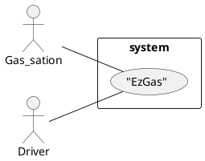
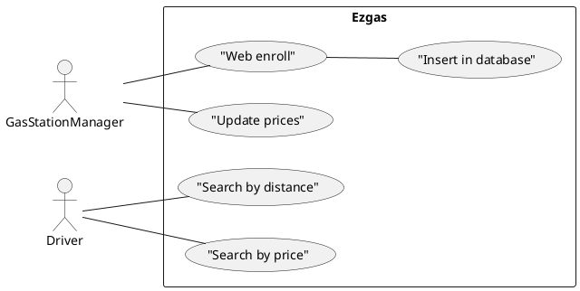

# Official Requirements Document

Authors: Giuseppe Carrubba

Date: 29/03/2020

Version: 1

Change history

# Contents
- [Abstract](#abstract)
- [Stakeholders](#stakeholders)
- [Context Diagram and interfaces](#context-diagram-and-interfaces)
	+ [Context Diagram](#context-diagram)
	+ [Interfaces](#interfaces)

- [Stories and personas](#stories-and-personas)
- [Functional and non functional requirements](#functional-and-non-functional-requirements)
	+ [Functional Requirements](#functional-requirements)
	+ [Non functional requirements](#non-functional-requirements)
- [Use case diagram and use cases](#use-case-diagram-and-use-cases)
	+ [Use case diagram](#use-case-diagram)
	+ [Use cases](#use-cases)
	+ [Relevant scenarios](#relevant-scenarios)

# Abstract

A group of students outside Turin are forced to use their cars in turn to move to the university.
Every day they are forced to do many kilometers and consume a lot of fuel. They are always on the hunt for a gas station to save as much time and money as possible. One of them takes care of keeping an eye on the prices but never manages to guarantee complete and up-to-date information.

One of them, that study computer engineer, had the brilliant idea to develop an application that can help them to save money and track prices based on the nearest gas station. This application is used by the administrators of the gas stations to promote their quality and prices to help drivers save money by moving as little as possible from their path.

# Stakeholders

| Stakeholder name  | Description |
| ----------------- |:-----------:|
| Developer | Who develops, mantains and also use the application for its interests|
|Gas station administrator | Uses the application to promote his station |
| Drivers   | Uses the application to find the cheaper/nearest station |

# Context Diagram and interfaces

## Context Diagram

## Interfaces
| Actor | Logical Interface | Physical Interface  |
| ------------- |:-------------:| -----:|
| Administrator | Web Application |Screen, keyboard, smartphone, tablet|
| Drivers | Web Application |Screen, keyboard, smartphone, tablet|

# Stories and personas

Aldo is a very smart guy and has an inclination for order and organization. He is trying to get the master degree on Embedded systems and every day he has to take his car, or go with the car of other colleagues, and drive for 40 minutes to reach the university. Every day he organizes himself with his colleagues to decide who will use the machine in turn.
Every time he has to deal with paying a different fee with his colleagues, as they don't know a priori how much it will cost to refuel their car and for a student money are always a problem. His colleagues trust his advice, but every time they waste a lot of time getting organized.

Aldo is happy to do this work every day, but he also would like to have a simple way to organize with his colleagues all expenses and consumption for the fuel. Without his work nobody has a clear idea of which gas station is more convenient than another and how money they have to prepair before getting out in the morning.

Giovanni is the director of a service station. He has always put good prices on his fuels, but unfortunately his position is not very intuitive for those who do not drive on the highway. With the application, his business is skyrocketing. He is very grateful to aldo for having had the idea of ​​making this app and being able to help him.

Giacomo is a colleague of aldo, he loves to drive. Every turn or gear change is an 
emotion for him. of all colleagues, he is the one who always prefers to drive instead of 
being a passenger

# Functional and non functional requirements

## Functional Requirements

| ID        | Description  |
| ------------- |:-------------:|
|  FR1     | Record a gas station in a database |  
|  FR2     | Record a user in the database |
|  FR3     | Record each kind of fuel price in the database |
|  FR4     | Search station by distance |
|  FR5     | Search station by price |

## Non Functional Requirements

| ID        | Type (efficiency, reliability, .. see iso 9126)           | Description  | Refers to |
| ------------- |:-------------:| :-----:| -----:|
|  NFR1     | Usability   | Application should be used with no training | All FR |
|  NFR2     | Performance | All functions should complete in < 1 sec  | All FR |
|  NFR3 		| Reliability | Ensure position accuracy | All FR |
|  NFR4     | Portability | The application runs on main smartphone operating systems  | All FR |
|  NFR5     | Portability | The application runs on web browser for pc user| All FR |   

# Use case diagram and use cases

## Use case diagram

## Use Cases

### Use case 1, UC1 - FR1  Record new gas station

| Actors Involved        | Administrator |
| ------------- |:-------------:|
|  Precondition     | Gas station G doesn't exist in the DB |  
|  Post condition     | Gas station exists in the DB |
|  Nominal Scenario     | Gas station Manager adds a new gas station in the database adding price and location of the gas station|
|  Variants     | Wrong enrollment or not complete: Warning |

### Use case 2, UC2 - FR2 Record new user and give interface

| Actors Involved        | Administrator |
| ------------- |:-------------:|
|  Precondition     | Driver user D exists without interface |  
|  Post condition   | driver user D exists with an interface |
|  Nominal Scenario | Administrator creates an interface, a form to insert new stations and prices|
|  Variants     |  |

### Use case 3, UC3 - FR3 Record fuel price

| Actors Involved        | Administrator |
| ------------- |:-------------:|
|  Precondition     | Gas station G exists |  
|  Post condition   | Possibility to update price of the fuel |
|  Nominal Scenario | Gas station Manager adds a gas station and adds prices |
|  Variants     		|  |

### Use case 4, UC4 - FR4 Search gas station by distance

| Actors Involved        | Administrator |
| ------------- |:-------------:|
|  Precondition     	| Gas station G exists, and location is known |  
|  Post condition     | Driver finds the best gas station |
|  Nominal Scenario   | Driver share is location with the system to find the nearest gas station |
|  Variants    			  |  |

### Use case 5, FR5 Search gas station by price

| Actors Involved        | Administrator  |
| ------------- |:-------------:|
|  Precondition     | Gas station G exists |  
|  Post condition   | Driver finds the best gas station |
|  Nominal Scenario | User is able to set a limit max price and see the best gas station price |
|  Variants     		|  |

# Relevant scenarios

## Scenario 1

| Scenario ID: SC1        | Corresponds to UC1  |
| ------------- |:-------------|
| Description | Gas station Manager inserts a new gas station |
| Precondition |  All data is inserted|
| Postcondition |  Added a new gas station to the system |
| Step#        |  Step description   |
|  1     | Gas station manager adds a new gas station |  
|  2     | Gas station manager adds prices |
|  3		 | Gas station Manager accept privacy terms |

## Scenario 2

| Scenario ID: SC2        | Corresponds to UC1  |
| ------------- |:-------------|
| Description  | Gas station Manager inserts gas station information not complete |
|Precondition  | Data partially inserted |
|Postcondition | Warning problem message |
| Step#        | Step description  |
|  1     | Gas station Manager adds a new gas station |  
|  2     | Gas station Manager compiles the form partially |
