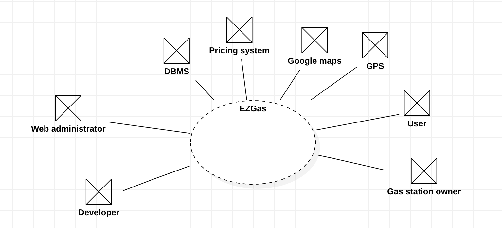
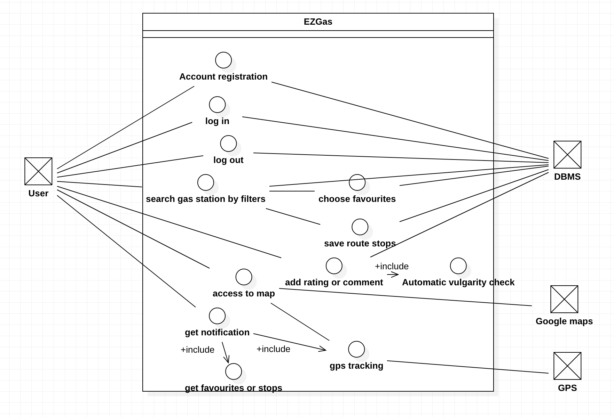
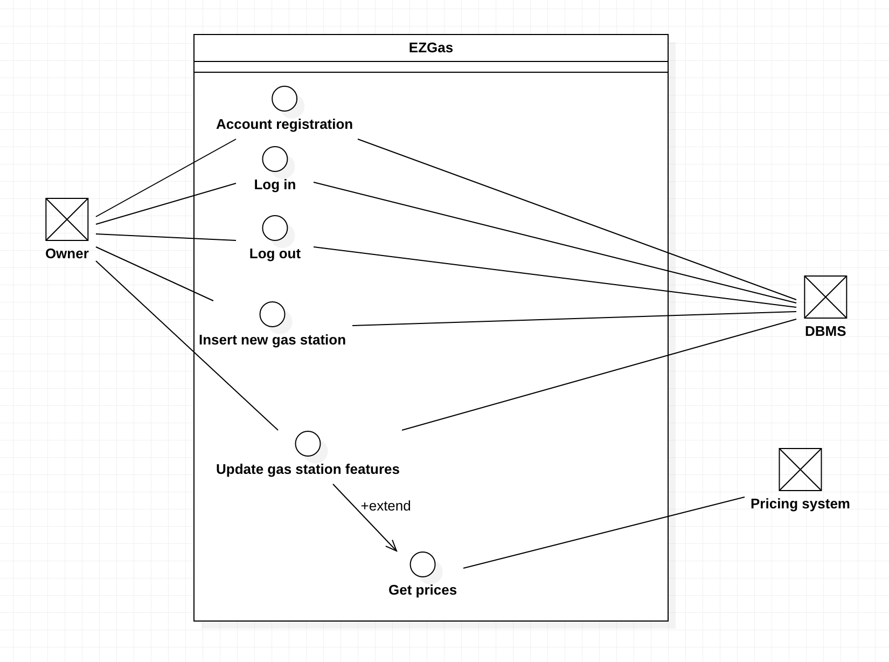
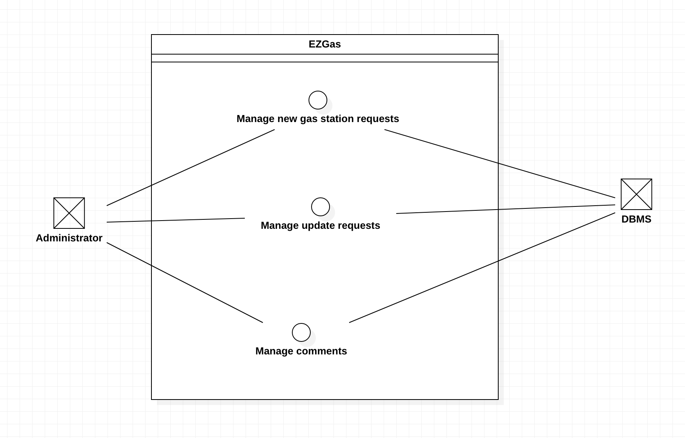

# Official Requirements Document

Authors: Marco Vinai

Date: 24/03/2020

Version: 0

# Contents
- [Abstract](#abstract)
- [Stakeholders](#stakeholders)
- [Context Diagram and interfaces](#context-diagram-and-interfaces)
	+ [Context Diagram](#context-diagram)
	+ [Interfaces](#interfaces) 
	
- [Stories and personas](#stories-and-personas)
- [Functional and non functional requirements](#functional-and-non-functional-requirements)
	+ [Functional Requirements](#functional-requirements)
	+ [Non functional requirements](#non-functional-requirements)
- [Use case diagram and use cases](#use-case-diagram-and-use-cases)
	+ [Use case diagram](#use-case-diagram)
	+ [Use cases](#use-cases)
	+ [Relevant scenarios](#relevant-scenarios)

# Abstract

EZGas is a crowdsourcing Web Application that informs users about prices and locations of different gas stations.
The user can access this service using a smartphone or a PC and can easily get wich is the nearest or cheaper gas station, so that he can manage his travels.
At the same time gas station holders can use this platform to get better reputation and advertising.

# Stakeholders

| Stakeholder name  | Description | 
| ----------------- |:-----------:|
| Web administrator     |Access the web app as moderator to check comments and veridicity of gas station owner requests(gas station exists, p.iva ok)| 
| User        |Access the web app to check where are the gas stations and which is their price according on some parameters (restaurant, car washing, brand)|
|Gas station owner| Access the web app to update prices and info about his gas station| 
|Developer| Develop the web application|
|Google Maps|Provide API for maps|
|DBMS Provider(Oracle,others)|Provide database service and interactions|

# Context Diagram and interfaces

## Context Diagram

## Interfaces
| Actor | Logical Interface | Physical Interface  |
| ------------- |:-------------:| -----:|
|Web Administrator|GUI,IDE |Screen, keyboard|
|User|GUI|Smartphone/screen,keyboard|
|Gas Station owner|GUI|Smartphone/screen,keyboard|
|Developer|GUI,IDE|Screen, keyboard|
|Google Maps|Web service API|Internet connection|
|DBMS|Web service API|Internet connection|
|Pricing System|Web service API|Internet connection|
|GPS|Web service API|GPS|

# Stories and personas
Nathan has a gas station outside a city, near an orbital road and want to be more known by the citizen of the near city. His prices are lower than the competitors and the location is quite strategic, but right now the citizens prefer to go to internal gas station, even if more expensive. Nathan would like to have a way to better advertise his prices.

Joel has a gas station in a highway: prices are quite high due to location, but his services are the best: there are a picnic area, a restaurant, restrooms with showers, a bar, a minimarket and a car wash service. He would like to better advertise his offer, in order to have more customers.

Jesse is a housewife: she rarely uses her car and when she does, she have problem to find proper gas station, since she has a gpl car. She would like to better understand where are gpl stations, so that she can move more with her car.Since there are few gpl stations, she also would like to keep under control those she knows and receive information if they change price.

Ash is a world traveler: with his camper he visited almost all Europe, but each time he arrives in a new city, he have some problems to find properly gas stations. He would like to check in advance where to go to refill his vehicle, in order to better organize his journeys.

# Functional and non functional requirements

## Functional Requirements

| ID        | Description  |
| ------------- |:-------------:| 
|  FR1     | Record new gas station |  
|  FR2     | Record fuel type and daily prices af a gas station|
|  FR3     | Record services and facilities of a gas station|
|  FR4     | Manage Account registation |
|  FR5     | Manage Account log in/log out sessions|
|  FR6     | Manage favourites gas station |
|  FR7     | Manage notifications (change of prices of favourite gas station/route)|
|  FR8     | Map display |
|  FR9     | GPS tracking |
|  FR10    | Manage ratings and comments for gas stations|
|  FR11    | Save intermediate stops in a route |
|  FR12    | Notify approaching to a presaved stop |
|  FR13    | Enable searching by filters |

## Non Functional Requirements

| ID        | Type (efficiency, reliability, .. see iso 9126)           | Description  | Refers to |
| ------------- |:-------------:| :-----:| -----:|
|  NFR1     | Usability | Application should be used with no training by both users and gas station owners  | All FR |
|  NFR2     | Performance | All functions should complete in < 1 sec  | All FR |
|  NFR3     | Portability | The application runs on every browser and on android/iOS| All FR |
|  NFR4     | Localisation | Decimal numbers use . (dot) as decimal separator |FR2|
|  NFR5     | Localisation | Prices have three digit decimal precision|FR2|

# Use case diagram and use cases

## Use case diagram

### User

## Use Cases 

### Use case 1, UC1 - FR4  Account registration

| Actors Involved        | User/Owner |
| ------------- |:-------------:| 
|  Precondition     | User U exists, account A doesn't exist |  
|  Post condition     | Account created |
| | Username and password stored in database |
|  Nominal Scenario     | User U access the webpage, select username and password, validate account via email and signs up. Website check them and create account.|
|  Variants     | Username already existing, password too short, email validation failure -> issue warning|

### Use case 2, UC2 - FR5 Log in

| Actors Involved        | User/Owner |
| ------------- |:-------------:| 
|  Precondition     | User has account, wnat to log in |  
|  Post condition     | User logged in |
|  Nominal Scenario     | User insert username and password and get in the web application home|
|  Variants     | Username and password are wrong -> issue warning |

### Use case 3, UC3 - FR5 Log out

| Actors Involved        | User/Owner |
| ------------- |:-------------:| 
|  Precondition     | User is logged in  |  
|  Post condition     | Log out performed |
|  Nominal Scenario     | User asks to log out and the session is terminated|
|  Variants     |  |

### Use case 4, UC4 - FR13 Search Gas Station by filter

| Actors Involved        | User |
| ------------- |:-------------:| 
|  Precondition     | User logged in |  
|  Post condition     | User get list of gas station filtered by his filter |
|  Nominal Scenario     | User chooses from set of filters and performs search, retreving list of matching gas stations|
|  Variants     | No match found -> issue message |

### Use case 5, UC5 - FR6 Choose favourites

| Actors Involved        | User  |
| ------------- |:-------------:| 
|  Precondition     | User logged in,  gas station exists in web app|  
|  Post condition     | Gas station saved in favourites |
|  Nominal Scenario     | User chooses gas station from list of filtered possibilities or directly from map, then want to save it, marking it as favourite. |
|  Variants     |  |

### Use case 6, UC6 - FR11 Save intermediate stops in a route

| Actors Involved        | User |
| ------------- |:-------------:| 
|  Precondition     | User logged in |  
|  Post condition     | Stops and route saved |
|  Nominal Scenario     | User chooses from map the route and in it selects intermediate stops to be saved |
|  Variants     | route not found (arrival or destination not existing)-> issue message |

### Use case 7, UC7 - FR10 Add ratings or comment

| Actors Involved        | User |
| ------------- |:-------------:| 
|  Precondition     | User logged in, gas station exists in web app, gas station not rated yet |
| Post condition     |  Comment inserted |
|| New average rating computed |
|  Nominal Scenario     | User want to give a feedback on a gas station, selects it and write a comment and a rating. This comment is then added to the gas station page. |
|  Variants     |  Comment not accepted due to vulgarity -> issue message |

### Use case 8, UC8 - FR8-FR9 Access to map + GPS Tracking

| Actors Involved        | User |
| ------------- |:-------------:| 
|  Precondition     | User logged in, GPS on | 
| Post condition     |  Map displayed |
|  Nominal Scenario     | User wants to access directly the map from main menu or from gas station page, gets redirected to map page with all gas stations highlighted and real time GPS position|
|  Variants     |  GPS not accessible |

### Use case 9, UC9 - FR7 Get notification due to change in favourite

| Actors Involved        | User |
| ------------- |:-------------:| 
|  Precondition     | User logged in, change in favourite gas station | 
| Post condition     |  Notification received |
|  Nominal Scenario     | Owner of a gas station changes price/ offers/name/other -> the user tha tselected that gas station as favourite receive notification|
|  Variants     |  User not logged -> no notification/buffer to send notification when logging |

### Use case 10, UC10 - FR12 Get notification due to approaching to route stop 
| Actors Involved        | User |
| ------------- |:-------------:| 
|  Precondition     | User logged in, stop saved, GPS on, distance from stop = 1 km (customizable)| 
| Post condition     |  Notification received, save stop as done |
|  Nominal Scenario     | User saved some stops in a route he wanted to do, receive a notification when is approaching the stop. |
|  Variants     |  User not logged/GPS not working -> no notification |

### Owner

### Use case 11, UC11 - FR1 Insert new gas station
| Actors Involved        | Owner |
| ------------- |:-------------:| 
|  Precondition     | Owner logged in, gas station exists | 
| Post condition     |  Gas station insertion request forwarded |
|  Nominal Scenario     | Owner wants to insert his gas station in this web app, so logs in and asks for insertion filling a form, with all the features and p.iva. Then wait for insertion request approval |
|  Variants     |  |

### Use case 12, UC12 - FR3 Upate gas station features
| Actors Involved        | Owner |
| ------------- |:-------------:| 
|  Precondition     | Owner logged in, gas station in website| 
| Post condition     |  Features request forwarded |
|  Nominal Scenario     | Owner wants to update features of the gas station, access proper modification page and forward update request. Then wait for approval |
|  Variants     |   |

### Use case 13, UC13 - FR2 Update fuel cost
| Actors Involved        | Pricing system |
| ------------- |:-------------:| 
|  Precondition     | Gas station in website | 
| Post condition     |  Prices of gas station updated |
|  Nominal Scenario     | The web app daily gets prices of all gas station saved, accessing automatically an external pricing system website, with all data |
|  Variants     |  Gas station not in pricing system website -> prices not available |

### Admin

### Use case 14, UC14 - FR1 Manage new gas station request
| Actors Involved        | Admin |
| ------------- |:-------------:| 
|  Precondition     | Gas station inertion request exists | 
| Post condition     |  New gas station added |
|  Nominal Scenario     | Web administrator receives a request, checks p.iva correctness, veridicity of information, then approves request and contacts the gas station owner|
|  Variants     |  Gas station not existing -> request denied|
|| Information not valid -> modify it or ask to resend |

### Use case 15, UC15 - FR3 Manage update request
| Actors Involved        | Admin |
| ------------- |:-------------:| 
|  Precondition     | Gas station update request exists | 
| Post condition     |  Update approved -> gas station info updated |
|  Nominal Scenario     | Web administrator receives a request, contacts the gas station owner and checks veridicity of information. Then approves request |
|  Variants     | Information not valid or fraudolent -> update denied |

### Use case 16, UC16 - FR10 Manage comments 
| Actors Involved        | Admin |
| ------------- |:-------------:| 
|  Precondition     | New comment inserted | 
| Post condition     |   |
|  Nominal Scenario     | Web administrator supervise automatic vulgarity check.|
|  Variants     | If still some vulgar or spam comments -> delete it  |

# Relevant scenarios

## Scenario 1

| Scenario ID: SC1        | Corresponds to UC1,UC2,UC3,UC4,UC5  |
| ------------- |:-------------| 
| Description | User U wants to use this service for the first time, selecting a favourite gas station with filters|
| Precondition |  U is not registered yet, web service active, gas stations already registered|
| Postcondition |  Accout created, gas station selected associated to U favourites |
| Step#        |  Step description   |
|  1     | User clicks on Sign up option of web app interface |  
|  2     | U fills form with mail, password and username|
|  3     | U verify the creation of the account through mail |
|  4 	 | U logs in using username and password created|
|  5	 | U Access the home and open the filter menu|
|  6	 | U selects features wanted (Address, facilities, fuel type, price range)|
|  7	 | U clicks on preferred gas station|
|  8	 | U adds gas station to favourites using apposite button|
|  9	 | U logs out |

## Scenario 2
| Scenario ID: SC2        | Corresponds to UC1,UC2,UC3,UC5,UC8  |
| ------------- |:-------------| 
| Description | User U wants to use this service for the first time, selecting a favourite gas station using the map|
| Precondition |  U is not registered yet, web service active, gas stations already registered|
| Postcondition |  Accout created, gas station selected associated to U favourites |
| Step#        |  Step description   |
|  1     | User clicks on Sign up option of web app interface |  
|  2     | U fills form with mail, password and username|
|  3     | U verify the creation of the account through mail |
|  4 	 | U logs in using username and password created|
|  5	 | U Access the home and opens the map|
|  6	 | U selects gas station wanted|
|  7	 | U adds gas station to favourites using apposite button|
|  8	 | U logs out |

## Scenario 3
| Scenario ID: SC3        | Corresponds to UC1,UC2,UC3,UC11  |
| ------------- |:-------------| 
| Description | Owner O wants to use this service for the first time, inserting his gas station|
|Precondition |  O and his gas station not registered yet|
|Postcondition |  account of O created, gas station request forwarded |
| Step#        | Step description  |
|  1     | Owner clicks on Sign up option of web app interface |  
|  2     | O fills form with mail, password and username|
|  3     | O verify the creation of the account through mail |
|  4 	 | O logs in using username and password created|
|  5     | O clicks on "insert new gas station" button|
|  6     | O fills the form with information (p.iva, address, description, facilities, photos, services, fuel types, service time)|
|  7     | O waits for request confermation and insertion|

## Scenario 4
| Scenario ID: SC4       | Corresponds to UC14  |
| ------------- |:-------------| 
| Description | Web admin checks and manage gas station insertion request|
| Precondition |  Owner O has already sent gas station request|
| Postcondition |  Web admin accept request and gas station is inserted into site|
| Step#        | Step description  |
|  1     | Web administrator receives notification of new gas station request via mail|  
|  2     | Web administrator accesses Agenzia delle entrate website to check p.iva|
|  3     | Web administrator accesses Google Map to check effective presence of gas station |
|  4 	 | Web administrator checks photos and description/facilities correspondance |
|  5     | Web administrator confirms insertion request|
|  6     | Web administrator notify owner of insertion|

## Scenario 5
| Scenario ID: SC5       | Corresponds to UC15  |
| ------------- |:-------------| 
| Description | Web admin checks and manage gas station modification request|
| Precondition |  Owner O has already sent gas station request|
| Postcondition |  Web admin accept request and gas station is inserted into site|
| Step#        | Step description  |
|  1     | Web administrator receives notification of new gas station request via mail|  
|  2 	 | Web administrator checks photos and facilities modification correspondance |
|  3     | Web administrator confirms modification request|
|  4     | Web administrator notify owner of modification|

## Scenario 6
| Scenario ID: SC6       | Corresponds to UC2,UC3,UC5,UC7,UC8  |
| ------------- |:-------------| 
| Description | User U wants to write an offensive comment on a gas station|
| Precondition |  U is already registered, gas station exists|
| Postcondition |  Comment rejected due to offensive words |
| Step#        |  Step description   |
|  1 	 | U logs in using username and password |
|  2	 | U Access the home and opens the map|
|  3	 | U selects gas station wanted|
|  4	 | U adds a comment containing vulgaritis using the apposite form|
|  5	 | U receive notification of rejected comment due to offensive words |
|  6	 | Message is stored, but not visible for further checks |
|  7	 | U logs out |

