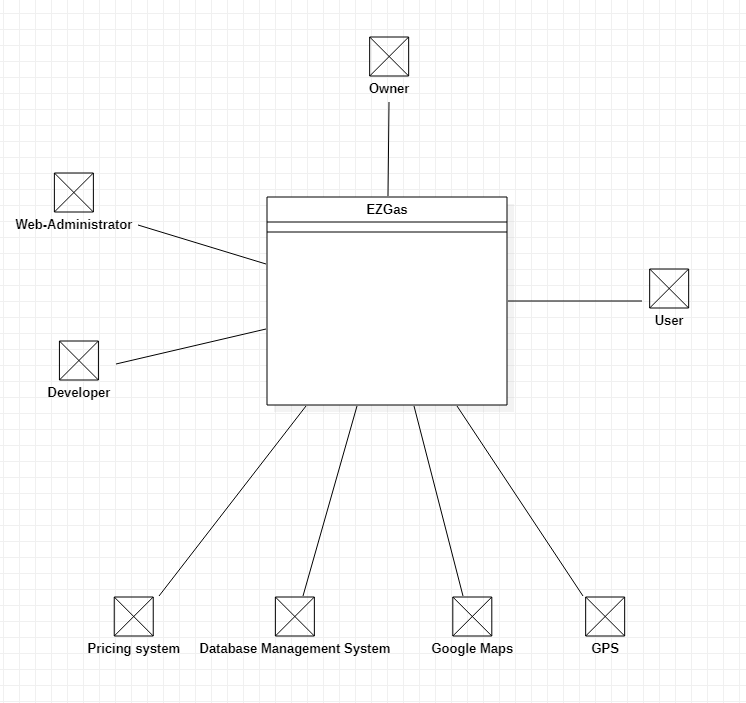
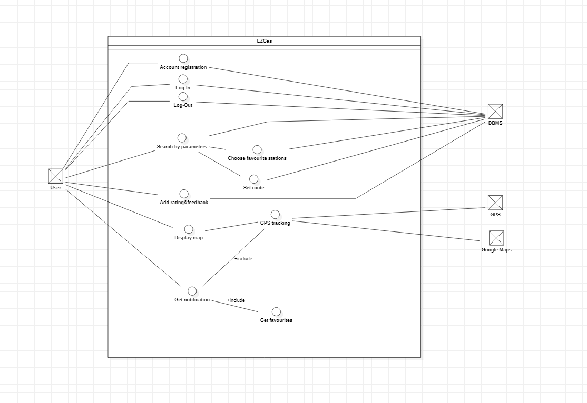
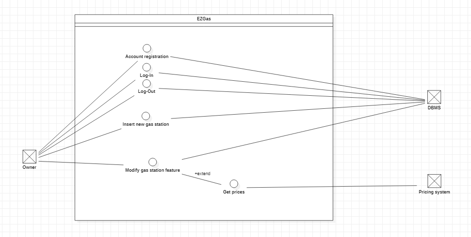
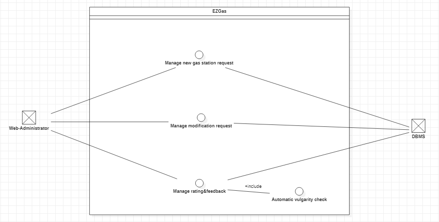

# Official Requirements Document

Authors: Maurizio Morisio, Luca Ardito, Riccardo Coppola

Date: 24/03/2020

Version: 0

# Contents
- [Abstract](#abstract)
- [Stakeholders](#stakeholders)
- [Context Diagram and interfaces](#context-diagram-and-interfaces)
	+ [Context Diagram](#context-diagram)
	+ [Interfaces](#interfaces) 
	
- [Stories and personas](#stories-and-personas)
- [Functional and non functional requirements](#functional-and-non-functional-requirements)
	+ [Functional Requirements](#functional-requirements)
	+ [Non functional requirements](#non-functional-requirements)
- [Use case diagram and use cases](#use-case-diagram-and-use-cases)
	+ [Use case diagram](#use-case-diagram)
	+ [Use cases](#use-cases)
	+ [Relevant scenarios](#relevant-scenarios)

- 
# Abstract

EZGas is a web-application devoted to gather data and information about pricing and location of several gas station.
The user can access the service by means of pc or smartphone in order to get easily which is the cheapest or nearest gas station.
Owners of gas station can hence improve their reputation and getting a fresh form of advertising.

# Stakeholders

| Stakeholder name  | Description | 
| ----------------- |:-----------:|
| Web-Administrator     |Access the web-app as moderator (check for vulgarity absence and veridicity of feedbacks, P.IVA and gas stations existance) | 
| User        |Access the web-app to retrieve the best gas station according to some parameters (price, location, availability of restaurant/bar, ...)| 
| Gas station owner    |Access the web-app to update general information of gas station| 
| Developer     |Develop the web-app| 
| Google Maps     |Provide API for maps |
| DBMS provider (Oracle, MongoDB, MariaDB) |Provide DB service | 

# Context Diagram and interfaces

## Context Diagram

## Interfaces
| Actor | Logical Interface | Physical Interface  |
| ------------- |:-------------:| -----:|
|Web-Administrator|GUI, IDE |Screen, keyboard|
|User|GUI |Screen, keyboard, smartphone|
|Gas-station owner|GUI |Screen, keyboard, smartphone|
|Developer|GUI, IDE |Screen, keyboard|
|Google Maps|Web service API|Internet connection|
|Database management system|Web service API|Internet connection|
|Pricing system|Web service API|Internet connection|
|GPS |Web service API|GPS satellite system|

# Stories and personas
Link is the owner of a little country road petrol station that works aside his wife Zelda to refuel and to manage the tiny bar got together with the petrol pump. 
Link wants to extend the brand recognition of his asset but does not want to spend too much money. Moreover, he wants to enlarge his clientele since it is located in a little traffic street.

Kratos and his son Atreus own a gas station in the highway. Prices are quite high since highway billing but the station is equipped with many facilities: Internet access point, GPL pump, self-service restaurant, a mini market, a picnic area, showers and toilets. They would like to highlight their wide offer of services, emphasising the high quality of stay.

Sam Porter Bridges is a freelance carrier and in his life, moving is crucial. He is used to travel on route 34 every week and he knows every gas station location on the way. He wants to be notified while driving with gas companies daily prices in order to pick every time the cheapest place to refuel.

Poldo is always hungry and travelling for him is a torture. He would like to stay update for every gas station on the way equipped with a fast food or a restaurant. 

# Functional and non functional requirements

## Functional Requirements

| ID        | Description  |
| ------------- |:-------------:| 
|  FR1     | Record new gas station |  
|  FR2     | Record fuel type and daily prices |
|  FR3     | Record all facilities and services associated to the gas station |
|  FR4     | Manage account registration |
|  FR5     | Manage log-in/log-out sessions |
|  FR6a    | Manage favourite gas stations |
|  FR6b    | Set favourite routes |
|  FR7     | Manage notifications (Price change, facility discount, approaching a gas station ... on favourites) |
|  FR8    | Display on maps: gas stations and routes with emphasis on favourites |
|  FR9    | Manage rating and feedbacks for gas stations |
|  FR10   | Search gas stations by parameters |
|  FR11   | GPS tracking |

## Non Functional Requirements

| ID        | Type (efficiency, reliability, .. see iso 9126)           | Description  | Refers to |
| ------------- |:-------------:| :-----:| -----:|
|  NFR1     | Usability | Application should be used with no training | All FR |
|  NFR2     | Performance | All functions should complete in < 1 sec  | All FR |
|  NFR3     | Portability | The application runs on every browser and on Android/IOS  | All FR |
|  NFR4     | Localisation | Decimal numbers use . (dot) as decimal separator | FR2 |
|  NFR5     | Localisation | Decimal numbers have 3-digit decimal precision | FR2 |

# Use case diagram and use cases

## Use case diagram - User

## Use Cases

### Use case 1, UC1 - FR4  Account registration

| Actors Involved        | User/Gas-station Owner |
| ------------- |:-------------:| 
|  Precondition     | User U exists, account to be created (doesn't exist yet) |  
|  Post condition     | Account created |
| | Username and password stored in DB |
|  Nominal Scenario     | User U accesses the web-app, select username and password, validate account via email, sign up|
|  Variants     | Password too short or not safe, username containing vulgarity, email not confirmed -> Issue warning |

### Use case 2, UC2 - FR5 Manage Log-In

| Actors Involved        | User/Gas-station owner |
| ------------- |:-------------:| 
|  Precondition     | Account exists, User U is not logged in |  
|  Post condition     | U logged in |
|  Nominal Scenario     | User U accesses the web-app, enter email/username and password, sign in |
|  Variants     | Username/Password/Email not correct |

### Use case 3, UC3 - FR5 Manage Log-Out

| Actors Involved        | User/Gas-station owner |
| ------------- |:-------------:| 
|  Precondition     | Account exists, User U is logged in |  
|  Post condition     | U logged out |
|  Nominal Scenario     | User U asks for log-out, log-out |
|  Variants     | |

### Use case 4, UC4 - FR10 Search gas stations by parameters 

| Actors Involved        | User |
| ------------- |:-------------:| 
|  Precondition     | User logged in |  
|  Post condition     | User gets list of gas stations filtered by U's parameters |
|  Nominal Scenario     | U enter some parameters (type of fuel, presence of facilities, location, price range, ... ), start the search, get gas-stations|
|  Variants     | No match found with entered parameters -> Issue "not found" |

### Use case 5, UC5 - FR6a Manage favourite gas stations

| Actors Involved        | User |
| ------------- |:-------------:| 
|  Precondition     | User U logged in, gas station exists inside the DB|  
|  Post condition     | Gas station set as favourite |
|  Nominal Scenario     | User chooses gas station from the map or from a search, then gas station marked as favourite |
|  Variants     | |

### Use case 6, UC6 - FR6b Set favourite routes

| Actors Involved        | User  |
| ------------- |:-------------:| 
|  Precondition     | User U logged in |  
|  Post condition     | Favourite route set |
|  Nominal Scenario     | User accesses map section in the web-app, select a route, mark route as favourite|
|  Variants     | Arrival/Destination not existing -> issue "Warning" |

### Use case 7, UC7 - FR9 Add rating and feedbacks for gas stations

| Actors Involved        | User |
| ------------- |:-------------:| 
|  Precondition     | User U logged in, gas station exists, gas station not rated yet |  
|  Post condition     | Rating and feedback forwarded |
|  Nominal Scenario     | User U searches a gas station, rate from 0-5 and associate a feedback |
|  Variants     | Gas station not existing, u in feedback section |

### Use case 8, UC8 - FR8/FR11 Display map

| Actors Involved        | User |
| ------------- |:-------------:| 
|  Precondition     | User U logged in, User's GPS on |  
|  Post condition     | Map retrieved |
|  Nominal Scenario     | User U can access directly the map from main menu or from gas station page, it is redirected to maps with gas station higlighted and real-time GPS position  |
|  Variants     | GPS not accessible |

### Use case 9, UC9 - FR7 Get notification of change

| Actors Involved        | User |
| ------------- |:-------------:| 
|  Precondition     | User U logged in, User's GPS on, change among favourites (fuel price changed, gas station facilities modified, discount incoming, ..) |  
|  Post condition     | User notified |
|  Nominal Scenario     | Web-app reacts in a change of gas stations' features and notify the user |
|  Variants     | User not logged -> store in buffer, send notifications when logged |

### Use case 10, UC10 - FR7 Get notification of proximity

| Actors Involved        | User |
| ------------- |:-------------:| 
|  Precondition     | User U logged in, User's GPS on, User U approaching a favourite gas station (distance from gas station <= U.distance) |  
|  Post condition     | User notified |
|  Nominal Scenario     | User U notified when approaching a favourite gas station or a gas station along the route set |
|  Variants     | User not logged -> store in buffer, send notifications when logged |

## Use case diagram - Owner

## Use Cases

### Use case 11, UC11 - FR1 Insert new gas station

| Actors Involved        | Owner |
| ------------- |:-------------:| 
|  Precondition     | Owner O logged in, gas station exists |  
|  Post condition     | Gas station insertion request forwarded |
|  Nominal Scenario     | Owner O inserts new gas station and all his features (type of fuel, facilities, ...), forward insertion request, waits for insertion request approval |
|  Variants     | |

### Use case 12, UC12 - FR3 Modify gas station features

| Actors Involved        | Owner |
| ------------- |:-------------:| 
|  Precondition     | Owner O logged in, gas station exists in DB |  
|  Post condition     | Gas station modification request forwarded |
|  Nominal Scenario     | Owner O modifies/add/remove gas station features, forward modification request, wait for approval  |
|  Variants     | |

### Use case 13, UC13 - FR2 Update fuel price

| Actors Involved        | Pricing system |
| ------------- |:-------------:| 
|  Precondition     | Gas station exists in DB |  
|  Post condition     | Fuel Prices updated |
|  Nominal Scenario     | The web-app gets daily prices of each petrol company from Pricing system API automatically |
|  Variants     | Gas station not in pricing system -> Issue "cannot access automatic pricing" |

## Use case diagram - Web Administrator

## Use Cases

### Use case 14, UC14 - FR1 Manage new gas station request

| Actors Involved        | Web Administrator  |
| ------------- |:-------------:| 
|  Precondition     | Gas station insertion request exists in DB |  
|  Post condition     | New gas station added |
|  Nominal Scenario     | The Web Administrator receives insertion request, checks P.IVA correctness, check presence of declared features, approves insertion request and contact the owner  |
|  Variants     | Gas station not existing -> issue "request denied" |

### Use case 15, UC15 - FR3 Manage modification request

| Actors Involved        | Web Administrator  |
| ------------- |:-------------:| 
|  Precondition     | Gas station modification request exists in DB |  
|  Post condition     | Gas station correctly modified |
|  Nominal Scenario     | The Web Administrator receives modification request, contact the gas station owner, check veridicity of request's features, approves insertion request  |
|  Variants     | Gas station modification fraudulent -> issue "request denied" |

### Use case 16, UC16 - FR9 Manage rating & feedback

| Actors Involved        | Web Administrator  |
| ------------- |:-------------:| 
|  Precondition     | New comment (rate+feedback) inserted |  
|  Post condition     |  |
|  Nominal Scenario     | The Web Administrator supervise automatic vulgarity check  |
|  Variants     | Comment contains vulgarity or spam -> cancel comment |

# Relevant scenarios

## Scenario 1

| Scenario ID: SC1        | Corresponds to UC1-UC2-UC3-UC4-UC5  |
| ------------- |:-------------| 
| Description | User U registrates his credentials, logs in and set some favourites, then he logs out|
| Precondition |  U is not registered yet (email not already in DB) |
| Postcondition |  account of U created, favourites gas stations associated to account of U |
| Step#        |  Step description   |
|  1     | U clicks on sign-up on web app interface |  
|  2     | U inserts username, password and a reference email |
|  3     | U confirms email from own mail system and validates account |
|  4 	 | U inserts username and password to log in |
|  5 	 | U browses the system using search bar applying filters (address, facilities, name of gas station, fuel type, price range) to find one or many favourites gas station and he adds it to list of favourites by clicking on it |
|  6	 | U logs out |

## Scenario 2

| Scenario ID: SC1        | Corresponds to UC1-UC2-UC3-UC8-UC5  |
| ------------- |:-------------| 
| Description | User U registrates his credentials, logs in and set some favourites, then he logs out|
| Precondition |  U is not registered yet (email not already in DB) |
| Postcondition |  account of U created, favourites gas stations associated to account of U |
| Step#        |  Step description   |
|  1     | U clicks on sign-up on web app interface |  
|  2     | U inserts username, password and a reference email |
|  3     | U confirms email from own mail system and validates account |
|  4 	 | U inserts username and password to log in |
|  5 	 | U browses the system using the map to find one or many favourites gas station and he adds it to list of favourites by clicking directly on the gas station displayed on map |
|  6	 | U logs out |

## Scenario 3

| Scenario ID: SC1        | Corresponds to UC1-UC2-UC3-UC11 |
| ------------- |:-------------| 
| Description | Owner O registrates his credentials, logs in and inserts his gas station|
| Precondition |  O is not registered yet (email not already in DB) |
| Postcondition |  account of O created, favourites gas stations requested to be inserted in the system waiting for confirmation |
| Step#        |  Step description   |
|  1     | O clicks on sign-up on web app interface |  
|  2     | O inserts username, password and reference email |
|  3     | O confirms email from own mail system and validates account |
|  4 	 | O fills gas station insertion request (P.IVA, facilities, type of fuel, photo, address, description of the station, services, opening/closure time) |
|  5 	 | O waits for confirmation |

## Scenario 4

| Scenario ID: SC1        | Corresponds to UC14 |
| ------------- |:-------------| 
| Description | Web Administrator WA checks and manage insertion requests |
| Precondition |  Owner O has already inserted gas station insertion request |
| Postcondition | WA completes gas station in sertion request check process |
| Step#        |  Step description   |
|  1     | WA receives notification of new gas station insertion request via mail |  
|  2     | WA accesses "Agenzia delle entrate" website to check O's P.IVA veridicity |
|  3     | WA checks on maps veridicity of location |
|  4 	 | WA parses photo appended with insertion request to check correspondances with declared facilities and fuel type |
|  5 	 | WA confirms gas station insertion request and notify O |

## Scenario 5

| Scenario ID: SC1        | Corresponds to UC15 |
| ------------- |:-------------| 
| Description | Web Administrator WA checks and manage modification requests |
| Precondition |  Owner O has already inserted gas station modification request |
| Postcondition | WA completes gas station modification request check process |
| Step#        |  Step description   |
|  1     | WA receives notification of new gas station modification request via mail |  
|  2 	 | WA parses photo appended with modification request to check veridicity of new service/facility |
|  5 	 | WA confirms gas station modification request and notify O |

## Scenario 6

| Scenario ID: SC1        | Corresponds to UC1-UC2-UC3-UC8-UC5  |
| ------------- |:-------------| 
| Description | User U wants to upload an offensive comment (rate + feedback) |
| Precondition |  U is registered (email already in DB) |
| Postcondition |  comment rejected |
| Step#        |  Step description   |
|  1     | U logs in with username and password |  
|  2     | U inserts username, password and a reference email |
|  3 	 | U browses the system using the map to find one gas station |
|  4	 | U adds a comment containing vulgarity/offensive language using dedicated comment form |
|  5      | U receives a warning for bad behaviour and rejected comment is stored in a buffer for further claims |
