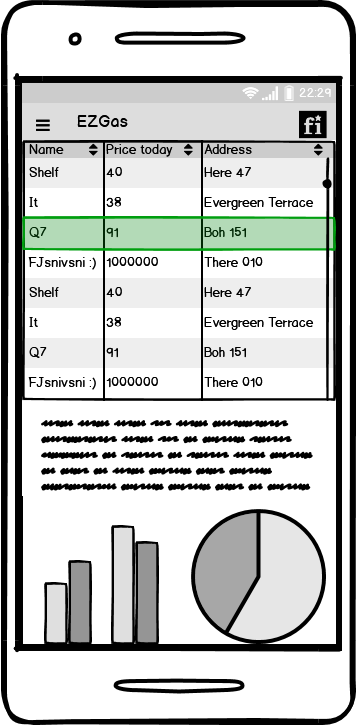

# EZGas: Official Requirements Document

Authors: Andrea Bruno

Date: 31/03/2020

Version: 3

Change history

| Version | Changes | 
| ----------------- |:-----------|
| 2 | Added map service (Google maps) in the system |
| 3 | Updated file names to be compatible with public repository |

# Contents
- [Abstract](#abstract)
- [Stakeholders](#stakeholders)
- [Context Diagram and interfaces](#context-diagram-and-interfaces)
	+ [Context Diagram](#context-diagram)
	+ [Interfaces](#interfaces) 
	
- [Stories and personas](#stories-and-personas)
- [Functional and non functional requirements](#functional-and-non-functional-requirements)
	+ [Functional Requirements](#functional-requirements)
	+ [Non functional requirements](#non-functional-requirements)
- [Use case diagram and use cases](#use-case-diagram-and-use-cases)
	+ [Use case diagram](#use-case-diagram)
	+ [Use cases](#use-cases)
	+ [Relevant scenarios](#relevant-scenarios)
- [Glossary](#glossary)
- [GUI Prototype](#gui-prototype)
    + [User](#user)
    + [Owner](#owner)

# Abstract

It is usually difficult for a driver to find a gas station near them when the tank is running low on fuel, and it's even worse if they want to save money choosing a station that offers a good deal. And, to add insult to injury, right after filling up the tank, they find another gas station with a much lower price.

EZGas is a service that provides a simple and complete preview of the gas stations near the user, as well as the prices of their fuel.

# Stakeholders

| Stakeholder name  | Description | 
| ----------------- |:-----------:|
| User | Uses the system to locate the nearest and cheapest gas station |
| Gas station owner | Doesn't use directly the application, provides its fuel prices |
| Map service | Provides maps and related functionalities |
| Administrator | Manages and supervises the system |

# Context Diagram and interfaces

## Context Diagram

## Interfaces
| Actor | Logical Interface | Physical Interface  |
| ------------- |:-------------:|:-----:|
| User | App/website/other platform | Personal device |
| Gas station | Direct channel | Direct channel |
| Map service | API | Internet |

# Stories and personas

- Tom travels in a lot of different cities, and he needs to know the position of nearby gas stations without roaming around or asking for directions every few minutes
- Jennifer is a commuter, and every day takes a long drive to go to work. She knows the gas stations near her usual route, but the prices are always changing and she always wonders where to stop to have the best deal.
- Any Gas is a large company, and it wants to be as easily available as possible. Its brand is easily recognizable, but drivers may not be aware of branches in less crowded areas of their cities
- Shelf is a family business and they usually offer competitive prices, but only loyal customers are aware of it. Due to this, a lot of people don't stop at their gas station simply because they're unaware of it.

# Functional and non functional requirements

## Functional Requirements

| ID        | Description  |
| ------------- |:-------------| 
|  FR1     | Show the position of the gas station |  
|  FR2     | Show the map of the zone |
|  FR3     | Show the price of each type of fuel in each gas station |
|  FR4     | Provide login functionality |
|  FR5     | Provide logout functionality |
|  FR6     | Embed user preferences and settings |
|  FR7     | Provide direction to a selected gasa station |
|  FR8     | Sort gas stations by proximity |
|  FR9     | Sort gas stations by fuel price |
|  FR10    | Show gas station interface |
|  FR11    | Insert new gas station |
|  FR12    | Update fuel price |

## Non Functional Requirements

| ID        | Type (efficiency, reliability, .. see iso 9126)           | Description  | Refers to |
| ------------- |:-------------:| :-----| :-----:|
|  NFR     | Reliability | System down time < 1 hour per year  | All FR  |
|  NFR     | Usability | Mean number of user inputs | FR 3-5, 7-9 |
|  NFR     | Efficiency | All functions should complete in < 1  sec  | FR 1-9 |

# Use case diagram and use cases

## Use case diagram

## Use Cases

### Use case 1, UC1 - FR4,5  Authentication

| Actors Involved        | User, Owner |
| ------------- |:-------------:| 
|  Precondition     | Account exists |  
|  Post condition     | User/Owner authenticated |
|  Nominal Scenario     | SC1, SC2 |
|  Variants     | User login , Owner login, successful login (SC1), failed login (SC2) |

### Use case 2, UC2 - FR1,2,6,7,8  Locate gas station

| Actors Involved        | User |
| ------------- |:-------------:| 
|  Precondition     | User authenticated |  
|  Post condition     | Gas station selected |
|  Nominal Scenario     | SC3 |
|  Variants     | Multiple gas stations, sorted by proximity (SC4) |

### Use case 3, UC3 - FR3,6,9 Show fuel price

| Actors Involved        | User |
| ------------- |:-------------:| 
|  Precondition     | User authenticated |  
|  Post condition     | Price selected |
|  Nominal Scenario     | SC5 |
|  Variants     | Price from multiple gas stations, sorted by price(SC6) |

### Use case 4, UC4 - FR10  Request gas station statistics

| Actors Involved        | Owner |
| ------------- |:-------------:| 
|  Precondition     | Owner authenticated |  
|  Post condition     | Statistics shown |
|  Nominal Scenario     | SC7 |

### Use case 5, UC5 - FR10,11,12  Update gas station info

| Actors Involved        | Owner |
| ------------- |:-------------:| 
|  Precondition     | Owner authenticated |  
|  Post condition     | Gas station status updated |
|  Nominal Scenario     | SC8 |

# Relevant scenarios

- Request gas station statistics
- Update gas station info

## Scenario 1

| Scenario ID: SC1        | Corresponds to UC1  |
| ------------- |:-------------| 
| Description | Authentication executed correctly |
| Precondition |  User has correct user credentials |
| Postcondition |  User is authenticated, a new session is created |
| Step#        |  Step description   |
|  1     | System presents a login form |  
|  2     | User inputs authentication credentials |
|  3     | System evaluates credentials |
|  4     | System generates new session |
|  5     | System proposes a personal page to User |

## Scenario 2

| Scenario ID: SC2        | Corresponds to UC1  |
| ------------- |:-------------| 
| Description | Authentication error |
| Precondition |  User has incorrect user credentials |
| Postcondition |  User is not authenticated |
| Step#        |  Step description   |
|  1     | System presents a login form |  
|  2     | User inputs wrong authentication credentials |
|  3     | System evaluates credentials |
|  4     | System generates error message |

## Scenario 3

| Scenario ID: SC3        | Corresponds to UC2  |
| ------------- |:-------------| 
| Description | Gas stations shown on the map |
| Precondition |  |
| Postcondition |  Gas station located |
| Step#        |  Step description   |
|  1     | System retrieves User location |  
|  2     | System retrieves nearby gas station locations |
|  3     | System shows gas station locations |

## Scenario 4

| Scenario ID: SC4        | Corresponds to UC2  |
| ------------- |:-------------| 
| Description | Gas stations sorted by proximity |
| Precondition | User selected corresponding option |
| Postcondition |  Gas stations located and sorted |
| Step#        |  Step description   |
|  1     | System retrieves User location |  
|  2     | System retrieves nearby gas station locations |
|  3     | System sorts gas stations by proximity |
|  4     | System shows gas station locations and relative proximity |

## Scenario 5

| Scenario ID: SC5        | Corresponds to UC3  |
| ------------- |:-------------| 
| Description | Price shown to the User |
| Precondition |  |
| Postcondition |  Prices shown |
| Step#        |  Step description   |
|  1     | System retrieves price from gas stations |  
|  2     | System shows gas station prices |

## Scenario 6

| Scenario ID: SC6       | Corresponds to UC3  |
| ------------- |:-------------| 
| Description | Price sorted |
| Precondition | User selected corresponding option |
| Postcondition |  Prices sorted and shown |
| Step#        |  Step description   |
|  1     | System retrieves price from gas stations | 
|  2     | System orders prices |
|  2     | System shows gas station prices in order |

## Scenario 7

| Scenario ID: SC5        | Corresponds to UC4  |
| ------------- |:-------------| 
| Description | Owner requests gas station statistics |
| Precondition | Owner authenticated |
| Postcondition |  Statistics shown |
| Step#        |  Step description   |
|  1     | System retrieves gas station statistics |  
|  2     | System shows gas station statistics |

## Scenario 8

| Scenario ID: SC8        | Corresponds to UC5  |
| ------------- |:-------------| 
| Description | Owner updates gas station info |
| Precondition | Owner authenticated |
| Postcondition |  Information updated |
| Step#        |  Step description   |
|  1     | Owner updates information |  
|  2     | System updates the database |
|  3     | System shows feedback |

# Glossary

# GUI Prototype

## User

## Owner

