# Official Requirements Document

Author: Loredana Finocchiaro

Date: 05/04/2020

Version: 3

Change history

| Version | Changes | 
| ----------------- |:-----------|
| 3 | Added [GUI prototype](#gui-prototype) |
| | Fixed defects in [Glossary](#glossary) |
| | Fixed defects in some [Use cases](#use-cases) |
| | Fixed defects in [Stories and personas](#stories-and-personas) |
| 2 | Added [Glossary](#glossary)  |
| | Fixed defects in some [Use cases](#use-cases) |
| | Added Non functional requirement [NFR6](#non-functional-requirements) |

# Contents
- [Abstract](#abstract)
- [Stakeholders](#stakeholders)
- [Context Diagram and interfaces](#context-diagram-and-interfaces)
	+ [Context Diagram](#context-diagram)
	+ [Interfaces](#interfaces) 
	
- [Stories and personas](#stories-and-personas)
- [Functional and non functional requirements](#functional-and-non-functional-requirements)
	+ [Functional Requirements](#functional-requirements)
	+ [Non functional requirements](#non-functional-requirements)
- [Use case diagram and use cases](#use-case-diagram-and-use-cases)
	+ [Use case diagram](#use-case-diagram)
	+ [Use cases](#use-cases)
	+ [Relevant scenarios](#relevant-scenarios)
- [Glossary](#glossary)
- [GUI Prototype](#gui-prototype)

# Abstract

EZGas is a crowdsourcing service that allows users to:
- collect prices of fuels in different gas stations;
- locate gas stations in an area, along with the prices they practice.

The service is developed in form of application for smartphones (Android or iOS). In order to be able to use the application, users have to download the app and subscribe a free account.

Prices are kept updated by users and gas stations' managers. Gas stations can be registered by explicit request from managers or indicated by users themselves (in this last case, the gas station will be officially added only after at least 5 reports from different users).

The administrator, who is also the developer, has the role of managing the EZGas application, assuring that the service is always run without any problem. Furthermore, the administrator can accept or refuse the requests for new gas stations to be added.

# Stakeholders

| Stakeholder name  | Description | 
| ----------------- |:-----------:|
| Admin/Developer     |Uses the application to manage pending requests from managers and users that want to add a gas station and to correct eventual bugs in the application| 
| Google Maps        |Provides an Application Program Interface (API) to the application, so that gas stations can be easily localized|
| Gas Station Manager | Uses the application to update regularly prices |
| User	| Uses the application directly, because he is interested in finding the closest gas station with the lowest price and also in keeping prices up to date|

# Context Diagram and interfaces

## Context Diagram

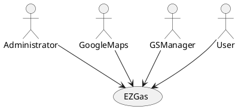

## Interfaces
| Actor | Logical Interface | Physical Interface  |
| ------------- |:-------------:| -----:|
| Admin/Developer | GUI/IDE | Smartphone or screen and  keyboard |
| Google Maps | API | Internet connection |
| GSManagers | GUI | Smartphone, Internet connection |
| Users | GUI | Smartphone, Internet connection |

# Stories and personas
Alice, Susan and Ally are three young and smart women that love travelling around the world by car. It may seem a bit strange choice, but they agree that it's possible to enjoy much more the trip if you simply drive a car, instead of taking airplanes or trains, avoiding frequent delays caused by public transport. You can decide whatever you want: you could also change your plans, feeling yourself completely free from scheduled departures.

One of the most difficult things they have noticed during the first trips is to find gas stations when they are in unknown place for the first time. In fact, Google Maps' application is good for finding the right way in order to reach a certain place, but it is not enough if you're searching for a gas station (possibly with the lowest prices).
Since Ally is a computer engineer, she decided to develop an application on her own in order to solve this issue, probably common to a lot of people.
So EZGas is born.

EZGas is a simple application for smartphones (Android and iOS) that provides the closest gas stations and relative prices on the basis of your GPS position. Gas stations are localized thanks to a specific API of Google Maps.

# Functional and non functional requirements

## Functional Requirements

| ID        | Description  |
| ------------- |:-------------:| 
|  FR1     | Subscribe a new account |  
|  FR2     | Log into an existing account |
|  FR3     | Add a new gas station |
|  FR4     | Indicate a new gas station |
|  FR5     | Search for the closest gas stations |
|  FR6     | Update prices |

## Non Functional Requirements

| ID        | Type (efficiency, reliability, .. see iso 9126)           | Description  | Refers to |
| ------------- |:-------------:| :-----:| :-----:|
|  NFR1     | Usability | The user interface of the application is simple and intuitive. Users need only a smartphone and Internet connection. | All FR |
|  NFR2     | Security | Users must change the initially assigned login password immediately after the first successful login. Privacy of personal information is guaranteed. | FR1 |
|  NFR3     | Portability | The application runs on the most recent versions of Android and iOS.  | All FR |
|  NFR4     | Efficiency | It depends on the constancy of users and managers that have to keep fuel's prices up to date. | FR6 |
|  NFR5     | Maintainability | The application doesn't require constant maintenance; however, the administrator checks periodically for possible raising issues. | All FR |
|  NFR6     | Performance | The application should react with a maximum delay of 1 sec. | All FR |

# Use case diagram and use cases

## Use case diagram

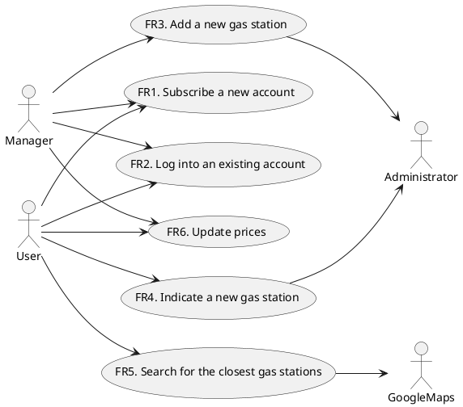
## Use Cases

### Use case 1, UC1 - FR1 Subscribe a new account

| Actors Involved        | User (or Manager) |
| ------------- |:-------------:| 
|  Precondition     | User has never subscribed an account with EZGas |  
|  Post condition     | User is enrolled to EZGas |
|  Nominal Scenario     | User selects the option "Sign in" from the application, then compiles a form providing his personal information. He will receive an e-mail with a link to be clicked in order to change the default password and confirm the subscription. |
|  Variants     | If the inserted e-mail address doesn't exist, user will never receive the link needed for the confirmation. |

### Use case 2, UC2 - FR2 Log into an existing account

| Actors Involved        | User (or Manager) |
| ------------- |:-------------:| 
|  Precondition     | User has already subscribed an account with EZGas |  
|  Post condition     | User is logged in |
|  Nominal Scenario     | User selects the option "Log in" from the application, then inserts his username and password: if these are correct, user will be correctly logged in. |
|  Variants     | If username and/or password are not correct, user will not be able to log in. |

### Use case 3, UC3 - FR3  Add a new gas station

| Actors Involved        | Manager, Administrator |
| ------------- |:-------------:| 
|  Precondition     | Manager has logged in with EZGas (account previously created) and is the owner of a gas station not already inserted |  
|  Post condition     | Gas station added among the available ones |
|  Nominal Scenario     | Manager sends a request for adding his gas station to the Administrator, which will approve that after checking if the information given by the manager are truthful. |
|  Variants     | The administrator may refuse the request if sure about the untruth of the information given by the manager. |

### Use case 4, UC4 - FR4 Indicate a new gas station

| Actors Involved        | User, Administrator |
| ------------- |:-------------:| 
|  Precondition     | User has logged in with EZGas (account previously created) |  
|  Post condition     | Number of reports for that specific station incremented by one |
|  Nominal Scenario     | User sends a request for indicating a gas station to the Administrator. The request will remain pending until it reaches at least 5 reports from different users. |
|  Variants     | If the request is the 5th one related to that specific gas station, the Administrator will add that gas station among the available ones after checking about the veracity of the information given by users. |

### Use case 5, FR5 Search for the closest gas stations

| Actors Involved        | User, GoogleMaps |
| ------------- |:-------------:| 
|  Precondition     | User has logged in with EZGas (account previously created) and has activated the GPS position |  
|  Post condition     | List of gas stations provided based on the GPS position |
|  Nominal Scenario     | User activates the GPS position; the application, thanks to GoogleMaps API, will provide the closest gas stations and relative prices. |
|  Variants     | |

### Use case 6, FR6 Update prices

| Actors Involved        | User (or Manager) |
| ------------- |:-------------:| 
|  Precondition     | User has logged in with EZGas (account previously created) |  
|  Post condition     | Record that prices for a specific gas station have been updated by a certain user in a certain date |
|  Nominal Scenario     | User selects a specific gas station and the option "Update prices", then he inserts the current prices. |
|  Variants     | |

# Relevant scenarios

## Scenario 1

| Scenario ID: SC1        | Corresponds to UC4  |
| ------------- |:-------------| 
| Description | User wants to indicate a new gas station |
| Precondition | The gas station hasn't been inserted by the relative manager, neither indicated by more than three users |
| Postcondition | Number of indications for that specific station incremented by one |
| Step#        |  Step description   |
|  1     | User selects the option "Indicate a new gas station"|  
|  2     | User inserts information about the gas station and its position |
|  3     | The request is confirmed and sent to the Administrator |
|  4 	 | The request remains pending until that gas station receives at least 5 reports by different users |

## Scenario 2

| Scenario ID: SC2        | Corresponds to UC4  |
| ------------- |:-------------| 
| Description | User wants to indicate a new gas station (5th report for that gas station) |
|Precondition | The gas station hasn't been inserted by the relative manager, but it was indicated by other four users |
|Postcondition | Gas station added among the available ones |
| Step#        | Step description  |
|  1     | User selects the option "Indicate a new gas station"|  
|  2     | User inserts information about the gas station and its position |
|  3     | The request is confirmed and sent to the Administrator |
|  4     | Since the request is the 5th one related to that specific gas station, the Administrator can finally process that. |
|  5     | The Administrator, after checking about the veracity of the information given by users, will add the gas station among the available ones. |

# Glossary

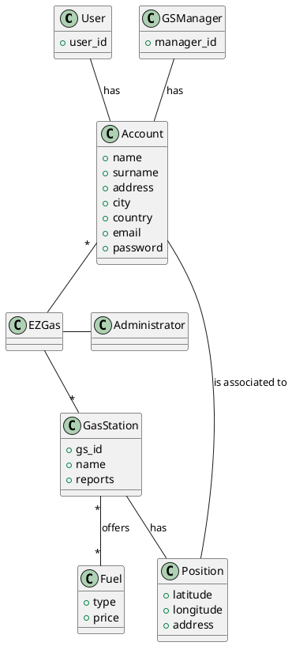

# GUI Prototype

### Use case 1, UC1 - FR1 Subscribe a new account

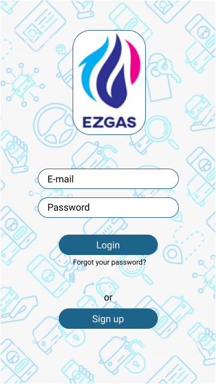 
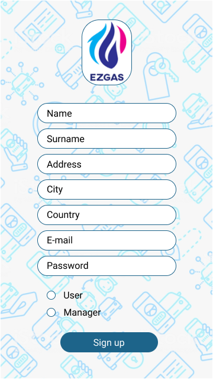

### Use case 2, UC2 - FR2 Log into an existing account

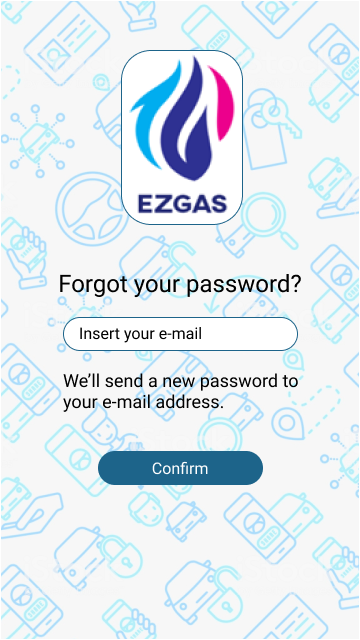

### Use case 3, UC3 - FR3  Add a new gas station
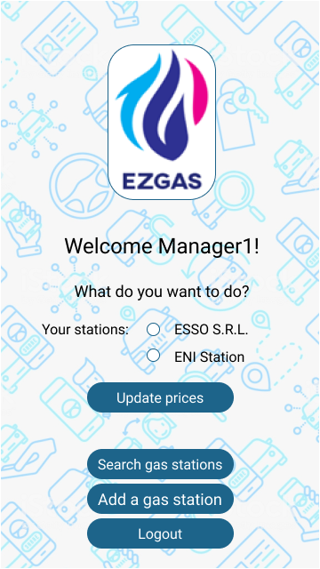
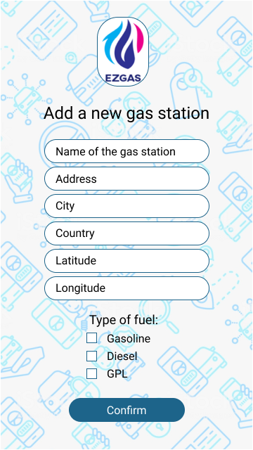

### Use case 4, UC4 - FR4 Indicate a new gas station
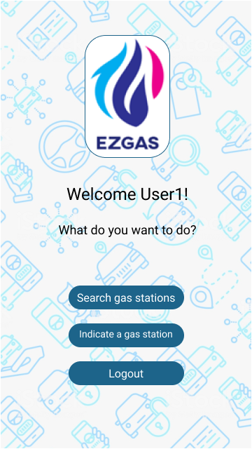

### Use case 5, FR5 Search for the closest gas stations
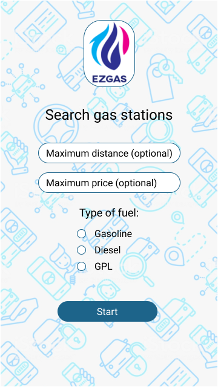
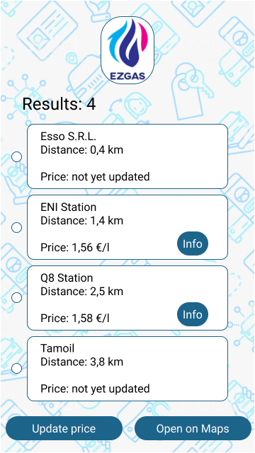

### Use case 6, FR6 Update prices
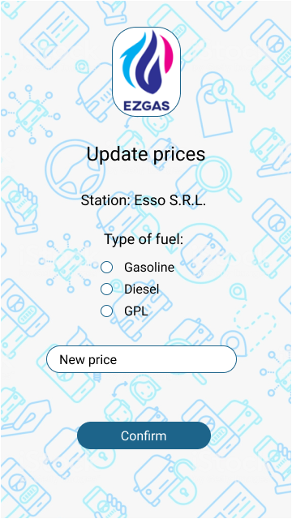

### Administrator's interface
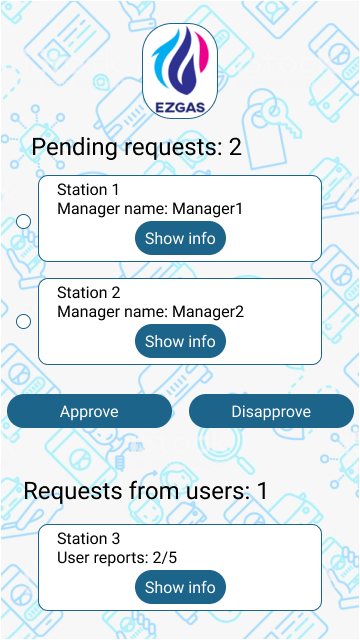