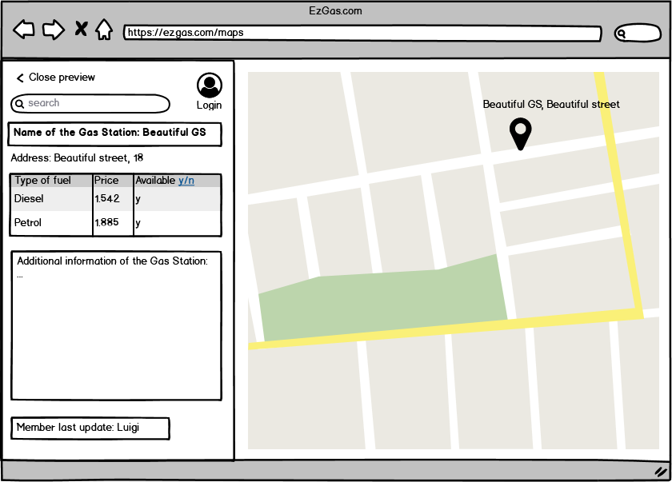
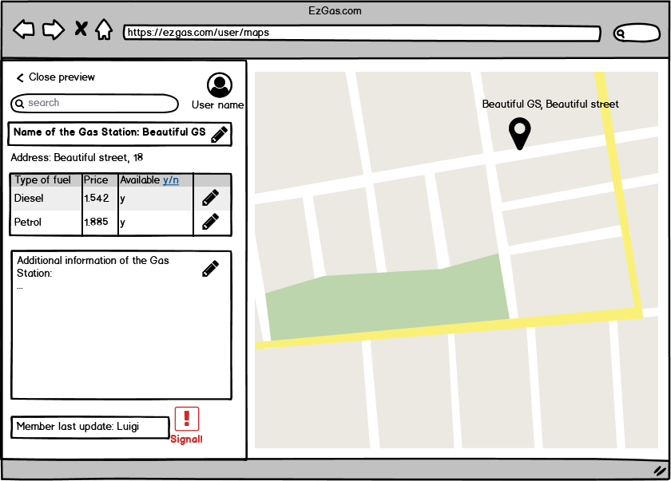
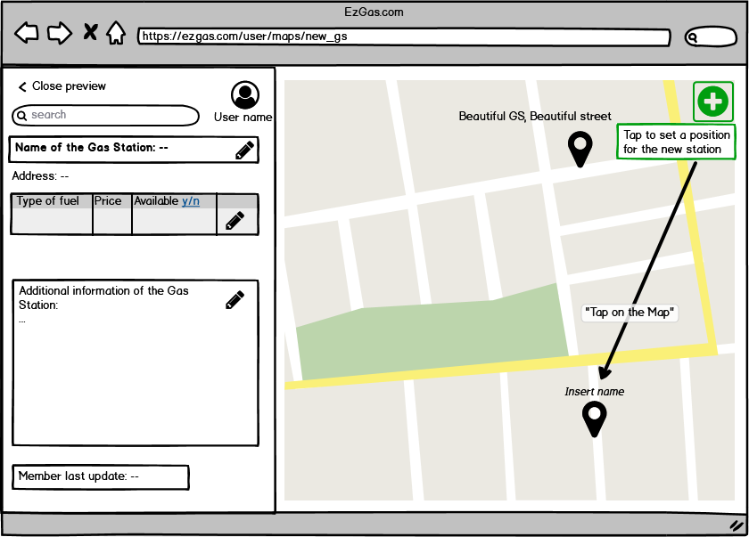
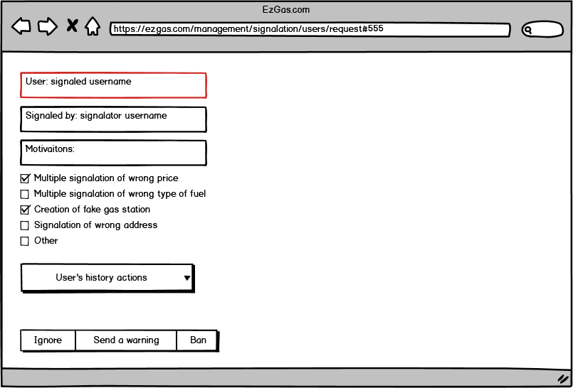
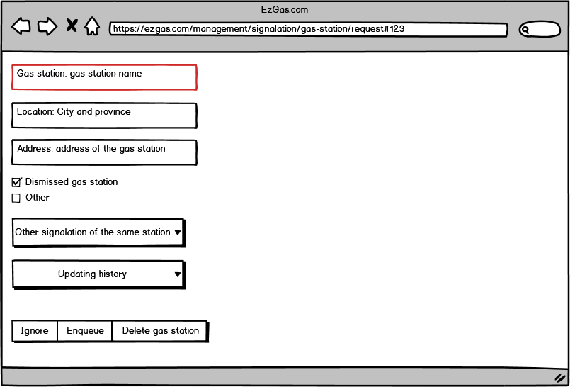

# Requirement Document - EzGas
Authors: Bolla Alessandro

Version: 1

# Contents
- [Stakeholders](#stakeholders)
- [Context Diagram and Interfaces](#context-diagram-and-interfaces)
    + [Context Diagram](#context-diagram)
    + [Interfaces](#interfaces)  
- [Stories and Personas](#stories-and-personas)
- [Functional and Non Functional Requirements](#functional-and-non-functional-requirements)
    + [Functionla Requirements](#functional-requirements)
    + [Non Functional Requirements](#non-functional-requirements)  
- [Use Case Diagram and Use Cases](#use-case-diagram-and-use-cases)
    + [Use Case Diagram](#use-case-diagram)
    + [Use Cases](#use-cases)
- [GUI Prototype](#gui-prototype)

# Stakeholders
| Stakeholder name | Description | 
| ----------------- |:-----------:|
| Administrator     |Manage the system. It has to manage signalation of users in case of bad behaviour of other users and in case of dismissed gas stations.| 
| Guest |  It is a user that uses the application in anonymous way. It cannot add or modify any information about gas stations|
| Member | It is a registered user. It can add and modify information about gas stations|

# Context Diagram and Interfaces

## Context Diagram
```plantuml
left to right direction
actor Guest as g
actor Member as m
actor Maps as map
actor Station as s
actor Administator as a

m  -- (EzGas)
g -- (EzGas)
(EzGas) -- map
a -right-(EzGas)
(EzGas) -- s
```

## Interfaces
| Actor | Physical Interface | Logical Interface  |
| ------------- |:-------------:| :-----:|
| Guest, Memeber, Administrator| Screen, keyboard | GUI |
| Maps | GPS, Internet | Map serviece, e.g. Google Maps|
| Station | Gas Station | Pump control system |

# Stories and Personas

- Paul is an occasional user that do not use so much his car. Anyway, between his house and his job there are some gas stations. Paul uses the application to find the cheaper fuel distributor.

- Eric is a home seller and he trales quite a lot to go to his customers' houses. He uses EzGas to find the best station depending on his location. Eric is also a lazy person that does not want to put any effort in keeping updated the application, indeed he uses EzGas as a Guest.

- Anna works ina an office in about 15 km from her house. She is a very finicky person that loves order and numbers. She also loves save money, so every day updates gas station prices that she meets.

- Rob is a trucker that loves to be useful to other people. During his job break, Rob updates gas station prices so that other people can save money.

- Rob and Anna signal to an admin when they occour in clear incoherent information, like a station signed as dismissed while is still opened. They also add new stations or update them when there are new kind of fuels available.

- John is a dishonest station owner. Sometimes he raises gas prices of other stations in order to have a moajor income to his station.

- Alex is an administrator of EzGas. He is in charge of delete dismissed stations and to get rid of bad users. He has access to all updates performed by each user in the last 6 Months. 

- Anna notice that John often updates gas stations with fake information. After a while, Anna signals to the system John. Alex will receive the signalation and if reasons provided by Anna are coherent with John's logs, then he will be banned.

# Functional and Non Functional Requirements

## Functional Requirements

| ID        | Description  |
| ------------- |:-------------:| 
| FR1 | Find the position of a gas station on the map system |
| FR1.1 | Check the fuels price of the selected station |
| FR1.2 | Check the type of available fuels |
| FR2 | Update information of an existing gas station |
| FR2.1 | Inser of a new fuel type |
| FR2.2 | Update prices |
| FR2.3 | Signal a dismissed station |
| FR3 | Insertion of a new gas station |
| FR4 | Signal a user |
| FR5 | Manage users |
| FR6 | Delete a dismissed station |

## Non Functional Requirements

| ID        | Type | Description  |
| ------------- |:-------------:| :-----:|
| NFR1 | Usability | A Guest should be use the application with no training. The Member user experience must be intuitive. |
| NFR2 | Efficiency | Maps must be loaded in <2 seconds. New station inserted in <1 second. Other functionality should be completed in <0.5 second. |
| NFR3 | Implementation | The system should be available in 2 languages (EN and IT). | 
| NFR4 | Interoperability | The system should work properly with the external map system. |
| NFR5 | Ethical | The system should manage wrong behaviours of Member users. | 
| NFR6 | Legislative | User and password of registered user must not be disclosed outside the software. |

# Use Case Diagram and Use Cases

## Use Case Diagram

```plantuml
left to right direction

actor Guest as g
actor Member as m
actor Maps as map
actor Station as s
actor Administator as a

g -- (FR1 Find the position of a gas station on the map system)
(FR1 Find the position of a gas station on the map system) -> map
(FR1 Find the position of a gas station on the map system) -> (FR 1.2 Check the type of available fuels)
(FR1 Find the position of a gas station on the map system) --> (FR 1.1 Check price)
m -- (FR1 Find the position of a gas station on the map system) 
m -- (FR2 Update information of an existing gas station)
(FR2 Update information of an existing gas station) -> (FR2.3 Signal dismissed station)
(FR2 Update information of an existing gas station) -> (FR2.2 Update prices)
(FR2 Update information of an existing gas station) -> (FR2.1 New fuel type)
(FR2.1 New fuel type) --> s
(FR2.2 Update prices) --> s
(FR2.3 Signal dismissed station) --> map
(FR2.3 Signal dismissed station) --> a
m -- (FR3 Insertion of a new gas station)
m -- (FR4 Signal a user)
(FR4 Signal a user) --> a
(FR5 Manage Users) <-- a
(FR6 Delete a dismissed station) <-a
map <- (FR6 Delete a dismissed station)

```
## Use Cases
**Use case 1 - Find a good gas station.**  
***Actors:*** Guest, Member.  
***Goal:*** find station and check available fuel types and their price.  
***Scenario:***   
- Find a station on the map (FR1)
- Check if the wanted fuel is available (FR1.1)
- Check if the price is fair (FR1.2)  

**Use case 2 - Update information of an existing gas station**  
***Actor:*** Member  
***Goal:*** keeping updated stations, fuels type and maps  
***Scenario:***  
- Login in the application  
- Find the station on the map to be uploaded (FR2)
- Choose of the operation to perform
- Add a new type of fuel (FR2.1)
- Update prices (FR2.2)
- Signal a dismissed station (FR2.3)  

**Use case 3 - Insertion of a new gas station**  
***Actor:*** Member  
***Goal:*** Insert a new gas station on the map system  
***Scenario:***
- Login in the application  
- Find the correct position on the map of the new station
- Create a new station (FR3)  

**Use case 4 - Signal a user**  
***Actor:*** Member  
***Goal:*** Signal to the system a wrong behaviour of a user  
***Scenario***: 
- Login in the application  
- Identify a wrong behaviour of a user
- Signal it to an administrator (FR4)

**Use case 5 - Manage users**  
***Actor:*** Administrator  
***Goal:*** delete bad users from the system  
***Scenario:*** 
- Administrator receives one or more signalation of a wrong behaviour performed by a user
- Administrator checks log files of the interested user
- If he detects bad behaviour, the user can be banned (FR5)  

**Use case 6 - Deletion of a dismissed gas station**  
***Actor:*** Administrator  
***Goal:*** keeping in the system only active gas station  
***Scenario:*** 
- Administrator receives one or more signalation of a dismissed station
- Wait a certain amount of time to check if the system receives update of the interested station
- Delete the station from the map system (FR6)

# Glossary
```plantuml

class EzGas
class Station{
    + Type of Fuel
    + Price
}
class Map{
    + Coordinates
}
class User_Account

EzGas -- Station
EzGas *---"*"User_Account
EzGas ---- Map
Map -- Station


note right of Station: "Physical gas station where an\nuser can go. It describes type\nof fuel available and price of fuels"
note right of Map: "It collects several gas stations.\nIt describes the physical location\nof a station and its coordinates"
note right of User_Account: "The account of a subscribed\nuser, which is a Member"
```
# GUI Prototype
## Use case 1 - Find a good gas station  

## Use case 2 - Update information of an existing gas station

## Use case 3 - Insertion of a new gas station 

## Use case 4 - Signal a user 

## Use case 5 - Manage users 

## Use case 6 - Deletion of a dismissed gas station 
