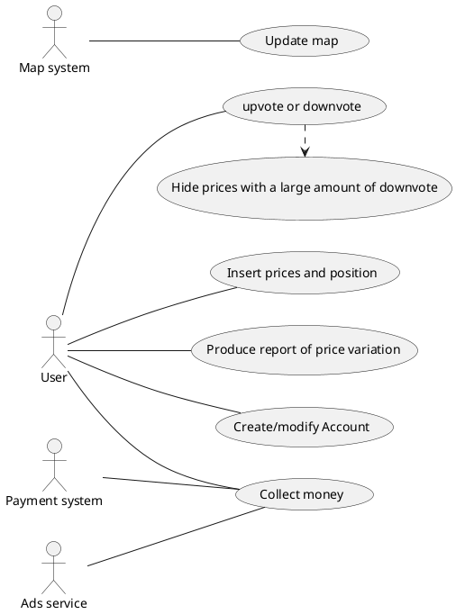

# Official Requirements Document

Authors: Cosimo Chetta
Date: 

# Contents
- [Stakeholders](#stakeholders)
- [Context Diagram and interfaces](#context-diagram-and-interfaces)
	+ [Context Diagram](#context-diagram)
	+ [Interfaces](#interfaces) 
	
- [Stories and personas](#stories-and-personas)
- [Functional and non functional requirements](#functional-and-non-functional-requirements)
	+ [Functional Requirements](#functional-requirements)
	+ [Non functional requirements](#non-functional-requirements)
- [Use case diagram and use cases](#use-case-diagram-and-use-cases)
	+ [Use case diagram](#use-case-diagram)
	+ [Use cases](#use-cases)
	+ [Relevant scenarios](#relevant-scenarios)
- [Glossary](#glossary)
- [System design](#system-design)
- [Deployment diagram](#deployment-diagram)


# Stakeholders

| Stakeholder name  | Description | 
| ----------------- |:-----------:|
| Developer         |Develop, fix and update the application| 
| Users             |Use the application to look for gas station and update the gas price| 

# Context Diagram and interfaces

## Context Diagram

```plantuml
@startuml
left to right direction
skinparam packageStyle rectangle

actor User as u
actor Map as m
actor Ads service as a
actor "Payment system" as ps
rectangle system { 
    (EZGas) as e
    a -- e
    u -- e
    e -- m
    e -- ps
}
@enduml
```

## Interfaces
| Actor | Logical Interface | Physical Interface  |
| ------------- |:-------------:| -----:|
|User | GUI | Smartphone, PC |
|Map  | API | Internet connection |
|Ads service | | Internet connection |
|Payment system | Web service | Internet connection |


# Stories and personas
Bruce is a rich businessman that needs to get gas for all his cars. He wants to keep his rich status and we know that gas is very expensive so everyday he has to travel across the city to find the lowest price. 
This is time consuming so he decided to build an app that can keep trace of gas stations in a crowdsourcing way.

At first the app will get the position of all gas station from an external database, then the users will update positions and prices.

Bruce wants to be sure that the prices inserted by the user are correct so there will be a upvote system that will favor proper values.

Bruce would like to get some money from this app so he inserted an ads service with an optional payment that will disable the ads.

# Functional and non functional requirements

## Functional Requirements

| ID        | Description  |
| ------------- |:-------------:| 
|  FR1     | Record prices and station position inserted by the users |  
|  FR2     | Let user upvote or downvote gas prices |
|  FR3     | Hide prices with a large amount of downvote (downvote > 2*upvote && downvote > minimum_value) |
|  FR4     | Produce a report about gas price variation over time in different areas |
|  FR5     | Manage accounts |
|  FR6     | Collect money from ads/users |
|  FR7     | Update map system |

## Non Functional Requirements

| ID        | Type (efficiency, reliability, .. see iso 9126)           | Description  | Refers to |
| ------------- |:-------------:| :-----:| -----:|
|  NFR1     | Usability | Application should be used with no training by any User  | All FR |
|  NFR2     | Performance | All functions should complete in < 0.5 sec  | All FR |
|  NFR3     | Portability | The application runs on Mobile phone and PCs (Android 4.4, iOS 10, Windows 7 or more recent version)  | All FR |
|  NFR4     | Localisation | Decimal numbers use . (dot) as decimal separator ||


# Use case diagram and use cases

## Use case diagram


## Use Cases

### Use case 1, UC1 - FR1  Record prices and station position inserted by the users

| Actors Involved        | User |
| ------------- |:-------------:| 
|  Precondition     | User account A exist |  
|  Post condition     |  |
|  Nominal Scenario     | User selects actual price P of gas station S and update it|
|  Variants     | if station S does not exist, create it |

### Use case 2, UC2 - FR2 User upvote or downvote gas prices

| Actors Involved        | User |
| ------------- |:-------------:| 
|  Precondition     | Price P exist, User account A exist |  
|  Post condition     | P.vote_post < P.vote_pre OR P.vote_post > P.vote_pre |
|  Nominal Scenario     | User select a price and downvote if it's not correct, otherwise upvote|
|  Variants     |  |

### Use case 3, UC3 - FR3 Hide prices with a large amount of downvote

| Actors Involved        | System |
| ------------- |:-------------:| 
|  Precondition     | User A upvoted or downvoted a price P |  
|  Post condition   | P could be hidden |
|  Nominal Scenario | If (downvote > 2*upvote && downvote > minimum_value), hide P|
|  Variants     |  |

### Use case 4, UC4 - FR5 Produce report of price variation

| Actors Involved        | User |
| ------------- |:-------------:| 
|  Precondition     | Area A exist|  
|  Post condition     | |
|  Nominal Scenario     | User select an area A, defines a time range, application collects all price P of the gas station G in the time range and presents them|
|  Variants     |  |

### Use case 5, FR5 Create account

| Actors Involved        | User  |
| ------------- |:-------------:| 
|  Precondition     | Account A does not exist |  
|  Post condition     | Account A has been created |
|  Nominal Scenario     | User create an account by entering his data |
|  Variants     | |

### Use case 6, FR5 Update account

| Actors Involved        | User |
| ------------- |:-------------:| 
|  Precondition     | Account A exist |  
|  Post condition     | Account A has been modified |
|  Nominal Scenario     | User select a property of his account and modify it |
|  Variants     | |

### Use case 7, FR6 Collect money from user
| Actors Involved        | User |
| ------------- |:-------------:| 
|  Precondition     | Account A exist, user has not already payed |  
|  Post condition     | Account A has no Ads |
|  Nominal Scenario     | User select payment method and pays an amount of money to free his account from ads |
|  Variants     | |

### Use case 8, FR6 Collect money from ads
| Actors Involved        | Ads Service |
| ------------- |:-------------:| 
|  Precondition     | |  
|  Post condition     | |
|  Nominal Scenario     | Every time a user see an ads the ads service send money to the application owner |
|  Variants     | |
# Relevant scenarios

## Scenario 1

| Scenario ID: SC1        | Corresponds to UC1  |
| ------------- |:-------------| 
| Description | User update price P of gas station G |
| Precondition |  User account A exist |
| Postcondition | Price P of gas station G added |
| Step#        |  Step description   |
|  1     | User select gas station G |  
|  2     | User select gas type GT |
|  3     | User insert new price P |

## Scenario 2

| Scenario ID: SC2        | Corresponds to UC1  |
| ------------- |:-------------| 
| Description | User update price P of a new gas station G|
|Precondition | User account A exist |
|Postcondition | Gas station G added, Price P of gas station G added |
| Step#        | Step description  |
|  1     | User select position of new gas station G |  
|  2     | User insert gas station G |
|  3     | User select gas type GT |
|  4     | User insert new price P |

## Scenario 3

| Scenario ID: SC2        | Corresponds to UC2  |
| ------------- |:-------------| 
| Description | User upvote/downvote a Price P |
|Precondition | User account A exist |
|Postcondition | upvote/downvote modified |
| Step#        | Step description  |
|  1     | User select price P of gas station G |  
|  2     | User choose to upvote/downvote it |