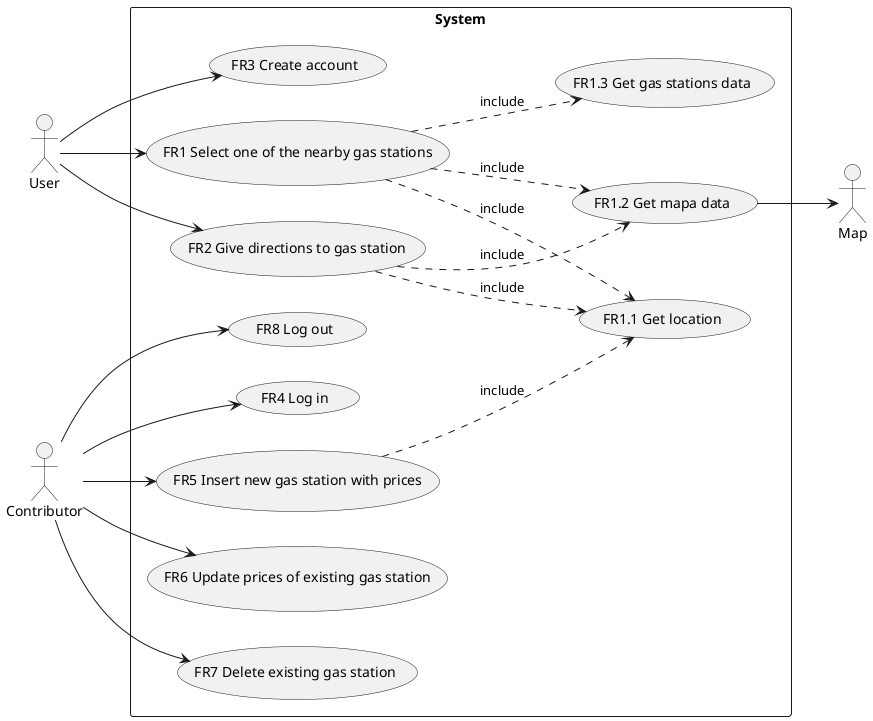
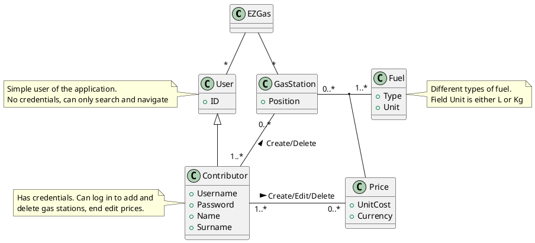

# Official Requirements Document

Authors: Alessandro Borione

Date: 24/03/2020

Version: 1

# Contents
- [Official Requirements Document](#official-requirements-document)
- [Contents](#contents)
- [Abstract](#abstract)
- [Stakeholders](#stakeholders)
- [Context Diagram and interfaces](#context-diagram-and-interfaces)
  - [Context Diagram](#context-diagram)
  - [Interfaces](#interfaces)
- [Stories and personas](#stories-and-personas)
- [Functional and non functional requirements](#functional-and-non-functional-requirements)
  - [Functional Requirements](#functional-requirements)
  - [Non Functional Requirements](#non-functional-requirements)
- [Use case diagram and use cases](#use-case-diagram-and-use-cases)
  - [Use case diagram](#use-case-diagram)
  - [Use Cases](#use-cases)
- [Relevant Scenarios](#relevant-scenarios)
  - [Scenario 1](#scenario-1)
  - [Scenario 2](#scenario-2)
- [Glossary](#glossary)

# Abstract
EZGas is a mobile application that enables drivers and riders to share information about gas stations and the price they practice, allowing for a fast search of the area for the best deals!

# Stakeholders

| Stakeholder name |                                               Description                                               |
| ---------------- | :-----------------------------------------------------------------------------------------------------: |
| Map              |                                   Provides APIs to show map on screen                                   |
| Contributors     | Use the app to insert in the system prices of fuel in different gas stations. Has credentials to log in |
| Users            |              Use the application to find the best deal in terms of cost/distance for gas.               |

# Context Diagram and interfaces

## Context Diagram

```plantuml
left to right direction
actor Map as m
m -- (EZGas)

actor User as u
u -- (EZGas)

actor Contributor as c
c -- (EZGas)
```

## Interfaces
| Actor       | Logical Interface |     Physical Interface |
| ----------- | :---------------: | ---------------------: |
| Map         |        API        |               Internet |
| Contributor |        GUI        | Smartphone touchscreen |
| User        |        GUI        | Smartphone touchscreen |

# Stories and personas
Mike loves to travel the country riding his truster motorbike. In doing so, he often finds himself ith an almost empty tank, and no knowledge of the nearby gas stations. He opens EZGas on his phone mounted on the bike and travels to the nearest gas station following the directions given by the app. He can also compare the different prices and chose the cheaper one, since traveling is an expensive hobby per se.


# Functional and non functional requirements

## Functional Requirements

| ID    |                                   Description                                    |
| ----- | :------------------------------------------------------------------------------: |
| FR1   |                      Select one of the nearby gas stations                       |
| FR1.1 |                           Get location from GPS Sensor                           |
| FR1.2 |                          Get map tiles from map system                           |
| FR1.3 |                        Get gas stations data from server                         |
| FR2   | Give directions updating in real time to reach the gas station selected in `FR1` |
| FR3   |        Create new account for Contributor with unique email and password         |
| FR4   |                Log in Contributor with correct email and password                |
| FR5   |            Insert new prices for a gas station not yet in the system             |
| FR6   |         Update prices of a gas station previously inserted in the system         |
| FR7   |         Delete a gas station with all his listed prices if it has closed         |
| FR8   |                                     Log out                                      |

## Non Functional Requirements

| ID   | Type (iso 9126) |                                   Description                                    |       Refers to |
| ---- | :-------------: | :------------------------------------------------------------------------------: | --------------: |
| NFR1 |    Usability    | Application should be usable after a quick tutorial prompted the first time only |         All FRs |
| NFR2 |   Portability   |              The application should run under both Android and iOS               |         All FRs |
| NFR3 |  Functionality  |       All functions should complete (success or error) in under 0.5 second       |         All FRs |
| NFR4 |                 |               Prices are shown in the currency used in the country               | FR1.3, FR5, FR6 |

# Use case diagram and use cases

## Use case diagram


## Use Cases

###Use case 1, UC1 - FR1, FR2  Select one of the nearby gas stations and show directions to reach it
| Actors Involved  |                                                         User, Map                                                          |
| ---------------- | :------------------------------------------------------------------------------------------------------------------------: |
| Pre Conditions   |                              Position P is valid, Gas Stations G exist in 20 km radius from P                              |
| Post Condition   |                                                      P == G.position                                                       |
| Nominal Scenario | User selects one of the visible gas stations, selects `Start` button, follows directions given by app to reach destination |
| Variants         |                                        User takes wrong road, recompute directions                                         |

###Use case 2, UC2 - FR3  Create new account
| Actors Involved  |                              User                              |
| ---------------- | :------------------------------------------------------------: |
| Pre Conditions   | User has a valid email address E, User has a strong password P |
| Post Condition   |  User can log in with E and P (gains Contributor privileges)   |
| Nominal Scenario |               User inserts E and P when prompted               |
| Variants         |               E already used to register, abort                |
|                  |               P is not a strong password, abort                |

###Use Case 3, UC3 - FR4, FR5  Log in and insert new gas stations
| Actors Involved  |                                             Contributor                                              |
| ---------------- | :--------------------------------------------------------------------------------------------------: |
| Pre Conditions   |                          Position P is valid, Contributor is not logged in                           |
| Post Conditions  |                         `FR1` shows new Gas Station G, where G.position == P                         |
| Nominal Scenario | Contributor inserts credential to log in, selects `Add` button, inserts fuel prices in form, submits |
| Variants         |                                       Wrong credentials, retry                                       |
|                  |                                     Form submitted empty, abort                                      |

###Use Case 4, UC4 - FR6 Update gas station prices
| Actors Involved  |                               Contributor, Map                               |
| ---------------- | :--------------------------------------------------------------------------: |
| Pre Conditions   |       Position P is valid, Gas Stations G exist in 20 km radius from P       |
| Post Condition   |                        G.prices.post != G.prices.pre                         |
| Nominal Scenario | Contributor selects G on map, selects `Edit` button, updates prices, submits |
| Variants         |                         Form submitted empty, abort                          |

###Use Case 5, UC5 - FR7 Delete gas station
| Actors Involved  |                        Contributor, Map                         |
| ---------------- | :-------------------------------------------------------------: |
| Pre Conditions   | Position P is valid, Gas Station G exist in 20 km radius from P |
| Post Condition   |                  `FR1` doesn't show G anymore                   |
| Nominal Scenario | Contributor selects G on map, selects `Delete` button, submits  |
| Variants         |                                                                 |

# Relevant Scenarios

## Scenario 1
| Scenario ID: SC1 | Corresponds to UC1                                          |
| ---------------- | :---------------------------------------------------------- |
| Description      | User decides to go to gas station G from current position P |
| Pre Condition    | distance(P, G) < 20Km                                       |
| Post Sondition   | distance(P, G) <= 20m                                       |
| Step#            | Step description                                            |
| 1                | App shows gas station on map on a 20Km radius               |
| 2                | User selects G                                              |
| 3                | Uses presses `Start`                                        |
| 4                | App retrieves list of directions from Map service           |
| 5                | App shows next direction                                    |
| 6                | Users moves to indicated location                           |
|                  | Repeat steps __5__ and __6__ until reached G                |

## Scenario 2
| Scenario ID: SC2 | Corresponds to UC3                                         |
| ---------------- | :--------------------------------------------------------- |
| Description      | Contributor wants to add a new gas station G to the system |
| Pre Condition    | Contributor is phisically in G                             |
| Post Condition   | New gas station added to the system                        |
| Step#            | Step description                                           |
| 1                | Contributor presses `Login` button                         |
| 2                | Contributor enters email and password                      |
| 3                | Contributor presses `Add` button                           |
| 4                | Contributor inserts price data in form                     |
| 5                | Contributor presses `Submit` button                        |
| 6                | System stores G                                            |


# Glossary


