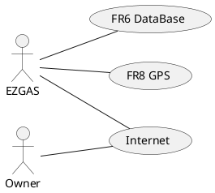

# Official Requirements Document

Authors: Iman Ostovar

Date: 29/03/2020

Version: 1.0

Change history

| Version | Changes | 
| ----------------- |:-----------|


# Contents
- [Abstract](#abstract)
- [Stakeholders](#stakeholders)
- [Context Diagram and interfaces](#context-diagram-and-interfaces)
	+ [Context Diagram](#context-diagram)
	+ [Interfaces](#interfaces) 
	
- [Stories and personas](#stories-and-personas)
- [Functional and non functional requirements](#functional-and-non-functional-requirements)
	+ [Functional Requirements](#functional-requirements)
	+ [Non functional requirements](#non-functional-requirements)
- [Use case diagram and use cases](#use-case-diagram-and-use-cases)
	+ [Use case diagram](#use-case-diagram)
	+ [Use cases](#use-cases)
	+ [Relevant scenarios](#relevant-scenarios)
- [Glossary](#glossary)

# Abstract

Some drivers may want to know the prices and the positions of the gas stations near them.
Having this information, they can choose the best station among them. It is useful for managing both fuel and pocket.
Knowing this, a group of developers may want to build an application which allows them to find the proper gas station that better fit in their necessities by concerning some parameters like position, maximum distance and prices, and the specific fuel.
Gas station owners can update pieces of information about prices and positions to raise their chance to be chosen.

# Stakeholders

| Stakeholder name  | Description | 
| ----------------- |:-----------:|
| Drivers     |Uses the application to choose among fuel stations  (1000-10000 people)| 
| Gas Station Owners        |use the application to share their prices and options, letting drivers know them|
| Map provider        |use the services from to share locations of stations|
| Databse provider        |use the services from to share save information among users|
| Developer        |tried to provide useful services for both station owners and drivers concerning  their income|

# Context Diagram and interfaces

## Context Diagram

```plantuml
left to right direction
actor EZGAS as a
a -- (Gas Staion owner)
a -- (Driver)
a -- (GPS)
a -- (Server)

```

## Interfaces
| Actor | Logical Interface | Physical Interface  |
| ------------- |:-------------:| -----:|
|Client|GUI |Toch Screen, keyboard|
|Server|web services (functions to be described, data exchanged, SOAP + XML) |internet connection|
|GPS|API GPS system on smartphones |phone’s antenna for gps locationing|


# Stories and personas
Alice usually wakes up late in the morning. She drinks a couple of coffee and goes out to prevent being fired from being late at work.
She has recently changed her house; as a result, she is no familiar with the local places.
Moreover, she is a very economical woman to save money and buy an electric car.
After being in her car, she found out he car almost runs out of the fuel. She was heard about a new application named EZGAS, which shows all gas stations and also sorts them by their prices. So she can easily download the app, turn on the gps, and using the internet to see all the near stations with their current prices.
Jerry is a young owner of a newly opened gas station. He is an update man, trying to use technology in all his life and work as much as possible.
He uses EZgas to let all drivers knew about his location and also low prices. A little description of his station is also included. Therefore he uses this application as an advertisement and makes his new station well-known.
Thanks to the EZGAS, Alice filled her car's fuel tank as fast as possible and did not get fired.
Jerry is also satisfied with raising a number of customers.

# Functional and non functional requirements

## Functional Requirements

| ID        | Description  |
| ------------- |:-------------:| 
|  FR1     | The Driver, shall be able to search for all gas station in chosen area  |  
|  FR2     |The Driver, shall be able to choose the fuel kind in searching |
|  FR3     | The Driver, shall be able to sort gas station in both distance and price |
|  FR4     | The Driver, shall be able to write a small comment about stations and also gives score |
|  FR5     | The Gas station Owner shall be able to update its prices, open hours and other parameters in database |
|  FR6     | The Gas station Owner shall be able to put special offers o special days or hours |
|  FR7     | The Gas station Owner shall be able to put some more detail about station options |
|  FR8     | The Gas station Owner should be authenticated |
|  FR9     |The Gas station Owner shall be able to edit his/her account any time |
|  FR10     | Both types of users shall be able to use a simple but different GUI for doing all the previous FRs |
|  FR11     | Both types of users, shall be able to report a bug via a bug system reporting. |

## Non Functional Requirements

| ID        | Type (efficiency, reliability, .. see iso 9126)           | Description  | Refers to |
| ------------- |:-------------:| :-----:| -----:|
|  NFR1     | Usability | Application should be used with no training by any colleague in the office  | All FR |
|  NFR2     | Performance | All functions should complete in < 1 sec  | All FR |
|  NFR3     | Portability | The application runs on both android and ios | All FR |
|  NFR4     | Portability | The application database should be accessed from most popular web browsers | All FR |
|  NFR5     | Localisation | Decimal numbers use. (dot) as decimal separator ||
|  NFR6     | Localisation | Prices and distances shall be able to change between different currencies and metrics ||


# Use case diagram and use cases

## Use case diagram


@startuml
left to right direction
actor EZGAS as a
a -- (FR6 DataBase)
a -- (GPS)
a -- (Internet)


actor Driver as c
c -- (Internet)
c -- (GPS)

@enduml


## Use Cases

### Use case 1, UC1 - FR5-7  Gas station owner update database

| Actors Involved        | Gas station owner |
| ------------- |:-------------:| 
|  Precondition     | Have a gas station, have an internet connection, have a smartphone or a computer. knowing Exact location the station|  
|  Postcondition     | Gas station is parameters has updated in database |
|  Nominal Scenario     | The gas station added information (location, kind of fuels supported, price, etc.) updated data base|
|  Variants     | The lower prices will promote in the application for drivers |

### Use case 2, UC2 - FR8 Gas station owner add station to datatbase

| Actors Involved        | Gas station owner |
| ------------- |:-------------:| 
|  Precondition     |Have a gas station, the owner has no account, have a scan of the station legal documents|  
|  Postcondition     | owner, make an account for his/her station |
|  Nominal Scenario     | owner make new acc az owner and add his/her station to data base|
|  Variants     |  |

### Use case 3, UC3 - FR1-4 Driver find the suitable station

| Actors Involved        | Driver |
| ------------- |:-------------:| 
|  Precondition     |Driver has an internet connection, has a smartphone. knowing Exact location itself |  
|  Postcondition     | Drivers Car fuel bank is filled |
|  Nominal Scenario     | Driver searches for near stations and chooses between them, and then routed to it|
|  Variants     |No gas station fit in the driver needs, he has to update the parameters  |

# Relevant scenarios

## Scenario 1

| Scenario ID: SC1        | Corresponds to UC1&2  |
| ------------- |:-------------| 
| Description |A gas station owner wants to upgrade the visibility of his gas station.|
| Precondition | The gas station owner has a cheaper station.|
| Postcondition |  The specific gas station appears in a special section. |
| Step#        |  Step description   |
|  1     |The gas station owner has to verify his identity (by sending a document). |  
|  2     | The gas station owner has to enable the application to access the bank account. |
|  3     | Deduce one for quantity of capsule T |

## Scenario 2

| Scenario ID: SC2        | Corresponds to UC3  |
| ------------- |:-------------| 
| Description | One driver use EZGas to find a solution that fit his need.|
|Precondition |  EZGas doesn’t find a gas station that fits the driver needs.|
|Postcondition |  account of C updated, count of T updated |
| Step#        | Step description  |
|  1     | The drive has to change the searching parameters |  
|  2     | EZGas perform another search|
|  3     | EZGas returns new results  |


