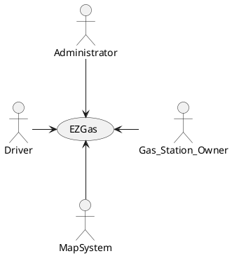
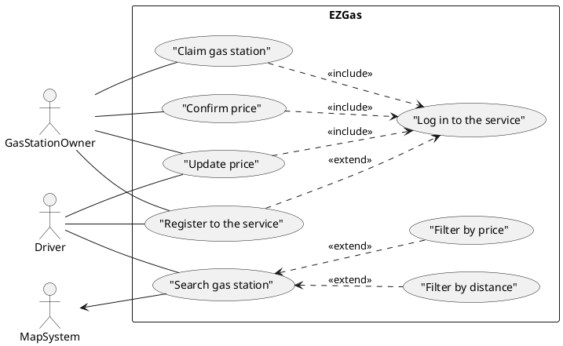
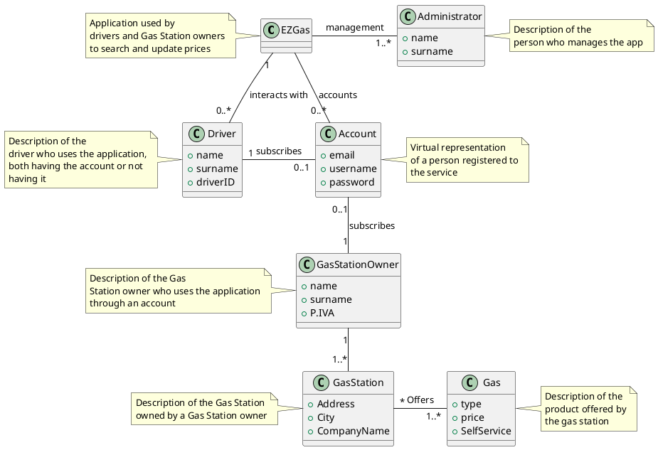

# Official Requirements Document

Authors: Gaetano Galasso

Date: 24/03/2020

Version: 2

# Change history

| Version | Changes |
| ----------------- |:-----------|
| 2 | Added Developer in Stakeholders|
|   | Added Administrator in Context Diagram and Interfaces|
|   | Added connection from Driver to "Update price" in the use case diagram|
|   | Edited nominal scenario of use case 4|
|   | Edited use case 6|
|   | Edited post-condition of scenario 2|
|   | Added Glossary section|

# Contents
- [Abstract](#abstract)
- [Stakeholders](#stakeholders)
- [Context Diagram and interfaces](#context-diagram-and-interfaces)
	+ [Context Diagram](#context-diagram)
	+ [Interfaces](#interfaces)

- [Stories and personas](#stories-and-personas)
- [Functional and non functional requirements](#functional-and-non-functional-requirements)
	+ [Functional Requirements](#functional-requirements)
	+ [Non functional requirements](#non-functional-requirements)
- [Use case diagram and use cases](#use-case-diagram-and-use-cases)
	+ [Use case diagram](#use-case-diagram)
	+ [Use cases](#use-cases)
- [Relevant scenarios](#relevant-scenarios)
- [Glossary](#glossary)

# Abstract
  Everyone wants to know where to refuel in the most convenient gas station of the zone, without spending ages finding it.
  EZGas collects all the updated prices, provided by drivers and owners of gas stations. Then, based on the position of the user, the application can show the best solutions.

# Stakeholders

  | STAKEHOLDER NAME  |       DESCRIPTION              |
  |-------------------|------------------------------------------------------------------------------------------------------------------------------------------------------|                                                                       
  | Driver            | The user that directly use the app in order to know the best gas prices in the zone and updates them in case of inconsistency. |
  | Gas Station owner | The one that can update prices, obtaining a certificate of veracity.        |
  | Maps System       | The system through which the app can show the gas stations available.       |
  | Administrator     | System that mantains the application.                                       |
  | Developer 		    | Develops the application.                                                    |

# Context Diagram and interfaces

## Context Diagram

# Interfaces

| Actor             | Logical Interface | PHYSICAL INTERFACE                                 |
|-------------------|-------------------|----------------------------------------------------|
| Driver            | GUI               | Smartphone display, touch screen                   |
| Gas Station owner | GUI               | Smartphone display, touch screen, Screen, Keyboard |
| Map System        | API               | Network, GPS                                       |
| Administrator     | GUI               | Smartphone display, touch screen, Screen, Keyboard |

# Stories and personas

Lorenzo is a sales agent. He drives for miles every day, so he needs to stop several times during his working hours in order to refuel his car. Lorenzo understood that it was a good idea to take note of the best pricing gas stations in order to remember them for the next time. Day by day he noticed that the prices were not fixed so he thought that it could be useful to have a community of people keeping track of the prices all over the country. Lorenzo created a forum in order to share his notes about the prices and the places where he was used to refuel. 

Giovanni is a truck driver. He discovered the forum created by Lorenzo and he considered that it could be useful for his long trips. Since he didn’t have time to write on the forum in order to update the prices, he decided not to sign up to it.

Maurizio is a gas station owner. He noticed that his earnings were not so satisfying so he decided to lower his prices. The problem was that, in order to increase his income, he needed expensive sponsorships and he would know a cheaper way to gain visibility.

# Functional Requirements

| ID     | Description                                                                               |
|--------|-------------------------------------------------------------------------------------------|
| FR 1   | The driver searches gas stations                                                          |
| FR 1.1 | The driver filters gas stations by distance                                               |
| FR 1.2 | The driver filters gas station by price                                                   |
| FR 2   | The driver can register to the service                                                      |
| FR 3   | The driver logs in                                                                        |
| FR 3.1 | The driver can update prices of gas station  only if he is registered and logged in          |
| FR 4   | The gas station owner can register to the service                                         |
| FR 5   | The gas station owner logs in                                                             |
| FR 5.1 | The gas station owner can confirm the updated prices  only if he is registered and logged in |
| FR 5.2 | The gas station owner can update the prices only  if he is registered and logged in       |
| FR 6   | Gas station owner can claim a gas station    |

# Non-Functional Requirements

| ID   | Type (efficiency, reliability, ... see iso 9126) | Description                                                             |         |
|------|-------------------------------------------------|-------------------------------------------------------------------------|---------|
| NFR1 | Usability                                       | GUI must be user-friendly                                                       | All FRs |
| NFR2 | Portability                                     | The application must be deployed on portable devices                    | All FRs |
| NFR3 | Reliability                                     | The application must avoid crashes  | All FRs |
| NFR4 | Functionality                                   | Data must be consistent                          | All FRs |
| NFR5 | Performance                                     | All functions must be completed in < 1 sec                              | All FRs |

# Use case diagram and use cases

## Use case diagram

## Use cases

### UC1: FR 1,FR 1.1, FR 1.2: Search for a gas station

| Actors involved  | Driver                                                                                                       |
|------------------|--------------------------------------------------------------------------------------------------------------|
| Pre-condition    | Internet and Gps connections and Map System work                                                             |
| Post-conditions  | Get results                                                                                                  |
| Nominal Scenario | Driver wants to retrieve informations about the stations    |

### UC2: FR 2: Driver registration

| Actors involved  | Driver                                                                                     |
|------------------|--------------------------------------------------------------------------------------------|
| Pre-condition    | Driver account does not exist.                                                             |
| Post-conditions  | Driver account exists.                                                                     |
| Nominal Scenario | Driver inserts Username, email and password, the account is created automatically by the system.             |
| Variants         | Driver inserts Username or password already used. |

### UC3: FR 3.1: Driver updates price

| Actors involved  | Driver                                                                                   |
|------------------|------------------------------------------------------------------------------------------|
| Pre-condition    | Prices are outdated                                                                      |
| Post-conditions  | Prices are temporarly updated and waiting for certification                                           |
| Nominal Scenario | Driver notices that the prices related to a gas station are outdated so he updates them. |

### UC4: FR 4: Gas station owner registration

| Actors involved  | Gas station owner                                                                                    |
|------------------|-------------------------------------------------------------------------------------------------------|
| Pre-condition    | Gas station owner account does not exist.                                                         |
| Post-conditions  | Gas station owner account exists.                                                                         |
| Nominal Scenario | A gas station owner inserts Username and Password and presses Sign up button. |
| Variants         | The gas station owner inserts Username or password already used.                                                 |

### UC5: FR 5.1: The gas station owner certifies an updated price

| Actors involved  | Gas station owner                                             |
|------------------|---------------------------------------------------------------|
| Pre-condition    | Gas station prices are updated by a driver but not certified. |
| Post-conditions  | Gas station prices are certified.                             |
| Nominal Scenario | Gas station owner checks and confirms prices.                 |
| Variants         | Gas station owner checks and updates wrong prices.            |

### UC6: FR 5.2: The gas station owner updates prices

| Actors involved  | Gas station owner                                       |
|------------------|----------------------------------------------------------|
| Pre-condition    | Prices are outdated and gas station owner has an account. |
| Post-conditions  | Prices are updated.                                      |
| Nominal Scenario | Gas station owner notices that the prices related to his gas station are outdated so he updates them.            |

### UC7: FR 6: The gas station owner claim his gas station

| Actors involved  | Gas station owner                                       |
|------------------|----------------------------------------------------------|
| Pre-condition    | A gas station has not a certified owner. |
| Post-conditions  | The gas station has a certified owner.   |
| Nominal Scenario | Gas station owner decides to gain the possibility to certify its prices.            |
| Variants         | Gas station owner claims a wrong gas station. |

## Relevant scenarios

### Scenario 1: Corresponds to UC3

| Scenario ID    | SC1                                                            |
|----------------|----------------------------------------------------------------|
| Description    | The driver notices an outdated price and decides to update it. |
| Pre-condition  | Price is outdated                                              |
| Post-condition | Price is updated                                               |
| Steps          | Step description                                               |
| 1.             | The driver selects the gas station.                            |
| 2.             | The driver selects the "update price" button.                    |
| 3.             | The driver inserts the new price.                              |
| 4.             | The driver submits the modification.                           |
| 5.             | The price is updated but not certified.                        |

### Scenario 2: Corresponds to UC5

| Scenario ID    | SC2                                        |
|----------------|--------------------------------------------|
| Description    | The gas station owner receives the update. |
| Pre-condition  | Price is updated but not certified.        |
| Post-condition | Price is certified.                 |
| Steps          | Step description                           |
| 1.             | The gas station owner selects the request. |
| 2.             | The gas station owner confirms the prices. |
| 3.             | The prices are correctly updated.           |

### Scenario 3: Corresponds to UC 5

| Scenario ID    | SC3                                                       |
|----------------|-----------------------------------------------------------|
| Description    | The gas station owner receives a wrong update.            |
| Pre-condition  | Price is updated but wrong.                               |
| Post-condition | The price is updated by the owner with the correct value. |
| Steps          | Step description                                          |
| 1.             | The gas station owner selects the request.                |
| 2.             | The gas station owner changes the prices.                 |
| 3.             | The prices are correctly updated.                          |

# Glossary

