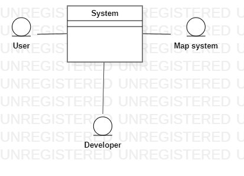
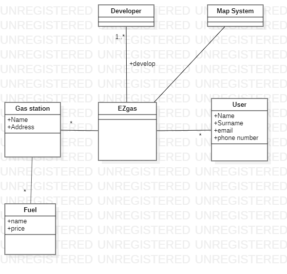

# Requirements for EZgaz

Authors: Antonin Poché : s275011

Date: 24/03/2020

Version: 1

Change history

| Version | Changes |    
| ----------------- |:-----------|    
| 2 | Fixed defect in [scenario 2](#scenario-2): precondition was wrong  |

# Contents
- [Abstract](#abstract)
- [Stakeholders](#stakeholders)
- [Context Diagram and interfaces](#context-diagram-and-interfaces)
  + [Context Diagram](#context-diagram)
  + [Interfaces](#interfaces) 
  
- [Stories and personas](#stories-and-personas)
- [Functional and non functional requirements](#functional-and-non-functional-requirements)
  + [Functional Requirements](#functional-requirements)
  + [Non functional requirements](#non-functional-requirements)
- [Use case diagram and use cases](#use-case-diagram-and-use-cases)
  + [Use case diagram](#use-case-diagram)
  + [Use cases](#use-cases)
  + [Relevant scenarios](#relevant-scenarios)
- [Glossary](#glossary)
- [System design](#system-design)
- [Deployment diagram](#deployment-diagram)

# Abstract

EZgas is an application that allow users (individuals) to find nearby gas station and their gas prices.

A user can update the price of a gas station and add a new gas station. And should do it for the application to work.

# Stakeholders

| Stakeholder name  | Description |   
| ----------------- |:-----------:|   
| User              | Uses the application to find a gas station or/and get the best prices also handle stations informations |   
| Map system        | Is used to show the map and compute distances| 
| Developer         | Create and maintain the application | 
 

# Context Diagram and interfaces

## Context Diagram



## Interfaces
| Actor | Logical Interface | Physical Interface  |   
| ------------- |:-------------:| -----:|   
| Users | GUI | Smartphone |   
| Map System | API | internet connection |   
| Developer | GUI |Screen, keyboard|


# Stories and personas
Bobby needs to refuel and is not close to his usual gas station, therefore he looks for a gas station.

Donald also need to refuel, but he is short on money and would like to find the nearby station with the cheapest fuel.

The developer wish to make a useful application, to get paid he can either set some publicities or believe in the users donations.

# Functional and non functional requirements

## Functional Requirements

| ID        | Description  |    
| ------------- |:-------------:|      
|  FR1     | Find nearby gas stations |      
|  FR2     | Show them on the map |     
|  FR3     | Show user's location on the map |    
|  FR4     | Show the price for the selected station |     
|  FR5     | Allow prices update of a gas station |      
|  FR6     | Allow addition of a new gas station |  
|  FR7     | A User can register |   

## Non Functional Requirements

| ID        | Type (efficiency, reliability, .. see iso 9126)           | Description  | Refers to |          
| ------------- |:-------------:| :-----:| -----:|         
|  NFR1     | Usability | Application should easy to understand and to use | All FR |          
|  NFR2     | Performance | Action should be complete in < 3 sec  | FR1 |     
|  NFR3     | Performance | All functions should complete in < 0.1 sec  | All other FR |        
|  NFR4     | Portability | The application runs on all android and IOS  | All FR |        


# Use case diagram and use cases

## Use case diagram

```plantuml
left to right direction
actor User as u
u -- (FR5 Update prices)      
u -- (FR6 Add gas station)
u -- (FR7 Register)
```
## Use Cases

### Use case 1, UC1 - FR5 Update a price

| Actors Involved        | User |   
| ------------- |:-------------:|     
|  Precondition     | User U registered |     
|  Post condition     | new price not to far from previous one |    
|  Nominal Scenario     | User select a gas station, user select a fuel, user enter new price |   
|  Variants     | The fuel does not exist, this need an update on the list of fuel |    

### Use case 2, UC2 - FR6 Add a gas station

| Actors Involved        | User |   
| ------------- |:-------------:|    
|  Precondition     | User U registered |     
|  Post condition     | No duplication of station, address s valid, name is valid (looks like a station name), prices makes sense (to define) |   
|  Nominal Scenario     | User enter the address, user enter the name of the gas station, user enter the prices|    

### Use case 3, UC3 - FR3 Register

| Actors Involved        | User |   
| ------------- |:-------------:|     
|  Precondition     | User have an email |      
|  Post condition     | No duplication of email or phone number |   
|  Nominal Scenario     | User choose to register, he enter Name Surname email and phone number, he validates his email with a link |   
|  Variants     | Duplication of email or phone number, issue warning |   


# Relevant scenarios

## Scenario 1

| Scenario ID: SC1        | Corresponds to UC1  |   
| ------------- |:-------------|    
| Description | User update a price |   
| Precondition | User is registered |   
| Postcondition | price updated |   
| Step#        |  Step description   |    
|  1     | User select gas station |      
|  2     | User select fuel |   
|  3     | User enter price |   
|  4     | Price updated |    

## Scenario 2

| Scenario ID: SC2        | Corresponds to UC2 |    
| ------------- |:-------------|    
| Description | User add a Gas station |    
| Precondition | User is registered |   
| Postcondition | Gas station added |   
| Step#        |  Step description   |    
|  1     | User select gas station |      
|  2     | User select fuel |   
|  3     | User enter price |   
|  4     | Price updated |    

## Scenario 3

| Scenario ID: SC3        | Corresponds to UC3 |    
| ------------- |:-------------|    
| Description | Register an user |    
| Precondition | User have an email |     
| Postcondition | User registe |    
| Step#        |  Step description   |    
|  1     | User enter his informations |      
|  2     | Check availability of email and phone number |   
|  3     | Send email verification request |    
|  4     | User verify his email |    


# Glossary



