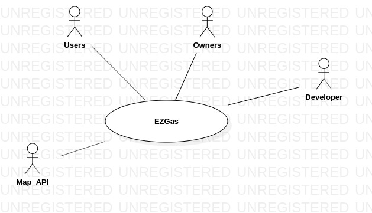
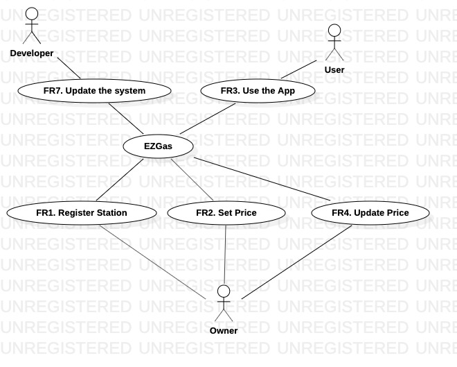

# Official Requirements Document

Authors: Manuel Sabelli, Giuseppe Petraglia

Date: 26/03/2020

# Contents
- [Abstract](#abstract)
- [Stakeholders](#stakeholders)
- [Context Diagram and interfaces](#context-diagram-and-interfaces)
	+ [Context Diagram](#context-diagram)
	+ [Interfaces](#interfaces) 
	
- [Stories and personas](#stories-and-personas)
- [Functional and non functional requirements](#functional-and-non-functional-requirements)
	+ [Functional Requirements](#functional-requirements)
	+ [Non functional requirements](#non-functional-requirements)
- [Use case diagram and use cases](#use-case-diagram-and-use-cases)
	+ [Use case diagram](#use-case-diagram)
	+ [Use cases](#use-cases)
	+ [Relevant scenarios](#relevant-scenarios)

# Abstract

A map with the prices of the gas station to inform the people which is the nearest and cheapest gas station around them. The people and the owner of gas station can share the location and the price of a gas station if necessary.

# Stakeholders

| Stakeholder name  | Description | 
| ----------------- |:-----------:|
| Owners     |Have the gas stations, and can add or remove his gas station. He also set and update the price of his station.| 
| Users        |Use the application directly. They are interested where the gas stations are and the prices of the gas stations.| 
| Developer | Is impacted in case the product to be developed is too complicated, or untestable, or with poorly written requirements. |
| Maps API | Show the gas stations near the user. |

# Context Diagram and interfaces

## Context Diagram

## Interfaces
| Actor | Logical Interface | Physical Interface  |
| ------------- |:-------------:| :-----:|
|User|Screen |TouchScreen|
|Owner|Screen |TouchScreen|
|MapsAPI|A function used to get GoogleMaps and upload the gas station. (Web Services) |Internet Connection (API)|
|Developer |Screen |TouchScreen|

# Stories and personas

Chris is going to the sea in a beautiful day with his family: Rihanna, his wife, Jack and Russell, his sons. 

During the trip, the gas tank is almost empty, then Chris takes his phone and he starts to use EZGas App, which shows to him the nearest gas station. 

Without this app, Chris would have been in a critical situation, because he needs the gas for his car when the tank is empty.

Yet fortunately Chris has the EZGas App, and his trip continues without problems.

Dave has been a waiter, and after three years when he earned money, he decides to buy a gas station. He uploads his gas station on the EZGas App and set the gas price, in this way, all the people know where his station is located. When the price of the gas changes, Dave updates his gas station price.

Dave is clever, and doing this he can earn more money, because gas station has more visibility.

# Functional and non functional requirements

## Functional Requirements

| ID        | Description  |
| ------------- |:-------------:| 
|  FR1     | The owner shall be able to register his gas station on the EZGas App |  
|  FR2     | The owner shall be albe to set the price of his gas station |
|  FR3     | The user shall be albe to visit the Map on the EZGas App |
|  FR4     | The owner can update the price of FR2 |
|  FR5     | When FR1 the system will set the gas station on the Map |
|  FR6     | When FR3 the system will show to him all the gas stations on the Map |
|  FR7     | The developer shall be able to update the system |

## Non Functional Requirements

| ID        | Type (efficiency, reliability, .. see iso 9126)           | Description  | Refers to |
| ------------- |:-------------:| :-----:| -----:|
|  NFR1     | Usability | Application should be used with no training by users   | FR3, FR6 |
|  NFR2     | Performance | All functions should complete in < 0.5 sec  | All FR |
|  NFR3     | Portability | The application runs on Android and iOS  | All FR |
|  NFR5     | Localisation | Decimal numbers use . (dot) as decimal separator |
|  NFR6     | Performance | The system should be easily changeable (prices and Maps) | ALL FR ||

# Use case diagram and use cases

## Use case diagram

## Use Cases

### Use case 1, UC1 - FR1  Register Station

| Actors Involved        | Owner |
| ------------- |:-------------:| 
|  Precondition     | Station S exists, Owner O exists |  
|  Post condition     | S registered on the system |
|  Nominal Scenario     | Owner registers his gas station on the system |
|  Variants     | Owner O has not enough money to buy a station, issue warning |

### Use case 2, UC2 - FR2 Set Price

| Actors Involved        | Owner |
| ------------- |:-------------:| 
|  Precondition     | Station S exists, station has not the price |  
|  Post condition     | S.price is set |
|  Nominal Scenario     | Owner sets the price of his gas station |
|  Variants     |  |

### Use case 3, UC3 - FR3 Use the App

| Actors Involved        | User |
| ------------- |:-------------:| 
|  Precondition     |  |  
|  Post condition     |  |
|  Nominal Scenario     | User starts to use the EZGas App|
|  Variants     |  |

### Use case 4, UC4 - FR4 Update Price

| Actors Involved        | Owner |
| ------------- |:-------------:| 
|  Precondition     | Station S exists, the price of this station is changed |  
|  Post condition     | S.price is updated |
|  Nominal Scenario     | When a price changing is noticed, the Owner updates the price of his gas station|
|  Variants     |  |

### Use case 7, UC7 - FR7 Update the System

| Actors Involved        | Developer |
| ------------- |:-------------:| 
|  Precondition     | System S exists, Developer D exists |  
|  Post condition     | S is updated |
|  Nominal Scenario     | Developer updates the System |
|  Variants     | |

# Relevant scenarios

## Scenario 1

| Scenario ID: SC1        | Corresponds to UC1  |
| ------------- |:-------------| 
| Description | User uses the EZGas APP |
| Precondition |  User needs to re-full tank of his car with gas|
| Postcondition |  User discover the nearest gas station |
| Step#        |  Step description   |
|  1     | User looks for a gas station on the EZGas App |  
|  2     | User reaches the gas station  |
|  3     | User refuels at the gas station |

## Scenario 2

| Scenario ID: SC2        | Corresponds to UC1  |
| ------------- |:-------------| 
| Description | Owner registers his gas station on the system |
|Precondition | Gas station is not yet on the system |
|Postcondition |  Gas station is uploades on the system |
| Step#        | Step description  |
|  1     | Owner registers his gas station on the system |  
|  2     | Owner sets the price of his gas station on the system |
|  3     | Owner updates the price when he needs to do it |