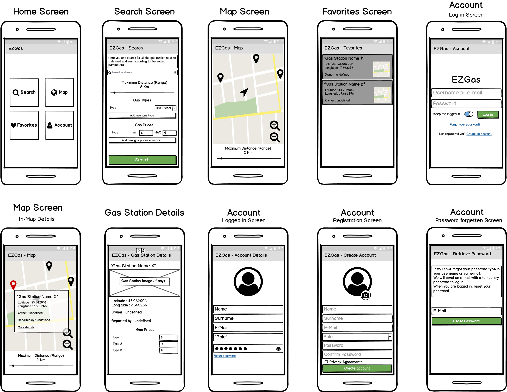

# EZGas Requirements
### Lab 2 - Software Engineering

Author: Gaetano Prudente

Date: 25/03/2020

# Contents
- [Abstract](#abstract)
- [Stakeholders](#stakeholders)
- [Context Diagram and interfaces](#context-diagram-and-interfaces)
	+ [Context Diagram](#context-diagram)
	+ [Interfaces](#interfaces)
- [Stories and personas](#stories-and-personas)
- [Functional and non functional requirements](#functional-and-non-functional-requirements)
	+ [Functional Requirements](#functional-requirements)
	+ [Non functional requirements](#non-functional-requirements)
- [Use case diagram and use cases](#use-case-diagram-and-use-cases)
	+ [Use case diagram](#use-case-diagram)
	+ [Use cases](#use-cases)
	+ [Relevant scenarios](#relevant-scenarios)
- [Glossary](#glossary)
- [GUI Prototype](#gui-prototype)

# Abstract

During a trip, **drivers** may need to re-fuel their car.
They look for the gas stations near by, with their relative informations like prices, location, ecc..

A **Gas Station Manager** wants to advertise his activity, so travellers will know where his station is and what prices he applies.

The EZGas developer created a service that collects the prices of the gas stations and locates them, that supports users.
They also developed an application that shows a list of the gas stations, sorting them by distance.
To keep things simple the application is standalone.
In order to provide a better service the application can use the GPS location to acquire a more precise location and gather customized results.


# Stakeholders

| Stakeholder name    | Description |
| -----------------   |:-----------:|
|Driver (registered)  |Uses the application to look for gas station informations (prices, location, ...) and can also indicate a new gas station if he founds a new one, along with the prices it practice and its location|
|Driver (unregistered)|Uses the application to look for gas station informations (prices, location, ...)|
|Gas station manager  |Uses the application to set his own gas station informations (prices, location, ...)|
|EZGas developer      |Their interests are user experience and application's informations, such as bugs, crashes, ecc...|
|Administrator        |CEO of EZGas|
|Buyer			          |It can a company that wants to implement the EZGas in its system or the user himself (if the application is not free-to-use)|
|Map service					|Service to display on the map the gas stations in both static way and dinamic way acoording to the GPS position of the user|

# Context Diagram and interfaces

## Context Diagram

<!-- ```puml
left to right direction
actor Gas_Station_Manager as gsm
actor Developer as dev
actor Map_System as ms
actor Driver_registered as drvR
actor Driver_unregistered as drvUR
rectangle "System"{
	database "Gas_Station_DB" {
	}
	database "Users_DB" {
	}
	(EZGas Application) -left- Gas_Station_DB
	(EZGas Application) -right- Users_DB
}
System -down- drvR
System -down- drvUR
System -down- gsm
System -up- ms
System -up- dev
``` -->


## Interfaces
| Actor | Logical Interface | Physical Interface  |
| ------------- |:-------------:| ----- |
|Driver (registered)  |GUI            |Screen, keyboard|
|Driver (unregistered)|GUI            |Screen, keyboard|
|Gas station manager  |GUI            |Screen, keyboard|
|Developer					  |GUI, Working Environment|Screen, keyboard|
|Map system 				  |API     			  |Internet				 |

# Stories and personas
Paul is a well-known freelancer who travels a lot through the world because of his job.
Since he mostly travel by car, he'd like to know about the gas station he will found on the road during his trips.
When Paul travels, he has to pay for his own gas so he would like to know how many gas stations he will find on the road and what prices they apply to gas, so he can make wise decision about re-fuel in order to save money.

Luke is a Taxi driver in New York and likes to listen to his passengers stories, while driving them to their destinations.
In order to provide an excelent service he must be sure that he has enough gas to complete a ride, so it is fundamental to him knowing where are the nearest gas stations and their prices, to make re-fuel without spending to much and come back to work again.

John is a gas station manager. He wants to advertise his activity to everyone about his location and his prices, in order to become the best gas station manager in the country.

# Functional and non functional requirements

## Functional Requirements

| ID        | Description  |
| ------------- |:-------------:|
|  FR1     | Record a new gas station with its relative informations (location, price) --> User Side|  
|  FR2     | Record a new gas station with its relative informations (location, price) --> Gas Station Manager Side |
|  FR3     | Produce a report about correctness of the informations about a gas station --> only user side |
|  FR4     | Produce a report about suggestions for the application --> User Side |
|  FR5     | Manage accounts |
|  FR6     | Manage gas station locations in DB and display them on a map |
|  FR7     | Manage crashes of the application --> Developer Side |
|  FR8     | Record application use (Is it a drivers or a GS manager? Are the informations reliable according to users feedbacks? ecc..) |
|  FR9     | Update a gas station informations (location, price) |

## Non Functional Requirements

| ID        | Type (efficiency, reliability, .. see iso 9126)           | Description  | Refers to |
| ------------- |:-------------:| :-----:| -----:|
|  NFR1     | Usability | Application should be used with no training by any user  | All FR |
|  NFR2     | Performance | All functions should complete in < 3 sec  | All FR |
|  NFR3     | Portability | The application runs on Android and iOS | All FR |
|  NFR4     | Portability | The application (functions and data) should be portable from a smartphone to another smartphone in less than 5 minutes | All FR |
|  NFR5     | Localization | Decimal numbers use . (dot) as decimal separator for prices and GPS position (latitude, longitude) |
|  NFR6     | Reliability | Application statistics should report a crash-free rate > 95% |

# Use case diagram and use cases

## Use case diagram

<!-- ```plantuml
left to right direction
actor Gas_Station_Manager as gsm
actor Map_System as ms
actor Driver_registered as drvR
actor Driver_unregistered as drvUR
drvR -- (FR1 Record a new gas station with its relative informations - User Side)
(FR1 Record a new gas station with its relative informations - User Side) -- (FR9 Update a gas station informations) : <<extends>>
gsm -- (FR2 Record a new gas station with its relative informations - Gas Station Manager Side)
(FR2 Record a new gas station with its relative informations - Gas Station Manager Side) -- (FR9 Update a gas station informations) : <<extends>>
drvR -- (FR3 Produce a report about correctness of the informations about a gas station)
drvUR -- (FR3 Produce a report about correctness of the informations about a gas station)
drvR -- (FR4 Produce a report about suggestions for the application)
drvUR -- (FR4 Produce a report about suggestions for the application)
gsm -- (FR4 Produce a report about suggestions for the application)
drvR -- (FR5 Manage accounts)
drvUR -- (FR5 Manage accounts)
gsm -- (FR5 Manage accounts)
(FR5 Manage accounts) -- (FR5.1 Create account) : <<include>>
(FR5 Manage accounts) -- (FR5.2 Edit account) : <<include>>
(FR5 Manage accounts) -- (FR5.1 Delete account) : <<include>>
drvR -- (FR6 Manage gas station locations in DB and display them on a map)
drvUR -- (FR6 Manage gas station locations in DB and display them on a map)
(FR6 Manage gas station locations in DB and display them on a map) -- ms
``` -->


## Use Cases

### Use case 1, UC1 - FR1  Record a new gas station with its relative informations --> User Side

| Actors Involved        | Administrator |
| ------------- |:-------------:|
|  Precondition     | Internet connection enabled, GPS enabled, user must be registered |  
|  Post condition     | Update of the gas station database |
|  Nominal Scenario     | Insert of a gas station |
|  Variants     | FR9 Update a gas station informations |
|  | Notify that informations are provided by the station manager |

### Use case 2, UC2 - FR2 Record a new gas station with its relative informations --> Gas Station Manager Side

| Actors Involved        | Administrator |
| ------------- |:-------------:|
|  Precondition     | Internet connection enabled, GPS enabled, Manager must be registered and verified|  
|  Post condition     | Update of the gas station database |
|  Nominal Scenario     | Insert of a gas station |
|  Variants     | FR9 Update a gas station informations |
|  | Notify that informations are provided by the station manager |

### Use case 3, UC3 - FR3 Produce a report about correctness of the informations about a gas station

| Actors Involved        | Administrator |
| ------------- |:-------------:|
|  Precondition     | Internet connection enabled, GPS enabled |  
|  Post condition     |  |
|  Nominal Scenario     | Rate correctness of informations gathered from the application |
|  Variants     |  |

### Use case 4, UC4 - FR4 Produce a report about suggestions for the application

| Actors Involved        | Administrator |
| ------------- |:-------------:|
|  Precondition     | Internet connection enabled |  
|  Post condition     |  |
|  Nominal Scenario     | Provide suggestions for apllications improvements |
|  Variants     | The user can provide his informations in order to be contacted to gathered more specific informations about the suggestions |

### Use case 5, FR5 Manage accounts

| Actors Involved        | Administrator  |
| ------------- |:-------------:|
|  Precondition     | Internet connection enabled |  
|  Post condition     | Update of the user informations |
|  Nominal Scenario     | Insert, update, delete account through personal credetials |
|  Variants     | |

### Use case 6, FR6 Manage gas station locations in DB and display them on a map

| Actors Involved        | Administrator |
| ------------- |:-------------:|
|  Precondition     | Internet connection enabled, GPS enabled |  
|  Post condition     |  |
|  Nominal Scenario   | Show in the map the position of the gas stations |
|  | Navigate the user to a gas station using his GPS position |
|  | Every 5 min the map refreshes itself in order to check for prices updates |
|  Variants     | |


# Relevant scenarios

## Scenario 1

| Scenario ID: SC1        | Corresponds to UC1  |
| ------------- |:-------------|
| Description | Insert/Update of a new gas station |
| Precondition | The user must be registered |
| Postcondition |  Update of the gas station database |
| Step#        |  Step description   |
|  1     | The user using the map or the GPS position provides the gas station location |  
|  2     |  The user provides the types of gas avaiable and their prices |
|  3     | Confirmation of the information provided |

## Scenario 2

| Scenario ID: SC2        | Corresponds to UC2  |
| ------------- |:-------------|
| Description | Insert/Update of a new gas station |
| Precondition | The gas station manager must be registered and verified |
| Postcondition |  Update of the gas station database |
| Step#        |  Step description   |
|  1     | The manager using the map or the GPS position provides the gas station location |  
|  2     |  The manager provides the types of gas avaiable and their prices |
|  3     | Confirmation of the information provided |

# Glossary

<!-- ```puml
class EZGas{

}
class Developer{
	+ Name
	+ Surname
	+ SSN
	+ Salary
}
class User {
	+ Phone_Id
}
class PersonalAccount {
	+ Id
	+ Name
	+ Surname
	+ SSN
	+ Role
}
class GasStation{
	+ Latitude
	+ Longitude
}
class Gas{
	+ Type
	+ Price
}

note "Role can be Registered User or Gas Station Manager" as N1
PersonalAccount -- N1

User o-- PersonalAccount
GasStation --"*" Gas :"can provide"
EZGas --"*" User
EZGas --"*" GasStation
EZGas --"*" Developer : "working on it"
PersonalAccount --"*" GasStation : "notifies presence of	"
``` -->


# GUI Prototype



<!-- ```puml
left to right direction
rectangle "Home_Screen"{
	(Search)
	(Map)
	(Favorites)
	(Account)
}
rectangle "Search_Screen"{

}
rectangle "Map_Screen"{

}
rectangle "Favorite_Screen"{

}
rectangle "Account_Screen"{
	(Log In)
	(Registration)
	(User Details)
	(Retrieve Password)

	(Log In) -- (Registration) : "On click on Create Account"
	(Log In) -- (Retrieve Password) : "On click on Forgot Password"
	(User Details) -- (Retrieve Password) : "On click on Forgot Password"
	(Registration) -- (Log In) : "end of Registration"
	(Log In) -- (User Details) : "on successful log in"
}
rectangle "Gas_Station_Details_Screen"{

}

note "Search parameters are sent" as N1

(Search) -- Search_Screen
(Map) -- Map_Screen
(Favorites) -- Favorite_Screen
(Account) -- (Log In) : "if no user is logged in the application"
(Account) -- (User Details) : "if the user is logged in the application"
Map_Screen -- Gas_Station_Details_Screen : "On click on More Details of a Gas Station"
Favorite_Screen -- Gas_Station_Details_Screen : "On click on a Gas Station of the list"
Search_Screen -- Map_Screen : "on click on the Search button"
Search_Screen ..> N1
N1 ..> Map_Screen
``` -->

