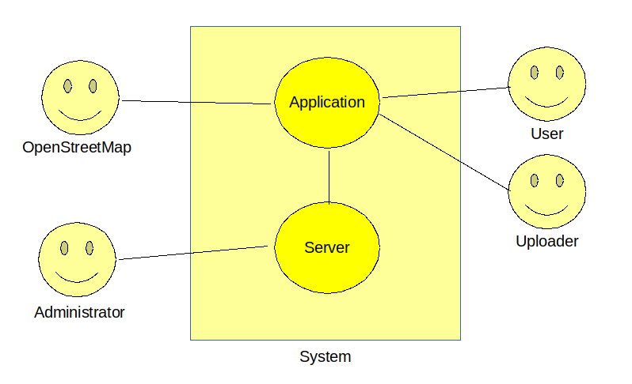

Official Requirements Document
==============================

Author: Andrea Fanti

Date: 2020-03-29

## Contents
* [Abstract](#abstract)
* [Stakeholders](#stakeholders)
* [Context diagram and interfaces](#context-diagram-and-interfaces)
	+ [Context diagram](#context-diagram)
	+ [Interfaces](#interfaces)
* [Stories and personas](#stories-and-personas)
* [Functional and non functional requirements](#functional-and-non-functional-requirements)
	+ [Functional requirements](#functional-requirements)
	+ [Non functional requirements](#non-functional-requirements)
* [Use cases](#use-cases)

## Abstract
EZGas is a service that allows its users to perform essentially 2 actions:
+ upload prices of a particular gas station to the community
+ locate surrounding gas stations. In particular, locate them and highlight
  the cheapest ones

## Stakeholders
| Stakeholder name | Description																					|
|:---------------- |:---------------------------------------------------------------------------------------------- |
| Users            | Drives a vehicle and occasionally has to refill its fuel tank									|
| Uploaders        | Users who update or upload a gas station's price list (or the gas station existance)			|
| Administrator    | Ensures the system storing all the prices remains up and running								|
| Developers       | Don't use the application directly. Develop the application and design the database used by it |
| OpenStreetMap    | Used as map service (display map, show gas stations markers, calculate routes)					|

## Context diagram and interfaces

### Context diagram

### Interfaces
| Actor                            | Logical | Physical         |
| -------------------------------- |:-------:|:----------------:|
| map service (i.e. OpenStreetMap) | OSM API | internet         |
| user                             | GUI     | touchscreen      |
| uploader                         | GUI     | touchscreen      |
| administrator                    | shell   | screen, keyboard |

## Stories and personas
Charlie is a traveler who dreams to visit every country in the world with his
camper.  
As he travels around the globe, many times it happens that his vehicle is close
to leave him on foot, so Charlie is forced to find quickly a fuel station.

Luckily for him, the EZGas app that he installed on its phone easily points him
to the nearest gas station. Once again Charlie can continue its journey.

Carl is a guy who goes to work by car.
Sometimes, since the path is long, it happens that he has to do gas refueling
on his way to work.

Using EZGas, he can look which gas station is more convenient for him, after
all, money doesn't grow on trees!  
While he's there, he usually updates the shown petrol price to the current one
if it has changed so everyone can benefit from it.

## Functional and non functional requirements

### Functional requirements
| ID  | Description															  |
| --  | --------------------------------------------------------------------- |
| FR1 | Record a previously not present gas station in the system			  |
| FR2 | Insert/update a gas station's price listing							  |
| FR3 | Show a gas station's most recently recorded price listing			  |
| FR4 | Calculate route to a specific gas station                             |
| FR5 | Calculate route to the nearest gas station							  |
| FR6 | Calculate route to the cheapest gas station within a certain distance |

### Non functional requirements
| ID   | Type         | Description 												   | Refers to |
| ---- | ------------ | -------------------------------------------------------------- | --------- |
| NFR1 | Usability    | Application should be usable by 90% of people without training | All FR    |
| NFR2 | Performance  | Action must complete within 1 second                           | FR2, FR3  |
| NFR3 | Performance  | Action must complete within 5 seconds                          | FR1,4,5,6 |
| NFR4 | Portability  | Application run on Android version 8 (and successive)          | All FR    |
| NFR5 | Localisation | Application is localised in english and italian                | All FR    |

## Use cases

### UC1: FR1 - Record a previously not present gas station in the system
- **Actors involved**: Uploader
- **Precondition**: Gas station G exists, G not already recorded, Uploader
  has GPS signal
- **Nominal Scenario**:
	1. Uploader inputs gas station's name (ex. "Esso")
	2. Current location is acquired
	3. Tuple (name, current location) is sent to the server
- **Variants**: /

### UC2: FR2 - Insert/update a gas station's price listing
- **Actors involved**: Uploader, OpenStreetMap
- **Precondition**: Gas station G exists
- **Nominal Scenario**:
	1. Map is shown in Uploader's application
	2. Uploader select a gas station in the map
	3. Uploader writes price/volume for each (or a subset) fuel present in the
	   gas station
	4. tuple (gas station, price listing) is sent to the server
- **Variants**: /

### UC3: FR3 - Show a gas station's most recently recorded price listing
- **Actors involved**: User, OpenStreetMap
- **Precondition**: none
- **Nominal Scenario**:
	1. Map is shown in User's application
	2. Server is queried for all gas stations that fit in the screen
	3. markers are placed on the map at gas stations' locations
	4. User taps on a gas station's marker
	5. Server is queried for that gas station' price listing
	6. returned price listing is shown on the application
- **Variants**: /

### UC4: FR4 - Calculate route to a specific gas station
- **Actors involved**: User, OpenStreetMap
- **Precondition**: none
- **Nominal Scenario**:
	1. Map is shown in User's application
	2. current location CL is acquired
	2. Server is queried for all gas stations that fit in the screen
	3. markers are placed on the map at gas stations' locations
	3. User taps on a gas station's marker M
	4. calculate and show path from CL to M
- **Variants**: /

### UC5: FR5 - Calculate route to the nearest gas station
- **Actors involved**: User, OpenStreetMaps
- **Precondition**: User has GPS signal
- **Nominal Scenario**:
	1. Current location CL is acquired and sent to the server
	2. the nearest gas station's location GL is returned to the application
	3. calculate and show path from CL to GL
- **Variants**: /

### UC6: FR6 - Calculate route to the cheapest gas station within a certain distance
- **Actors involved**: User, OpenStreetMaps
- **Precondition**: User has GPS signal
- **Nominal Scenario**:
	1. User selects a radius R of search from current location
	2. Current location CL is acquired
	3. tuple (CL, R) is sent to the server
	4. all gas stations within a distance R from CL are returned to the application
	5. cheapest 5 gas stations are calculated by application
	6. map is shown with these stations highlighted. Refer to UC4
- **Variants**:  /

<!--
The following text is not intended to be part of the document but is here to
correctly show the document in the vim text editor.
vim: tabstop=4 shiftwidth=4
-->
