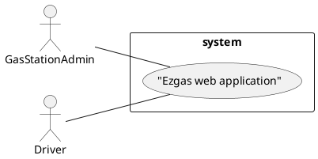

# Official Requirements Document

Authors: Federico Princiotto

Date: 24/03/2020

# Contents
- [Abstract](#Abstract)
- [Stakeholders](#stakeholders)
- [Context Diagram and interfaces](#context-diagram-and-interfaces)
    + [Context Diagram](#context-diagram)
    + [Interfaces](#interfaces) 
    
- [Stories and personas](#stories-and-personas)
- [Functional and non functional requirements](#functional-and-non-functional-requirements)
    + [Functional Requirements](#functional-requirements)
    + [Non functional requirements](#non-functional-requirements)
- [Use case diagram and use cases](#use-case-diagram-and-use-cases)
    + [Use case diagram](#use-case-diagram)
    + [Use cases](#use-cases)
    + [Relevant scenarios](#relevant-scenarios)

# Abstract
TODO

# Stakeholders

| Stakehokder name | Description |
| --- | --- |
| Gas station admin | Uses the web application to promote his gas station |
| Drivers | Uses the web application to search for a near gas station or for a cheaper one |
| Developer | Who has to develop and maintain the web application|

# Context Diagram and interfaces

## Context Diagram

## Interfaces
| Actor | Logical Interface | Physical Interface  |
| ------------- |:-------------:| -----:|
|Administrator|Web Application |Pc, smartphone|
|Driver|Web Application |Pc, smartphone|

# Stories and Personas

TODO

# Functional and non functional requirements
## Functional Requirements

| ID | Description |
| --- | --- |
| FR1 | User interface to insert a new gas station | 
| FR2 | Insert gas station in Ezgas database |
| FR3 | Update daily gas station price (done manually by the admin) |
| FR4 | Search gas station by distance to the user |
| FR5 | Search gas station by price |

## Non functional requirements

| ID | Type |Description |
| --- | --- | --- |
| NFR1 | Usability | Should have a user-friendy interface |
| NFR2 | Peformance | Web page and result should not appear in more than 1 second |
| NFR3 | Portability | Should be compatible with all the most used browsers |
| NFR4 | Portability | Should be optimized both for desktop and mobile interfaces |
