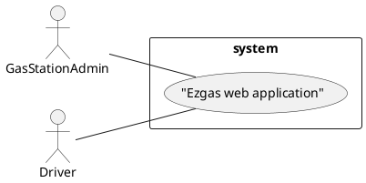
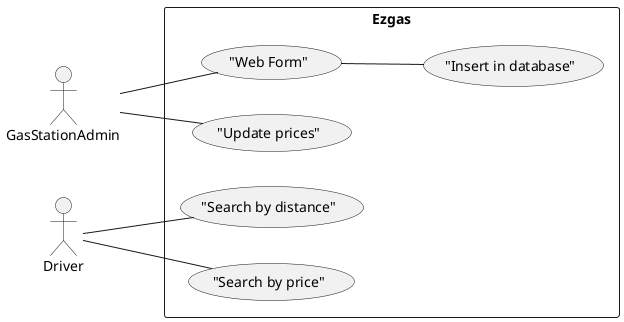

# Official Requirements Document

Authors: Federico Princiotto

Date: 24/03/2020

# Contents
- [Abstract](#Abstract)
- [Stakeholders](#stakeholders)
- [Context Diagram and interfaces](#context-diagram-and-interfaces)
    + [Context Diagram](#context-diagram)
    + [Interfaces](#interfaces) 
    
- [Stories and personas](#stories-and-personas)
- [Functional and non functional requirements](#functional-and-non-functional-requirements)
    + [Functional Requirements](#functional-requirements)
    + [Non functional requirements](#non-functional-requirements)
- [Use case diagram and use cases](#use-case-diagram-and-use-cases)
    + [Use case diagram](#use-case-diagram)
    + [Use cases](#use-cases)
    + [Relevant scenarios](#relevant-scenarios)

# Abstract

A web application that allows gas station's owner to register their gas station, and driver to search gas station around them, filtering by distance or price.

# Stakeholders

| Stakehokder name | Description |
| --- | --- |
| Gas station admin | Uses the web application to promote his gas station |
| Drivers | Uses the web application to search for a near gas station or for a cheaper one |
| Developer | Who has to develop and maintain the web application|

# Context Diagram and interfaces

## Context Diagram

## Interfaces
| Actor | Logical Interface | Physical Interface  |
| ------------- |:-------------:| -----:|
|Administrator|Web Application |Pc, smartphone|
|Driver|Web Application |Pc, smartphone|

# Stories and Personas

- John is a simple driver. Like any simple driver, he wants to save some money when he drives a lot, and he wants to save some money when he refuel is beloved car. Usually John has to look for the less expensive gas station, or just  trust the nearest one. With **Ezgas** John can search a near and not too expensive gas station in less than a minute. But he still cannot do it while driving: it's dangerous!
- Mark is the owner of a gas station. His gas station is not very expensive, but is really difficult to found, distant from the main roads, so he has only a few of clients every day. With **Ezgas** he can be found more easily from other drivers, and have more clients!

# Functional and non functional requirements
## Functional Requirements

| ID | Description |
| --- | --- |
| FR1 | User interface to insert a new gas station | 
| FR2 | Insert gas station in Ezgas database |
| FR3 | Update daily gas station price (done manually by the admin) |
| FR4 | Search gas station by distance to the user |
| FR5 | Search gas station by price |

## Non functional requirements

| ID | Type |Description |
| --- | --- | --- |
| NFR1 | Usability | Should have a user-friendy interface |
| NFR2 | Peformance | Web page and result should not appear in more than 1 second |
| NFR3 | Portability | Should be compatible with all the most used browsers |
| NFR4 | Portability | Should be optimized both for desktop and mobile interfaces |

# Use case diagram and use cases

## Use case diagram

## Use cases

- ### Use case 1, UC1 - FR1, User interface to insert a new gas station 
| Actors Involved | Administrator |
| ------------- |:-------------:| 
|  Precondition  |  |  
|  Post condition | Create a web form with all the information needed to insert a new gas station |
|  Nominal Scenario | A has station owner wants to add his gas station in the web application |
| Variant | Form incomplete |

- ### Use case 2, UC2 - FR2 
| Actors Involved | |
| ------------- |:-------------:| 
|  Precondition | All information needed are available |  
|  Post condition  | Gas station is in database |
|  Nominal Scenario  | Database update after web form |

- ### Use case 3, UC3 - FR3, Update gas station prices
| Actors Involved | Gas station price |
| ------------- |:-------------:| 
|  Precondition     | Gas station exists |  
|  Post condition     | Gas station price updated |
|  Nominal Scenario     | Once a day, the gas station admin wants to update the prices shown in the web application |

- ### Use case 4, UC4 - FR4, Search by distance
| Actors Involved | Driver |
| ------------- |:-------------:| 
|  Precondition |  Database available, drivers gps available |  
|  Post condition | Show all gas station within a certain distance |
|  Nominal Scenario | User search for a nearby gas station |

- ### Use case 5, UC5 - FR5, Search by price
| Actors Involved | Driver |
| ------------- |:-------------:| 
|  Precondition |  Database available, drivers gps available |  
|  Post condition | Show all gas station with price < selected_price |
|  Nominal Scenario | User search for a not too expensive gas station |

# Relevant scenarios

## Scenario 1
| Scenario ID: SC1 | Corresponds to UC2  |
| ------------- |:-------------| 
| Description | Update database, insert new gas station |
| Precondition | All information available |
| Postcondition |  New gas station is in the database |

| Step#        |  Step description   |
| ------------- |:-------------| 
|  1     | Check if all information about the new gas station are complete |  
|  2     | Check if is not already in the database |
|  3     | Insert in database |

## Scenario 2
| Scenario ID: SC2 | Corresponds UC2  |
| ------------- |:-------------| 
| Description | Update database, insert new gas station |
| Precondition | The form was wrown/incomplete, informations missing|
| Postcondition | Raise error to the user who tried to insert the new gas station |

| Step#        |  Step description   |
| ------------- |:-------------| 
|  1     | Check if all information about the new gas station are complete |  
|  2     | Raise error |
