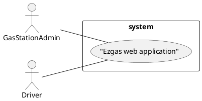

# Official Requirements Document

Authors: Federico Princiotto

Date: 24/03/2020

# Contents
- [Abstract](#Abstract)
- [Stakeholders](#stakeholders)
- [Context Diagram and interfaces](#context-diagram-and-interfaces)
    + [Context Diagram](#context-diagram)
    + [Interfaces](#interfaces) 
    
- [Stories and personas](#stories-and-personas)
- [Functional and non functional requirements](#functional-and-non-functional-requirements)
    + [Functional Requirements](#functional-requirements)
    + [Non functional requirements](#non-functional-requirements)
- [Use case diagram and use cases](#use-case-diagram-and-use-cases)
    + [Use case diagram](#use-case-diagram)
    + [Use cases](#use-cases)
    + [Relevant scenarios](#relevant-scenarios)

# Abstract
TODO

# Stakeholders

| Stakehokder name | Description |
| --- | --- |
| Gas station admin | Uses the web application to promote his gas station |
| Drivers | Uses the web application to search for a near gas station or for a cheaper one |
| Developer | Who has to develop and maintain the web application|

# Context Diagram and interfaces

## Context Diagram

## Interfaces
| Actor | Logical Interface | Physical Interface  |
| ------------- |:-------------:| -----:|
|Administrator|Web Application |Pc, smartphone|
|Driver|Web Application |Pc, smartphone|
