# EZGas Requirements Document

Author: Alessandro Pizzorno

Date: 24/03/2020

Version: 3

| Version | Changes | 
| ----------------- |:-----------|
| 2 | Added Glossary |
| | Updated [Use Case Diagram](#use-case-diagram) |
| | Fixed inaccuracies in [Use Cases](#use-cases): modified preconditions of UC1, UC2 and UC7 |
| 3 | Added User Interface |

# Contents
- [Abstract](#abstract)
  
- [Stakeholders](#stakeholders)
  
- [Context Diagram And Interfaces](#context-diagram-and-interfaces)
	- [Context Diagram](#context-diagram)
	- [Interfaces](#interfaces)
- [Stories And Personas](#stories-and-personas)
- [Functional And Non Functional Requirements](#functional-and-non-functional-requirements)
	- [Functional Requirements](#functional-requirements)
	- [Non Functional Requirements](#non-functional-requirements)
- [Use Case Diagram And Use Cases](#use-case-diagram-and-use-cases)
	- [Use Case Diagram](#use-case-diagram)
	- [Use Cases](#use-cases)
    - [Relevant Scenarios](#relevant-scenarios)
- [Glossary](#glossary)
- [User Interface](#user-interface)
	

# Abstract

Everyday people get into their cars and drive either to go to work, on vacation or simply to meet up with some friends.
As the time passes the fuel level of their tanks gets lower and lower until they find themselves stopping for gas at the first gas station they can spot and paying a lot more money than they would have had to if only they had known that a couple of kilometers ahead there were another gas station with a lower fuel price.

Thanks to EZGas this won't be a problem anymore.

EZGas is an application providing a crowdsourcing service to allow users to collect the prices of fuels in the different gas stations and to locate the gas stations in a specific area along with the prices they practice.

# Stakeholders

| Stakeholder Name | Description |
| ---------------- | ----------- |
| Users            | Use the application to locate on a map the nearest gas stations to their area of interest and their fuel prices. They can also insert new gas stations and update the prices of others |
| Administrator | Doesn't use directly the application itself but manages the users checking their modifications to the list of gas stations and prices and handling any possible errors | 
| Map Provider  |  Grants the application the permission to use its maps to locate the different gas stations on |

# Context Diagram And Interfaces

## Context Diagram

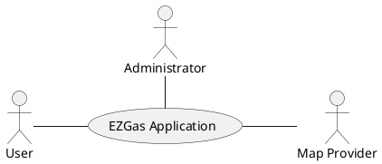

## Interfaces

| Actor | Logical Interface | Physical Interface  |
| ------------- |:-------------:| -----:|
| User | GUI | Screen, Keyboard, Touchscreen |
| Administrator | GUI | Screen, Keyboard, Touchscreen |
| Map Provider | API | Internet Connection |

# Stories And Personas

Linus is a commuter who spends a lot of his time during the days inside his car either travelling to work or just moving around the city to perform everyday chores.Besides, he has a strong sense of respect for the work of others and he is very proactive.

As a consequence, Linus spends a relevant amount of his salary in gas and he would reall like to reduce it to dedicate part of it for other purposes.

Therefore, Linus would appreciate a simple way to use his smartphone to always look up the best fuel prices available among the gas stations near to him as he travels in order to save some money and also never have to be worried about the possibility of going out of gas.
Moreover, he would also be really happy to share the location of the best spots he  already found to refuel after years of travelling through the same zones.

Bob owns a gas station in an area that is not very known unfortunately and he would like to increase the amount of customers he receives.
Therefore Bob would like to have an easy way to signal the position of his gas station on the map along with the fuel prices he practices that he knows are very competitive compared to the competiton since he already had already lowered them a bit hoping that would help with the whole customer situation too.

Lucy is an average person who travels a lot by car too and would absolutely love to have the possibility to reduce her expenses on something she needs to buy very often such as gas for her car but she has also always been very skeptical about the whole online identity matter because of the possible risks related to her privacy involved with having one. So she would like a way to gain access to a service like the one Linus desires but without needing expose her personal data in any way.

# Functional And Non Functional Requirements

## Functional Requirements

| ID        	| Description   |
| ------------- |:-------------:| 
| FR1 			| Show on the map the available gas stations and the fuel prices they practice in a specific area|
| FR2 			| Show directions on the map to reach the chosen gas station for the refuel |
| FR3			| Let registered Users inert a new gas station |
| FR4			| Let registered Users update the prices of a gas station 	  |
| FR5 			| Make available the report of eventual errors |
| FR6			| Manage Users accounts |
| FR7			| Produce a report on the avereage reliability of the information inserted by each registered user |
| FR8			| Produce a report on the total average reliability of the information inserted into the application |
 
 ## Non Functional Requirements

| ID        | Type (Efficiency, Reliability, .. see ISO 9126)           | Description  | Refers to |
| ------------- |:-------------:| :-----:| -----:|
| NFR1			| Usability 	| Application should be used with no training by any colleague in the office  | All FR |
| NFR2			| Efficiency 	| All functions should complete in < 0.5 sec  	| All FR 		|
| NFR3			| Portability 	| The application should run on MS Windows 10, Mac OS X (High Sierra or later) and Linux  | All FR 				|
| NFR4			|  Portability 	| The application data should be to the regisered account so that it can be easily portable from one smartphone to a new one	 | 		 |
| NFR5			| Localisation	| Fuel prices are displayed in Euros using , (comma) as decimal separator |

# Use Case Diagram And Use Cases

## Use Case Diagram

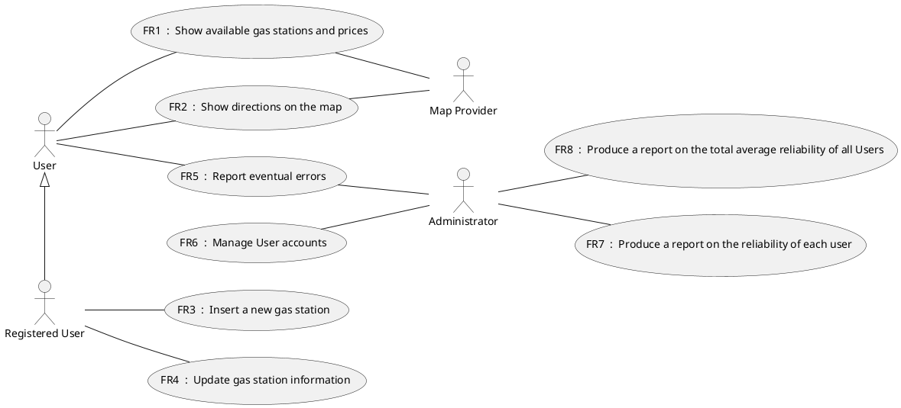
## Use Cases

### Use Case 1, UC1 - FR1 Show available gas stations and prices

| Actors Involved        | User, Map provider |
| ------------- |:-------------:| 
|  Precondition     | Map provider M is up and running, internet connection is working, GPS is working |  
|  Post condition     | Current position correctly visualized on the map along with the different available gas stations and the fuel prices they practice |
|  Nominal Scenario     | User activate the geolaction on his device, the map around his current position loads and visualizes the location of near gas station and their information|
|  Variants     | User decides to filter his options through some constraints, only the matching gas stations will be visualized |

### Use Case 2, UC2 - FR2 Show directions on the map

| Actors Involved        | User, Map provider |
| ------------- |:-------------:| 
|  Precondition     | Map Provider M is up and running, internet connection is working, GPS is working, Gas stations near the current position and their fuel prices are correctly displayed on the map (FR1) |  
|  Post condition     | Path from the User's current position to the selected gas station correctly visualized on the map |
|  Nominal Scenario     | After having opened the application, the User evaluates the available gas stations shown near his position, selects one and the directions to reach it are highlited on the map  |
|  Variants     | User decides to look for an alternative path to reach the desired gas station to avoid having to pay for highway tickets, a new path matching his desire is calculated and shown |

### Use Case 3, UC3 - FR3 Insert a new gas station

| Actors Involved        | User |
| ------------- |:-------------:| 
|  Precondition     | The User is registered and logged into the application and the gas station must not be already present in the database |  
|  Post condition     |  Gas station correctly added to the database and shown on the map along with its information |
|  Nominal Scenario     | The User inserts the position of the new gas station by inputting its coordinates or writing its address, then he fills in the information about the gas station. After that the application will send the new data to the server to be added to the database |
|  Variants     | If the gas station is already present in the database, return an error message to tell the User about it and cancel the insertion |

### Use Case 4, UC4 - FR4 Update gas station information

| Actors Involved        | User |
| ------------- |:-------------:| 
|  Precondition     |The User is registered and logged into the application |  
|  Post condition     |  The new information is correctly registered into the databse and visualized on the application|
|  Nominal Scenario     | The User selects the specific gas station he wants to update the information of and inserts a new price for a fuel type. After that the application will send the new data to the server to be used to update the database |
|  Variants     | |

### Use Case 5, UC5 - FR5 Report eventual errors

| Actors Involved        | User, Administrator |
| ------------- |:-------------:| 
|  Precondition     |  |  
|  Post condition     |   |
|  Nominal Scenario     | The User finds some kind of error relative to the service and fills in a report about it. The report is sent to the Administrator to investigate further into it |
|  Variants     | | 

### Use Case 6, UC6 - FR6 Manage User Accounts

| Actors Involved        | Administrator |
| ------------- |:-------------:| 
|  Precondition     |  |  
|  Post condition     |   |
|  Nominal Scenario     | The Administrator can interact the User accounts by changing their permissions, resetting their passwords, creating, deleting or suspending them |
|  Variants     | |  

### Use Case 7, UC7 - FR7 Produce a report on the reliability of each user

| Actors Involved        | Administrator  |
| ------------- |:-------------:| 
|  Precondition     | User U is a registered |  
|  Post condition     |  |
|  Nominal Scenario     | The Administrator selects the User U, defines a time range and the application collects all the eventual reports of error issued in the selected time range related to the information that specific user inserted and presents them |
|  Variants     | |

### Use Case 8, UC8 - FR8 Produce a reprot on the total average reliability 

| Actors Involved        | Administrator  |
| ------------- |:-------------:| 
|  Precondition     | |  
|  Post condition     |  |
|  Nominal Scenario     | The Administrator defines a time range and the application collects all the eventual reports of error issued in the selected time range related to wrong information and presents them |
|  Variants     | |

# Relevant Scenarios

## Scenario 1

| Scenario ID: SC1        | Corresponds to UC1  |
| ------------- |:-------------| 
| Description | Show near gas stations on the map along with their fuel prices |
| Precondition | Internet connection is working |
| Postcondition | The gas stations near the position of the User are displayed on the screen along with their prices |
| Step#        |  Step description   |
|  1     | The User activates the location module on his device |  
|  2     | The application performs a research based on the current position |
|  3     | The application selects all the gas stations in a default range of kilometres around the current position |
|  4 	 | Gas stations and their fuel prices are displayed on the map |

## Scenario 2

| Scenario ID: SC2        | Corresponds to UC1  |
| ------------- |:-------------| 
| Description | Show near gas stations on the map along with their fuel prices filtered by some constraints |
| Precondition | Internet connection is working |
| Postcondition |  Only gas stations satisfying the constraints are displayed on the map along with their prices  |
| Step#        |  Step description   |
|  1     | The User activates the location module on the device |
|  2	 | The User defines some constraints to filter the research | 
|  3     | The application performs a research based on the current position and the defined constraints |
|  4     | The application selects all the gas stations satisfying the constraints specified by the User around its current position |
|  5 	 | The Gas stations selected by the application and their fuel prices are displayed on the map |

## Scenario 3

| Scenario ID: SC3        | Corresponds to UC1  |
| ------------- |:-------------| 
| Description | Show near gas stations on the map along with their fuel prices without an internet connection |
| Precondition | Internet connection is not working or not active |
| Postcondition |  The gas stations and their fuel prices present in the cache of the application are displayed along with a warning message  |
| Step#        |  Step description   |
|  1     | The User activates is location module on the device |  
|  2	 | The User defines some constrains to filter the research of near gas stations |
|  3     | The application tries to start the research but it fails |
|  4     | The application looks for gas stations satisfying  the constraints specified by the User into its cached data |
|  5 	 | If the application is successful in finding some gas stations matching the constraints in the cache, it displays them on the map along a warning message |
|  6 	 | If the application fails in finding some gas stations matching the constraints in the cache, it simply displays a warning message about the lack of internet connection |

## Scenario 4

| Scenario ID: SC4        | Corresponds to UC2  |
| ------------- |:-------------| 
| Description | Show directions on the map to reach a specific gas station |
| Precondition | Internet connection is working, the User has the location module of his device active and available gas stations near his position are shown on the map (FR1) |
| Postcondition |  The path to reach the specified gas station is higlited on the map  |
| Step#        |  Step description   |
|  1     | The User selects on the map the specific gas station he wants to reach |  
|  2     | The application performs a research of the shortest path from the current position of the User to the selected gas station to reach |
|  3 	 | The path found by the application is higlited on the map |

## Scenario 5

| Scenario ID: SC5        | Corresponds to UC2  |
| ------------- |:-------------| 
| Description | Show directions filtered by User specified constraints to reach a specific gas station on the map |
| Precondition | Internet connection is working, the User has the location module of his device active and available gas stations near his position are shown on the map (FR1) |
| Postcondition |  The path satisfying the constraints to reach the specified gas station is higlited on the map  |
| Step#        |  Step description   |
|  1     | The User selects on the map the specific gas station he wants to reach |
| 2		 | The User specifies the constraints to filter the research of the path to reach the selected gas station | 
|  3     | The application performs a research of a path from the current position of the User to the selected gas station  to reach that satisfies the constraints specified |
|  3 	 | The path found by the application is higlited on the map |

## Scenario 6

| Scenario ID: SC6        | Corresponds to UC2  |
| ------------- |:-------------| 
| Description | Show directions on the map to reach a specific gas station without an internet connection |
| Precondition | Internet connection is not working, the User has the location module of his device active and available gas stations near his position fetched from the cache of the application are shown on the map |
| Postcondition |  An error message is displayed |
| Step#        |  Step description   |
|  1     | The User selects on the map the specific gas station he wants to reach |  
|  2     | The application performs a research of a path from the current position of the User to the selected gas station to reach but it fails|
|  3 	 | An error message notifying the impossibility of showing directions due to the lack of an internet connection is displayed to the User |

## Scenario 7

| Scenario ID: SC7        | Corresponds to UC3  |
| ------------- |:-------------| 
| Description | Insertion of a new gas station |
|Precondition |  Internet connection is working, the new gas station to insert is not already present in the database |
|Postcondition |  The new gas station is correctly added to the database |
| Step#        | Step description  |
|  1     | The User selects the section of the application to perform a new gas station insertion |  
|  2     | The User fills in the  gas station name, its address, its coordinates, and finally the information about  its fuel prices |
|  3     | The application takes this information and adds it into the database  |
|  4 	 | The new gas station is displayed on the map along with its information |

## Scenario 8

| Scenario ID: SC8        | Corresponds to UC3  |
| ------------- |:-------------| 
| Description | Insertion of a gas station already present into the database |
|Precondition |  Internet connection is working, the new gas station to insert is already present into the database |
|Postcondition |  The insertions is rejected and an error message is displayed |
| Step#        | Step description  |
|  1     | The User selects the section of the application to perform a new gas station insertion |  
|  2     | The User fills in the  gas station name, its address, its coordinates, and finally the information about  its fuel prices |
|  3     | The application takes this information and finds out that its already present into the database |
|  4 	 | The application rejects the new insertion discarding the inserted data |
| 5		 | An error message notifying the User about the duplicate information is displayed on the screen |

## Scenario 9

| Scenario ID: SC9        | Corresponds to UC3  |
| ------------- |:-------------| 
| Description | Insertion of a new gas station without an internet connection |
|Precondition |  Internet connection is not working |
|Postcondition |  A warning message is shown on the screen |
| Step#        | Step description  |
|  1     | The User selects the section of the application to perform a new gas station insertion |  
|  2     | The User fills in the  gas station name, its address, its coordinates, and finally the information about  its fuel prices |
|  3     | The application tries to send the information to the server to add it to the database but it fails |
|  4 	 | The application displays to the User a warning message asking whether to discard the information about the new gas station or to store it locally and wait for an internet connection to correctly complete the operation. |

## Scenario 10

| Scenario ID: SC10        | Corresponds to UC4  |
| ------------- |:-------------| 
| Description | Update of the information about a specific gas station |
|Precondition |  Internet connection is working |
|Postcondition |  The new information about the selected gas station is correctly inserted into the database |
| Step#        | Step description  |
|  1     | The User selects the section of the application to perform an update of the information about a gas station |  
|  2     | The User selects from a list the gas station he wants to update the information of |
|  3	 | The User inserts the new prices for the different types of fuel |
|  4     | The application takes this information and sends it to the srever to update the database |
|  4 	 | The gas station is displayed on the map along with its updated information |

## Scenario 11

| Scenario ID: SC11        | Corresponds to UC4  |
| ------------- |:-------------| 
| Description | Update of the information about a specific gas station without an internet connection |
|Precondition |  Internet connection is not working |
|Postcondition |  A warning message is shown on the screen |
| Step#        | Step description  |
|  1     | The User selects the section of the application to perform an update of the information about a gas station |  
|  2     | The User inserts the new prices for the different types of fuel |
|  3     | The application tries to send the information to the server to update the database but it fails |
|  4 	 | The application displays to the User a warning message asking whether to discard the newly inserted information about the selected gas station or to store it locally and wait for an internet connection to correctly complete the operation. |

# Glossary

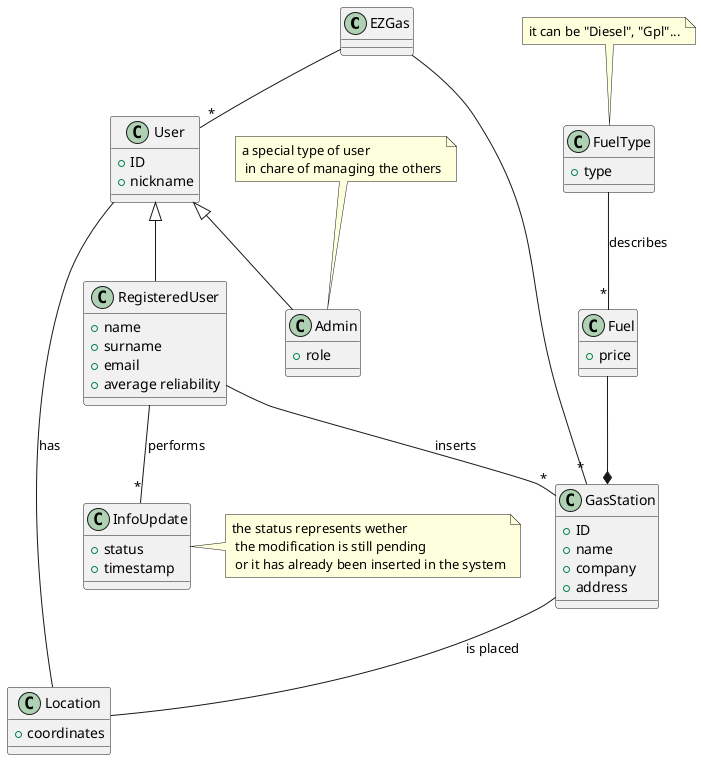

# User Interface

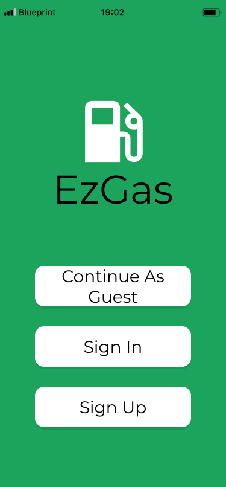 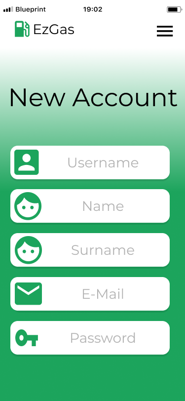 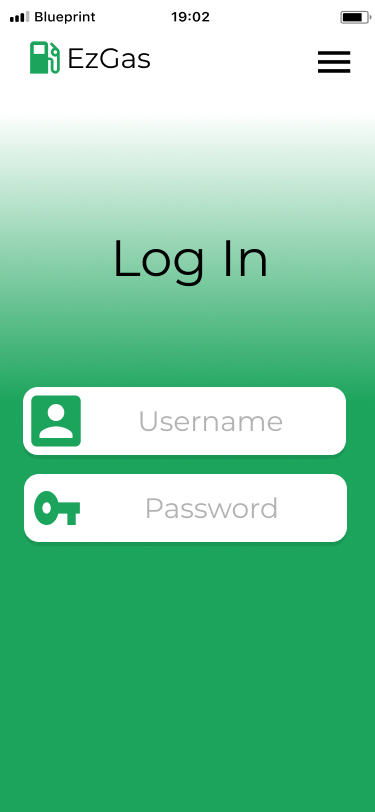 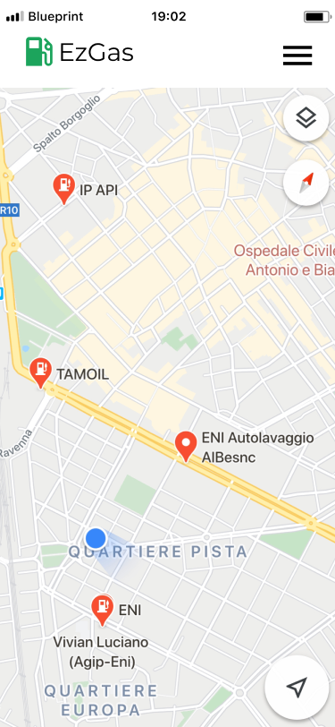 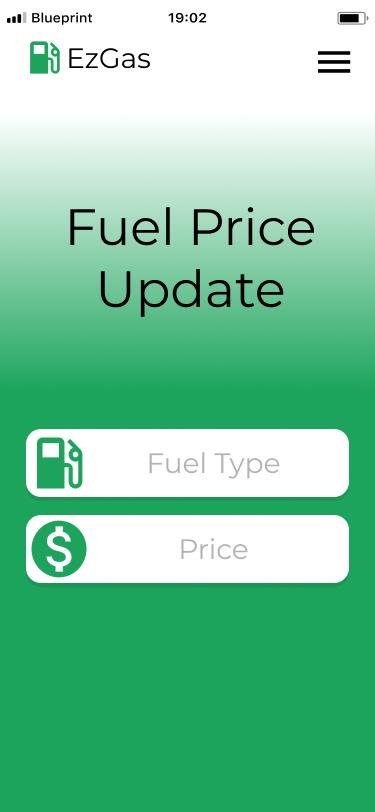 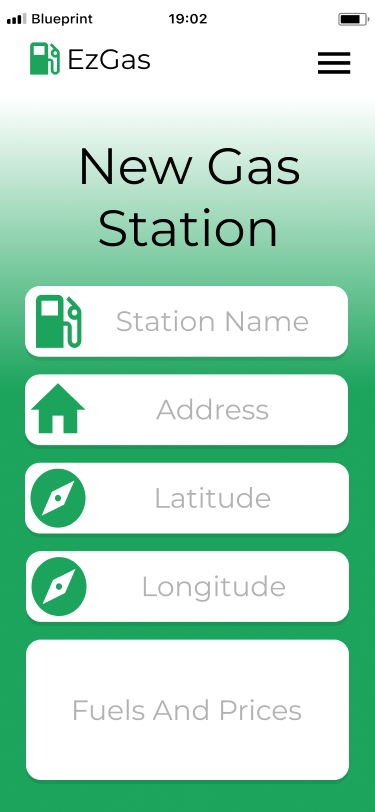 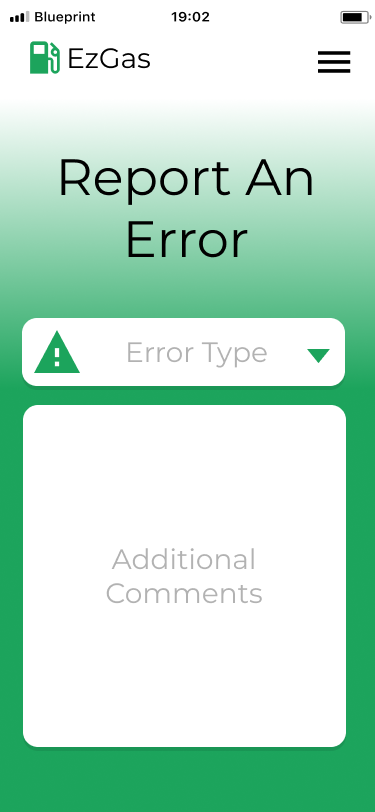 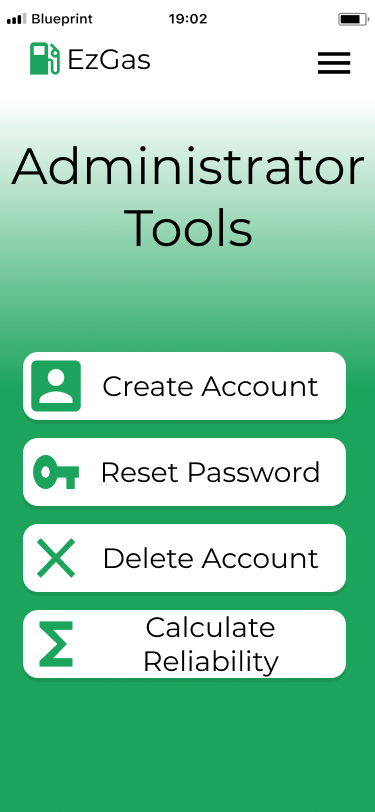 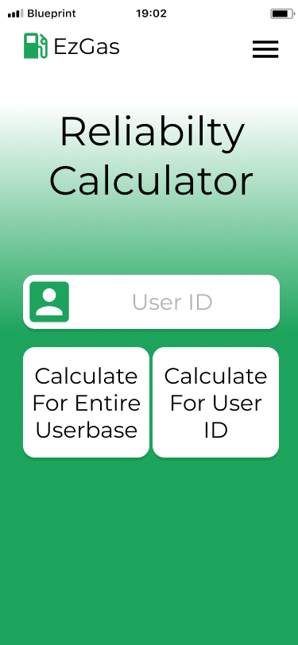 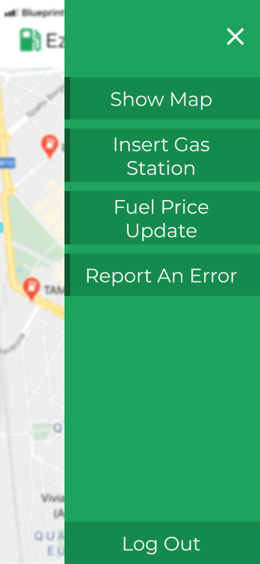 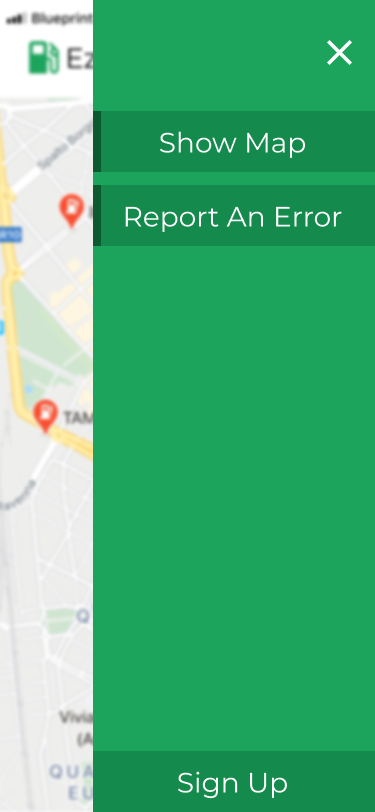 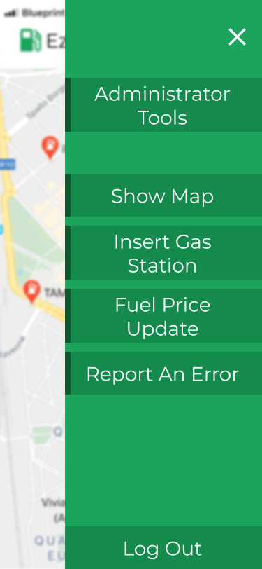