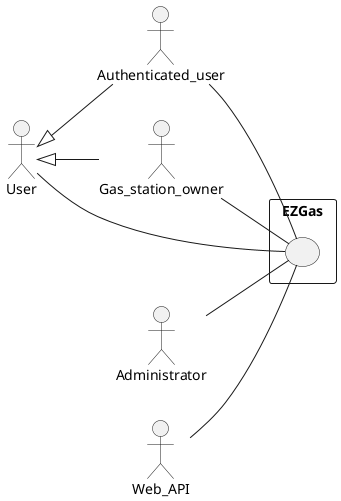
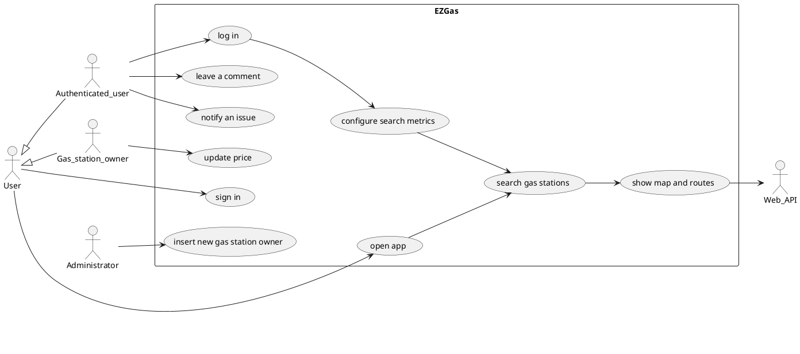
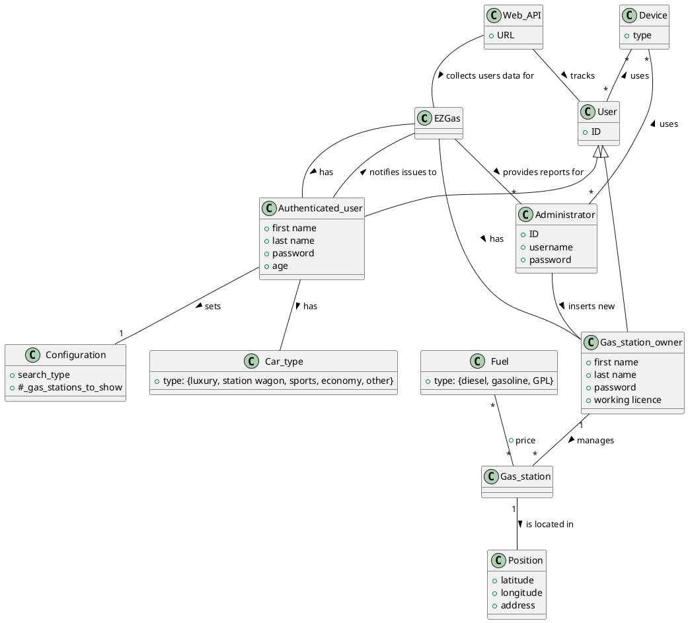

# Official Requirements Document

Author: Gastaldi Paolo

Date: 07/04/2020

Version: 5

Change history

| Version | Changes | 
| :- | :- |
| 2 | Abstract, stakeholdes, stories, use cases, functional requirements, non functional requirements corrections |
| 3 | Adding glossary |
| 4 | Glossary corrections |
| 5 | Adding GUI prototype |

# Contents

- [Abstract](#abstract)
- [Stakeholders](#stakeholders)
- [Context Diagram and interfaces](#context-diagram-and-interfaces)
	+ [Context Diagram](#context-diagram)
	+ [Interfaces](#interfaces) 
	
- [Stories and personas](#stories-and-personas)
- [Functional and non functional requirements](#functional-and-non-functional-requirements)
	+ [Functional Requirements](#functional-requirements)
	+ [Non functional requirements](#non-functional-requirements)
- [Use case diagram and use cases](#use-case-diagram-and-use-cases)
	+ [Use case diagram](#use-case-diagram)
	+ [Use cases](#use-cases)
	+ [Relevant scenarios](#relevant-scenarios)
- [Glossary](#glossary)
- [GUI prototype] (#gui-prototype)

# Abstract

*Gas station* positions are very important for *drivers*, expecially for who travels a lot for his/her job. Finding a gas station can be an expensive time activity and depends on each single person preferences.

Gas station owners are very interested to increase their visibility, in particular those one who does not provide their service on a main and busy road. They can try to make their own advertisements, but a specific system for gas stations can be more effective.

The *EZGas application* goal is to provide an uniform interface between drivers and gas station owners. As different people have different ways to choose with gas station use, many metrics will be implemented to allow multiple configurations.

# Stakeholders

| Stakeholder name  | Description | 
| :- | :-: |
| User | Uses the application to find a gas station, according to predefined or configurable metrics |
| Authenticated user | Is able to do more actions than a non authenticated user: insert car data, configure more search metrics, review gas stations |
| Gas station owner | Owns the gas station, after he/she register to the system can set the price for each selled fuel |
| Administrator | Manages users data (user accounts, feedbacks, comments, analytics) and gas station oweners data (registration, validation) |
| Web API | To show maps, driving routes, send user requests and data to the app servers |

# Context Diagram and interfaces

## Context Diagram

## Interfaces

| Actor | Logical Interface | Physical Interface |
| :- | :-: | :-: |
| User | Web application | Smartphone, PC |
| Authenticated user | Web application | Smartphone, PC |
| Gas station owner | Web application | Smartphone, PC |
| Administrator | Web application | Smartphone, PC |
| Web API | Web API | Internet |

# Stories and personas

Giacomo travels a lot for his work. When he has to fill his car he wants to find the nearest gas station. Furthermore he does not like to configure apps before using them - he prefers fast and easy solutions.

Enrico always pays a lot of attention to save money. When he has to fill his car he chooses the cheapest and nearest gas station very carefully. He thinks an automated app on his smartphone can be very useful for people like him.

Elisabetta hates waiting for gas station queues. She would like to predict which gas stations are the most used in a specific hour of the day.

Carlo owns a gas station in a secondary street. Even if he keeps low prices, he cannot increase his customers because few traffic is there. He would like a new system to increase his visibility to drivers.

# Functional and non functional requirements

## Functional Requirements

| ID | | Description |
| :- |:- | :-: |   
| FR1 | | Register a new user |
| FR2 | | Provide gas station positions |
| FR3 | | Leave a comment about a gas station |
| FR4 | | Configure gas station search |
| | FR4.1 | Search by nearest postition |
| | FR4.2 | Search by lower prices |
| | FR4.3 | Search by less congested gas station | 
| FR5 | | Select a gas station |
| FR6 | | Notify gas station issues to the system administrator |
| | FR6.1 | Notify a wrong fuel price |
| | FR6.2 | Notify a wrong position |
| FR7 | | Update a fuel price |
| FR8 | | Register a new gas owner |
| FR9 | | Track users application usage |

## Non Functional Requirements

| ID | Type | Description | Refers to |
| :- | :- | :-: | -: |
| NFR1 | Usability | Application should be used with no training by all users | All FR |
| NFR2 | Performance | All functions should complete in < 5 sec | All FR |
| NFR3 | Portability | The application runs on all most used browsers (Chrome v.80 or more, Firefox v.72 or more, Safari v.13 or more, Microsoft Edge v.80 or more) | All FR |

# Use case diagram and use cases

## Use case diagram

## Use Cases

### Use case 1, UC1 - FR1: Sign in a new user

| Actors Involved | User |
| :- | :-: | 
| Precondition | The User has not performed the log in yet |  
| Post condition | New Authenticated user in the system |
| Nominal Scenario | The User selects sign in, insert first name, last name, email, age, car type, new password and accepts legal terms |
| Variants | The Administrator manually inserts new user data (described in the nominal scenario) |

### Use case 2, UC2 - FR2: Open app

| Actors Involved | User, Authenticated user, Web API |
| :- | :-: | 
| Precondition | |  
| Post condition | Maps rendered on the screen showing 3 gas station according to the configured metrics (by default, the nearest gas stations) |
| Nominal Scenario | The User or the Authenticated User opens the app |
| Variants | |

### Use case 3, UC3 - FR3: Leave a comment

| Actors Involved | Authenticated user, Web API |
| :- | :-: | 
| Precondition | The gas station position has been reached |  
| Post condition | New comment inserted, related to a specific gas station |
| Nominal Scenario | The Authenticate User drives to the gas station, the application shows a comment space, the user write his/her comment and a vote |
| Variants |  |

### Use case 4, UC4 - FR4: Configure search metrics

| Actors Involved | Authenticated user |
| :- | :-: | 
| Precondition | Log in has been performed |  
| Post condition | Search metrics has been set |
| Nominal Scenario | The Authenticated user selects his/hew account configuration, selects the metrics used to search gas stations |
| Variants | When the Authenticated user performs his/her first log in, the system automatically computer metrics configuration according the his/her personal data (car type, age, current device type) |

### Use case 5, UC5 - FR5: Select a gas station

| Actors Involved | User, Authenticated user, Web API |
| :- | :-: | 
| Precondition | The application has been opened, the map has been rendered with a marker on gas station positions |  
| Post condition | Map and route rendering |
| Nominal Scenario | The User or the Authenticated user selects a gas station marker on the map, the Web API system computes the shortest route to the related gas station position |
| Variants |  |

### Use case 6, UC6 - FR6: Notify an issue

| Actors Involved | Authenticated user, Administrator |
| :- | :-: | 
| Precondition | The gas station position has been reached |  
| Post condition | New notification has been sent to the Administrator |
| Nominal Scenario | The Authenticate User drives to the gas station, finds an issue, select the issue notification on the application, insert information about the issue type and a comment, the issue is automatically forwarded to the Administrator |
| Variants |  |

### Use case 7, UC7 - FR7: Update fuel price

| Actors Involved | Gas station owner |
| :- | :-: | 
| Precondition | The log in has been performed |  
| Post condition | New fuel price shown on the application |
| Nominal Scenario | The gas station owner selects a fuel type, inserts a the new price |
| Variants |  |

### Use case 8, UC8 - FR8: Register a new gas station owner

| Actors Involved | Administrator |
| :- | :-: | 
| Precondition | A Gas station owner sent ID card and work licence scans to a system Administator. The gas station (specified by its address) has no authenticated Gas station owner yet |  
| Post condition | New gas station owner in the system, new gas station can be shown on the map |
| Nominal Scenario | The Administrator checks all documents he/she has received, manually fill a form to insert data about owner (first name, last name, working licence ID) and gas station (position, address, types of fuel) |
| Variants |  |

### Use case 9, UC9 - FR9: Track users application usage

| Actors Involved | User, Authenticated user, Gas station owner, Administrator, Web API |
| :- | :-: | 
| Precondition | Each User, Authenticated user or Gas station owner tracked has accepted application legal terms |  
| Post condition | Daily and weekly reports with analytics sent to the Administrator. Busyness of gas stations shown on the map (number of people currently using it) |
| Nominal Scenario | Each time a User or Authenticated user selects a gas station, information about the search(which the target gas station and which metrics has been used) is collected by the application. Also when he/she reaches the gas station and when goes away will be recorded. Gas station owner price changes are tracked too every time they are updated |
| Variants |  |

# Relevant scenarios

## Scenario 1

| Scenario ID: SC1 | Corresponds to UC2 |
| - | :- | 
| Description | Performing a new search |
| Precondition | The application is been opened |
| Postcondition | Map with gas station marker is shown, according to configured metrics |
| Step# |  |
| 1 | get the User or Authenticated user geographical location with Web API |  
| 2 | find the top nearest gas stations using the configured metrics in the application. How many gas stations will shown is by default 3, but it can be changed |
| 3 | show map and a marker for the current position |
| 4 | show on the map, for each gas station found, a selectable marker |

## Scenario 2

| Scenario ID: SC2 | Corresponds to UC4 |
| - | :- | 
| Description | Configure search metrics |
|Precondition | Log in has been performed by an Authenticad user |
|Postcondition | Updated gas station shown on the map |
| Step#  | |
| 1 | the Authenticated user enter in his/her personal area |  
| 2 | selects the search metric list from a menù |
| 3 | selects the type of metric used (nearest, cheapest, less busy) |
| 4 | selects how many gas stations find |
| 5 | saves changes |
| 6 | the map is update (as described by [Scenario 1](#scenario-1)) |

## Scenario 3

| Scenario ID: SC3 | Corresponds to UC6 |
| - | :- | 
| Description | Notify an issue |
|Precondition | Log in has been performed by an Authenticad user. A gas station has been reached. |
|Postcondition | New notification sent to the Administator |
| Step#  | |
| 1 | using Web API the current geographical location is obtained |  
| 2 | the Authenticated user selects the issue report icon on the application |
| 3 | selects the issue type (wrong price, wrong address, other) |
| 4 | optional comment can be written |
| 5 | selects to send it |
| 6 | the application records the notification |
| 7 | a notification is sent to the Administrator including the issue type, the optional comment and the Authenticated user ID |

# Glossary

# GUI prototype

The graphic user interface prototype has been build for the smallest device which can be used, a smartphone, as it usually is the most difficult graphic interface to desing.

All the following pictures can be seen on https://drive.google.com/open?id=14kPBRewnpwm0uIk67zV_6DXdY3h5qw6Y.

## User and Authenticated user homepage

## New search for a gas station

## Create a new account

## Log in

This log in prototype is the same for Authenticated User, Gas station owner and Administrator.

## Leave a comment and a vote

When the user reaches the gas station he/she has previously selected, a comment field automatically is shown.

## Manage default settings

The default search type is the search type automatically used when the app is opened.

## Issue notification

## Gas station owner homepage

A Gas station owner can own more than one gas station. When he/she opens the app, if more than one gas station is related to him/her, he/she has to select which gas station wants to manage.

## Administrator homepage

