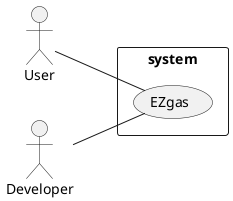
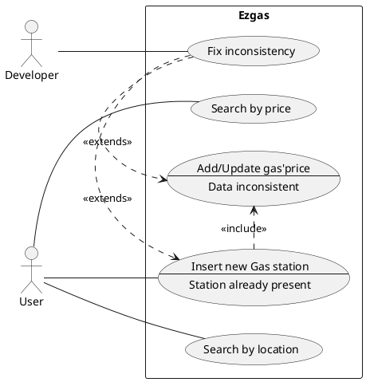
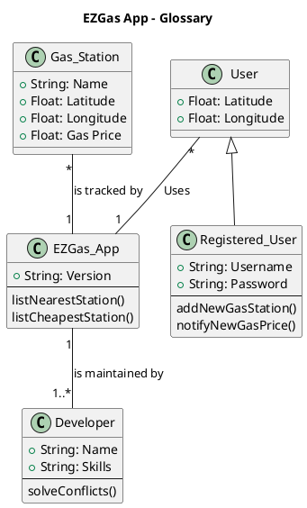

# Official Requirements Document

Authors: Pellittieri Vittorio

Date: 24/03/2020

# Contents
- [Stakeholders](#stakeholders)
- [Context Diagram and interfaces](#context-diagram-and-interfaces)
	+ [Context Diagram](#context-diagram)
	+ [Interfaces](#interfaces)
- [Stories and personas](#stories-and-personas)
- [Use case diagram and use cases](#use-case-diagram-and-use-cases)
	+ [Use case diagram](#use-case-diagram)
	+ [Use cases](#use-cases)
	+ [Relevant scenarios](#relevant-scenarios)
- [Functional and non functional requirements](#functional-and-non-functional-requirements)
	+ [Functional Requirements](#functional-requirements)
	+ [Non functional requirements](#non-functional-requirements)
- [UML Class Diagram (Glossary) ](#uml-class-diagram)

# Stakeholders

| Stakeholder name  | Description |
| ----------------- |:-----------:|
|User|Uses the application to find the gas station that offers the most convenient service. He/She can also report new gas station or notify the change of the fuel's cost in one specific gas station|
| Developer      |He/She updates constantly gas station fuel's price and adds new notified gas station. He/She also has to solve conflicts between discordant informations|

# Context Diagram and interfaces

## Context Diagram

## Interfaces

| Actor | Logical Interface | Physical Interface  |
| ------------- |:-------------:| -----:|
|User|GUI |Screen, keyboard|
|Developer|GUI |Screen, keyboard|

# Stories and personas

Luca, a commuting university student, has so many project for his future; he would like to become a researcher in one of the best universities in Germany.
Unfortunately he does not come from a wealthy family and for this reason it is necessary that he saves money as much as he can in order to be able to realize his inspirations.
One of his most daily expenses is the gas supply he has to do in order to reach his university which is far 30 minutes from home.
Therefore Luca every day, before going out, takes his phone and thanks to the EZGaz app he searches all the gas stations he'll meet in his path and chooses the most convenient one.

Francesco is a carrier of goods and every morning at 4 am , when the sun has not yet risen, he gets inside of his truck and starts driving to his daily destination.
Before leaving he looks for the stations where the gas is cheaper and fortunately he finds one that is located along its route.
Once arrived he discoveres that the price that was reported in the app was lower than that requested by the station.
For this reason, before getting back to driving, he reports the actual price so that all those who will use the app in the future will not see a price that is different from the real one.

# Functional and non functional requirements

## Functional Requirements

| ID        | Description  |
| ------------- |:-------------:|
|  F1     | Insert new gas station |
|  F2     | Add or update the price of gas in a station|
|  F3     | Report a price change |
|  F4     | Manage the location of users and stations|
|  F5     | Search by price|
|  F6     | Search by location|

## Non Functional Requirements

| ID        | Type (efficiency, reliability, .. see iso 9126)           | Description  | Refers to |
| ------------- |:-------------:| :-----:| -----:|
|  NF1     | Usability | Application should be easy to use | All FR |
|  NF2     | Performance | The localisation should complete in < 0.5 sec  | All FR |
|  NF3     | Portability | The application runs on Android and Iphone | All FR |
|  NF4     | Portability | All the data must be consistent through all the platforms| All FR |
|  NF4     | Reliability | All the data should be correct every moment | All FR |

# Use case diagram and use cases

## Use case diagram

## Use Cases

### Use case 1, UC1 - FR1 ADD A GAS STATION

| Actors Involved        | User |
| ------------- |:-------------:|
|  Precondition     | Gas station GS in not present in EZGaz Database|
|  Post condition     | Gas station GS in present in EZGaz Database || |
|  Nominal Scenario | User U adds new gas station GS and the fuel's price|
|  Variants     | Gas station is already present |

### Use case 2, UC2 - FR2 ADD GAS' PRICE OF A STATION

| Actors Involved        | User|
| ------------- |:-------------:|
|  Precondition     | Gas station GS price is wrong|
|  Post condition     | GS price is right || |
|  Nominal Scenario| User U update/add Gas' price|
|  Variants     | Someone else wrote a different price |

### Use case 3, UC3/UC4 - SEARCH BY PRICE/LOCATION

| Actors Involved        | User |
| ------------- |:-------------:|
|  Precondition     | User U wants to find the most convenient/ the nearest gas station GS|
|  Post condition     | User find the right Gas Station || |
|  Nominal Scenario| User open the apps and search for the nearest/ cheapest Gas Station GS|

### Use case 4, UC5 - FIX inconsistency

| Actors Involved        | Developer |
| ------------- |:-------------:|
|  Precondition     | An already present Gas station is reported or different gas' price are reported|
|  Post condition     | All the Gas Station and the prices are right || |
|  Nominal Scenario| Developer opens the app and decide which report is correct|

# Relevant scenarios

## Scenario 1

| Scenario ID: SC1        | Corresponds to UC1  |
| ------------- |:-------------|
| Description | User adds a new gas station
|Precondition |  Gas station GS in not present in EZGaz Database|
|Postcondition |  Gas station GS in present in EZGaz Database|
| Step        | Step description  |
|  1     | User U opens the EZGaz app|
|  2     | U selects the "Add new Gas station" button|
|  3     | U compiles the form regarding the price and the location of the station|
|  4     | U clicks the "SEND" button |

## Scenario 2

| Scenario ID: SC2        | Corresponds to UC3/UC4  |
| ------------- |:-------------|
| Description | User U wants to find the most convenient/ the nearest gas station GS|
|Precondition | User U needs to find a GS|
|Postcondition | User U found a GS |
| Step        | Step description  |
|  1     | User U opens the EZGaz app|
|  2     | U selects the "Search" button|
|  3     | U selects the radius range and the price range|
|  4     | U finds the best alternative|

## Scenario 3

| Scenario ID: SC3       | Corresponds to UC5  |
| ------------- |:-------------|
| Description | User U wants to find the most convenient/ the nearest gas station GS|
|Precondition | An already present Gas station is reported or different gas' price are reported|
|Postcondition |  All the Gas Station and the prices are right |
| Step        | Step description  |
|  1     | Developer D receives a notification|
|  2     | D solves the conflicts|
|  3     | D updates the database|

# UML Class diagram

