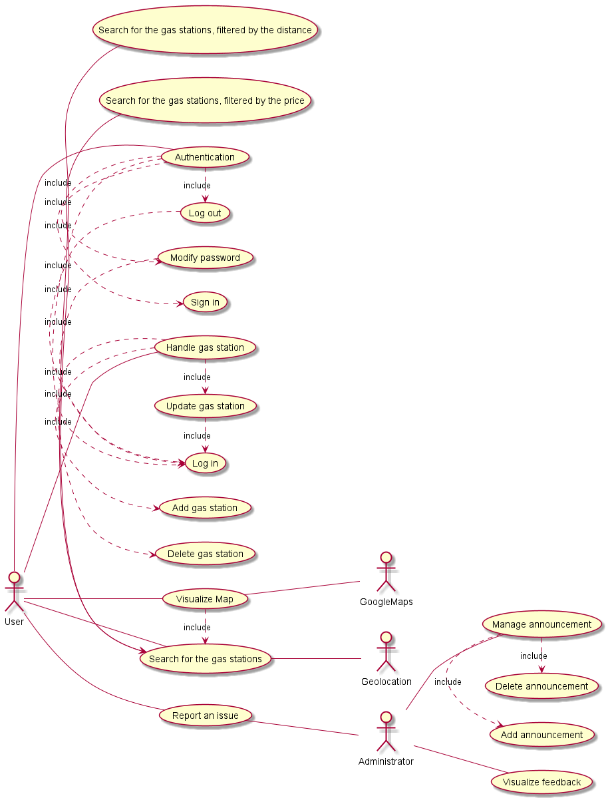

# Official Requirements Document

Authors: Maria Letizia Colangelo

Date: 24/03/2020

Version: 1

# Contents
- [Abstract](#abstract)
- [Stakeholders](#stakeholders)
- [Context Diagram and interfaces](#context-diagram-and-interfaces)
	+ [Context Diagram](#context-diagram)
	+ [Interfaces](#interfaces) 
	
- [Stories and personas](#stories-and-personas)
- [Functional and non functional requirements](#functional-and-non-functional-requirements)
	+ [Functional Requirements](#functional-requirements)
	+ [Non functional requirements](#non-functional-requirements)
- [Use case diagram and use cases](#use-case-diagram-and-use-cases)
	+ [Use case diagram](#use-case-diagram)
	+ [Use cases](#use-cases)
	+ [Relevant scenarios](#relevant-scenarios)

# Abstract

Some people volunteer to develop a crowdsourcing service, EZGas, that allows users to collect prices of fuels in different gas stations and locate gas stations in an area, along with the prices they practice. So they develop a website and an application too.

# Stakeholders

| Stakeholder name  | Description | 
| ----------------- |:-----------:|
| Administrator     |Uses the application to manage feedback, monitor activies, resolve problems| 
| User              |They use the application directly| 
| Google Maps System|Provide the map to the application| 
| Developer         |Develop the application and the website| 
| Geolocation       |Provide real-world geographic location |

# Context Diagram and interfaces

## Context Diagram

                            
## Interfaces
| Actor | Logical Interface | Physical Interface  |
| ------------- |:-------------:| -----:|
|Administrator|GUI |Screen, keyboard|
|User|GUI |Screen, keyboard|
|Google Maps System|API|Internet connection|
|Geolocation|API|Internet connection, WIFI, Bluetooth|

# Stories and personas

Mark is driving and he has to refuel as soon as possible. So he decides to pick up his phone, start the EZ and to search the nearest gas station.  
The nearest station is in 1 km, so he selects that, He opens the map and get there.

Luca is using his app EZGas to get to the cheapest gas station. He finds one and goes there. The prices that are defined in the app are wrong, so he updates them.

Diana is the admin of EZGas. Today the mayor of the city has decided to stop the diesel cars circulation. And Andrea writes an announcement on the EZGas website. 

Andrea is the gas station owner that will be open tomorrow. He wants to add the station to the EZGas service. So he signs in, and goes to the section to add a new gas station. But the website forbits him to complete the activity. So he reports an issue to the Administrator.

# Functional and non functional requirements

## Functional Requirements

| ID        | Description  |
| ------------- |:-------------:| 
|  FR1     | Search for a gas station |
|   FR1.1  | User can search for the gas stations, filtered by the distance|  
|   FR1.2  | User can search for the gas stations, filtered by the price|
|   FR1.3  | User can visualize the exact location of the selected gas station on map|
|  FR2     | Authorize and authenticate|
|   FR2.1  | User can sign in with his credentials (Name, Surname, EMail, Password)|
|   FR2.2  | User should be able to change his password after providing his email address and current password. |
|   FR2.3  | User can log in |
|   FR2.4  | User can log out |
|  FR3     | Handle gas station |
|   FR3.1  | User can update the information of a gas station |
|   FR3.2  | User can add a gas station|
|   FR3.3  | User can delete a gas station |
|  FR4     | User can report an issue|
|  FR5     | Google Maps should allow users to see the exact location of the selected gas station |
|  FR7     | Administrator should visualize problems reported by users |
|  FR8     | Administrator should manage announcements |
|   FR8.1  | Admin adds announcement |
|   FR8.2  | Admin deletes announcement |

## Non Functional Requirements

| ID        | Type (efficiency, reliability, .. see iso 9126)           | Description  | Refers to |
| ------------- |:-------------:| :-----:| -----:|
|  NFR1     | Usability | Application should be used with no training by any user   All FR |
|  NFR2     | Performance | All functions should complete in < 0.5 sec  | All FR |
|  NFR3     | Portability | The application runs on MS Windows (7 and more recent) and also in Android / IOS | All FR |
|  NFR4     | Portability | The application (functions and data) should be portable from a PC to another PC in less than 5 minutes | All FR |
|  NFR5     | Localisation | Decimal numbers use . (dot) as decimal separator ||

# Use case diagram and use cases

## Use case diagram

## Use Cases

### Use case 1, UC1 - FR1  Guest user can search for the gas stations

| Actors Involved        | User|
| ------------- |:-------------:| 
|  Precondition     | User has an Internet connection |  
|  Post condition     | User visualizes the list of the nearest gas stations|
|  Nominal Scenario     | User fills the research form, selecting the research criteria; the system asks him to enable geolocation, he clicks on allow, the system shows a list of all the corresponding results |
|  Variants     |  |

### Use case 2, UC2 - FR1.1  Guest user can search for the gas stations, filtered by the distance

| Actors Involved        | User|
| ------------- |:-------------:| 
|  Precondition     | User has an Internet connection |  
|  Post condition     | User visualizes the list of the nearest gas stations|
|  Nominal Scenario     | User fills the research form, selecting "filtered by distance";the system asks him to enable geolocation, he clicks on allow, the system shows a list of all the nearest stations |
|  Variants     | |

### Use case 3, UC3 - FR1.2  Guest user can search for the gas stations, filtered by the price

| Actors Involved        | User|
| ------------- |:-------------:| 
|  Precondition     | User has an internet connection |  
|  Post condition     | User visualizes the list of the gas stations with the lower prices|
|  Nominal Scenario     | User fills the research form, selecting "filtered by price"; the system asks him to enable geolocation, he clicks on allow, the system shows a list of all the gas stations whose price is lower|
|  Variants     | |

### Use case 4, UC4 - FR2.1 Guest user signs in

| Actors Involved        | User|
| ------------- |:-------------:| 
|  Precondition     | User has an Internet Connection |  
|  Post condition     | User is signed in |
|  Nominal Scenario     | The Guest User connects to the WebSite or opens the application on his smartphone, he clicks on the "sign in" button, he enters his credentials (Name, Surname, Email, Password), he confirms |
|  Variants     |The system gets error because the email is already associated to another account| 

### Use case 5, UC5 - FR2.2 User should be able to change his password

| Actors Involved        | User|
| ------------- |:-------------:| 
|  Precondition     | User is logged in |  
|  Post condition     | User has changed his password |
|  Nominal Scenario     | The User clicks on the button "MyProfile", The system shows to him his information, he selects "Modify Password", he fills the form to modify his password, writing the old one and the new one twice, he confirms. The system notifies him that the password is correctly modified  |
|  Variants     |failed password change | 

### Use case 6, UC6 - FR2.3 User logs in

| Actors Involved        | User|
| ------------- |:-------------:| 
|  Precondition     | User has an account |  
|  Post condition     | User is logged in |
|  Nominal Scenario     | The User connects to the WebSite or opens the application on his smartphone, he clicks on the login button, he enters his credentials (Email, Password), he confirms. The system notifies he is correctly signed in|
|  Variants     |The system gets error because the email or the password isn't correct| |The user has forgotten his password| 

### Use case 7, UC7 - FR2.4 User logs out

| Actors Involved        | User|
| ------------- |:-------------:| 
|  Precondition     | User is logged in |  
|  Post condition     | User is logged out |
|  Nominal Scenario     | The User clicks on the button to log out |
|  Variants     | | 

### Use case 8, UC8 - FR3 User handles gas stations

| Actors Involved        | User|
| ------------- |:-------------:| 
|  Precondition     | User is logged in |  
|  Post condition     |  |
|  Nominal Scenario     | The User clicks on the button to modify gas stations,  he confirms. The system make the user's changes and notifies him|
|  Variants     | |

### Use case 9, UC9 - FR3.1 User adds a gas station and prices

| Actors Involved        | User|
| ------------- |:-------------:| 
|  Precondition     | User is logged in |  
|  Post condition     | A gas station is added |
|  Nominal Scenario     | The User clicks on the button to add a gas station, he enter the name of the gas station, the details, and the prices, he confirms. The system adds the gas station and notifies the user that the gas station is correctly added|
|  Variants     | |

### Use case 10, UC10 - FR3.2 User updates prices of a gas station 

| Actors Involved        | User|
| ------------- |:-------------:| 
|  Precondition     | User is logged in and a gas station exists |  
|  Post condition     | Price updated |
|  Nominal Scenario     | The User selects a gas station, and he clicks on the button to update the price, he write the new price and he confirms. The system update the prices and notifies the user that the price is correctly update|
|  Variants     | |

### Use case 11, UC11 - FR3.3 User deletes a gas station 

| Actors Involved        | User|
| ------------- |:-------------:| 
|  Precondition     | User is logged in and a gas station exists |  
|  Post condition     | The gas station is deleted |
|  Nominal Scenario     | The User selects a gas station, and he clicks on the button to delete it and he confirms. The system deletes it and notifies the user that the gas station is correctly deleted|
|  Variants     | |

### Use case 12, UC12 - FR4 User reports an issue 

| Actors Involved        | User, Administrator |
| ------------- |:-------------:| 
|  Precondition     | User is logged in |  
|  Post condition     | The issue has been sent to the administrator |
|  Nominal Scenario     | The User clicks on the button to report an issue, he fills the box with the explanation of the problem, and he confirms. The system notifies the user that the issue has been correctly sent and notifies the administrator of the new issue|
|  Variants     | |

### Use case 13, UC13 - FR8.1 Add a new announcement

| Actors Involved        | Administrator |
| ------------- |:-------------:| 
|  Precondition     | Admin is logged in  |  
|  Post condition     | The announcement has been added to the section |
|  Nominal Scenario     | Admin clicks on the button to add a new announcement in the announcement section, he fills the form, and he confirms. The system add the announcement in the list of the section |
|  Variants     | |

### Use case 13, UC16 - FR8.2 Delete an announcement

| Actors Involved        | Administrator |
| ------------- |:-------------:| 
|  Precondition     | Admin is logged in  |  
|  Post condition     | The announcement has been deleted from the section |
|  Nominal Scenario     | Admin clicks on the button to delete an announcement in the announcement section, and he confirms. The system deletes the announcement in the list of the section |
|  Variants     | |

### Use case 14, UC14 - FR7 Visualize user's feedback

| Actors Involved        | Administrator |
| ------------- |:-------------:| 
|  Precondition     | Admin is logged in  |  
|  Post condition     | A list of issues is shown |
|  Nominal Scenario     | Admin clicks on the issues notification section. The system shows all the issues from user. |
|  Variants     | |

### Use case 15, UC15 - FR1.3 Visualize gas station on the map

| Actors Involved        | User, Google Maps|
| ------------- |:-------------:| 
|  Precondition     | User has an internet connection and Geolocation enabled |  
|  Post condition     | The gas station is shown on the map |
|  Nominal Scenario     | User selects the gas station. The system shows all the information of the gas station. He clicks on the button "view map". The system shows the exact location of the gas station on Google Maps |
|  Variants     | |

# Relevant scenarios

## Scenario 1

| Scenario ID: SC1        | Corresponds to UC2  |
| ------------- |:-------------| 
| Description | User searches for the nearest gas stations|
| Precondition |  User has an Internet Connection|
| Postcondition |User visualizes the nearest gas stations |
| Step#        |  Step description   |
|  1     | User opens the application or the website |  
|  2     | User searches the nearest gas stations |
|  3     | He visualizes a list of the nearest gas stations|

## Scenario 2

| Scenario ID: SC2        | Corresponds to UC3  |
| ------------- |:-------------| 
| Description | User searches for the cheapest gas stations|
| Precondition |  User has an Internet Connection|
| Postcondition |User visualizes the cheapest gas stations list|
| Step#        |  Step description   |
|  1     | User opens the application or the website |  
|  2     | User searches the cheapest gas stations |
|  3     | He visualizes a list of the cheapest gas stations|

## Scenario 3

| Scenario ID: SC3        | Corresponds to UC4  |
| ------------- |:-------------| 
| Description | User signs in|
|Precondition | User has an Internet connection|
|Postcondition | User is signed in |
| Step#        | Step description  |
|  1     | User opens the application and click on the sign in button |  
|  2     | User fills the sign in form, entering his name, surname, email and password, and confirms |
|  3     | The system notifies him he is correctly signed in|

## Scenario 4

| Scenario ID: SC4        | Corresponds to UC4  |
| ------------- |:-------------| 
| Description | User signs in, the email is associated to an account|
|Precondition | User has an Internet connection|
|Postcondition | User changes credentials |
| Step#        | Step description  |
|  1     | User opens the application and click on the sign in button |  
|  2     | User fills the sign in form, entering his name, surname, email and password, and confirms |
|  3     | The system notifies him that the email is already associated to an account|
|  4     | User fills again the form |

## Scenario 5

| Scenario ID: SC5        | Corresponds to UC5  |
| ------------- |:-------------| 
| Description | User changes his password|
|Precondition | User is logged in |
|Postcondition | The password is modified|
| Step#        | Step description  |
|  1     | The User clicks on the button "MyProfile" |
|  2     | The system shows to him his information |
|  3     | User selects "Modify Password" |
|  4     | The system shows him the form to modify his password, where he has to enter his old password, then his new password twice |
|  5     | He fills the form and confirms |
|  6     | The system notifies him that the password is correctly modified |  

## Scenario 6

| Scenario ID: SC6        | Corresponds to UC5  |
| ------------- |:-------------| 
| Description | User changes his password, failed change|
|Precondition | User is logged in |
|Postcondition | Change denied |
| Step#        | Step description  |
|  1     | The User clicks on the button "MyProfile" |
|  2     | The system shows to him his information |
|  3     | User selects "Modify Password" |
|  4     | The system shows him the form to modify his password, where he has to enter his old password, then his new password twice |
|  5     | He fills the form and confirms |
|  6     | The system notifies him that the password change is failed | 

## Scenario 7

| Scenario ID: SC7        | Corresponds to UC6  |
| ------------- |:-------------| 
| Description | User logs in|
|Precondition | User has an account|
|Postcondition | User is logged in|
| Step#        | Step description  |
|  1     | User opens the application and click on the login button |  
|  2     | User fills the login form, entering his email, and password, and confirms |
|  3     | The system notifies him that he is correctly logged in|

## Scenario 8

| Scenario ID: SC8        | Corresponds to UC6  |
| ------------- |:-------------| 
| Description | User logs in, failed login|
|Precondition | User has an account|
|Postcondition | User sets a new password|
| Step#        | Step description  |
|  1     | User opens the application and click on the login button |  
|  2     | User fills the login form, entering his email, and password, and confirms |
|  3     | The system notifies him that he the password is wrong|
|  4     | User clicks on the "forgot my password" button |
|  5     | The system sends to him an email to sets a new password|
|  6     | User sets a new password |

## Scenario 9

| Scenario ID: SC9        | Corresponds to UC6  |
| ------------- |:-------------| 
| Description | User logs in, failed login|
|Precondition | User has an account|
|Postcondition | User sets a new password|
| Step#        | Step description  |
|  1     | User opens the application and click on the login button |  
|  2     | User fills the login form, entering his email, and password, and confirms |
|  3     | The system notifies him that he the email is wrong|
|  4     | User fills again the form|

## Scenario 10

| Scenario ID: SC10        | Corresponds to UC7  |
| ------------- |:-------------| 
| Description | User logs out|
|Precondition | User is logged in |
|Postcondition | User is logged out|
| Step#        | Step description  |
|  1     | User clicks on the logout button |  
|  2     | The system notifies him that he is correctly logged out|

## Scenario 11

| Scenario ID: SC11        | Corresponds to UC9  |
| ------------- |:-------------| 
| Description | User adds a gas station and prices|
|Precondition | User is logged in |
|Postcondition | A new gas station is added |
| Step#        | Step description  |
|  1     | User clicks on the add gas station button |  
|  2     | User fills the form to add a new gas station|
|  3     | The system notifies him that the gas station is correctly added|

## Scenario 12

| Scenario ID: SC12        | Corresponds to UC10  |
| ------------- |:-------------|
| Description | User updates prices of a gas station|
|Precondition | User is logged in |
|Postcondition | The price of a gas station is updated |
| Step#        | Step description  |
|  1     | User selects a gas station he wants to modify |  
|  2     | User changes the prices of it|
|  3     | The system notifies him that the prices of a gas station are correctly updated|

## Scenario 13

| Scenario ID: SC13        | Corresponds to UC11  |
| ------------- |:-------------|
| Description | User deletes a gas station|
|Precondition | User is logged in |
|Postcondition | The gas station is deleted |
| Step#        | Step description  |
|  1     | User selects a gas station he wants to modify |  
|  2     | User clicks on the button delete|
|  3     | The system notifies him that the gas station has been correctly deleted|

## Scenario 14

| Scenario ID: SC14        | Corresponds to UC12  |
| ------------- |:-------------|
| Description | User reports an issue |
|  Precondition     | User is logged in |  
|  Post condition   | The issue has been sent to the administrator |
| Step#          | Step description |
|  1     |The User clicks on the button to report an issue
|  2     | He fills the box with the explanation of the problem, and he confirms |
|  3     | The system notifies the user that the issue has been correctly sent|
|  4     | The system notifies the administrator of a new issue|

## Scenario 15

| Scenario ID: SC15        | Corresponds to UC13  |
| ------------- |:-------------|
| Description | Admin add an announcement |
|  Precondition     | Admin is logged in  |  
|  Post condition     | The announcement has been added to the section |
| Step#        | Step description |
| 1      | Admin clicks on the button to add a new announcement in the announcement section |
| 2      | He fills the form, and he confirms. The system add the announcement in the list of the section |

## Scenario 16

| Scenario ID: SC16        | Corresponds to UC14  |
| ------------- |:-------------|
| Description | Visualize user's feedback |
|  Precondition     | Admin is logged in  |  
|  Post condition     | A list of issues is shown |
| Step#        | Step description |
|  1   | Admin clicks on the issues notification section |
|  2   | The system shows all the issues from user. |

## Scenario 17

| Scenario ID: SC17        | Corresponds to UC15 |
| ------------- |:-------------|
| Description | Visualize gas station on map |
|  Precondition     | User has an internet connection  |  
|  Post condition     | The gas station is shown on the map |
| Step#        | Step description |
|  1    |User selects the gas station. |
|  2    |The system shows all the information of the gas station.|
|  3    |User clicks on the button "view map". |
|  4    |The system shows the exact location of the gas station on Google Maps |

## Scenario 18

| Scenario ID: SC18        | Corresponds to UC16 |
| ------------- |:-------------|
| Description | Delete an announcement |
|  Precondition     | Admin is logged in  |  
|  Post condition     | The announcement has been deleted from the section |
| Step#        | Step description |
|  1   |Admin clicks on the button to delete an announcement in the announcement section, and he confirms.|
|  2   | The system deletes the announcement in the list of the section |

