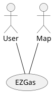
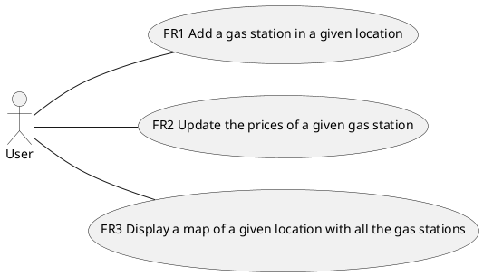
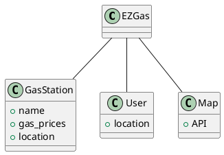
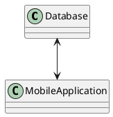
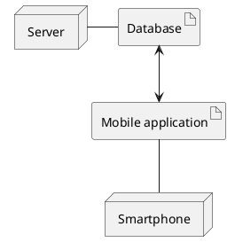

# Official Requirements Document - EZGas

Author: Nadir Casciola s280114 (note: changed school id from 235224 to 280114)

# Abstract

EZGas is a crowdsourcing service to collect and easily display the gas stations with their relative prices in an area.

# Stakeholders

| Stakeholder name  | Description | 
| ----------------- |:-----------:|
| User | Uses the service to see gas stations and prices in his area |
| Developer | Develops the service |
| External map service | Provides the map |

# Context Diagram and interfaces

## Context Diagram

## Interfaces
| Actor | Logical Interface | Physical Interface  |
| ------------- |:-------------:| -----:|
| User | GUI | Screen, keyboard |
| Map | API | Internet |

# Stories and personas
## Person that needs to find a gas station
A person who needs to refill his car.

He opens up EZGas and chooses the best gas station based  on how far it is and how good are its prices.

## Person that contributes to EZGas
A person that knows of a gas station and its prices.

He opens up EZGas to explore his other options, and notices tha the gas station he knows about is missing or the price is outdated.

He updates EZGas based on his information.

## Owner of a gas station
Someone who owns a gas station.

He opens up EZGas to add his gas station and keep his prices updated, since that could get him some new clients.

He could also use the service to check on the prices of other gas stations near him.

# Functional and non functional requirements

## Functional Requirements

| ID        | Description  |
| ------------- |:-------------:| 
| FR1 | Add a gas station in a given location |
| FR2 | Update the prices of a given gas station |
| FR3 | Display a map of a given location with all the gas stations and their prices |
| FR4 | Get the location of the user |

## Non Functional Requirements

| ID        | Type (efficiency, reliability, .. see iso 9126)           | Description  | Refers to |
| ------------- |:-------------:| :-----:| -----:|
|  NFR1 | Usability | Application should be used with no training by any user  | All FR |
|  NFR2     | Performance | All functions should complete in < 3 sec  | All FR |
|  NFR3     | Portability | The application run on Android and iOS  | All FR |

# Use case diagram and use cases

## Use case diagram

## Use Cases

### Use case 1, UC1 - FR1 Add a gas station in a given location

| Actors Involved        | User |
| ------------- |:-------------:| 
|  Precondition     | Gas station GS exists, GS is not on EZGas' database |  
|  Post condition     | GS is in EZGas' database |
|  Nominal Scenario     | User adds GS to system, its location is correct, GS was not in system before |
|  Variants     | GS was already in the system, GS' location is obviously wrong (example it is in the middle of the ocean) |

### Use case 2, UC2 - FR2 Update the prices of a given gas station

| Actors Involved        | User |
| ------------- |:-------------:| 
|  Precondition     | Gas station GS is already in the system, its price is outdated |  
|  Post condition     | GS' price is updated |
|  Nominal Scenario     | User inserts new price in the system |
|  Variants     | GS was not already in the system |

### Use case 3, UC3 - FR3 Display a map of a given location with all the gas stations

| Actors Involved        | User |
| ------------- |:-------------:| 
|  Precondition     | User wants to see the gas stations GS in an area |  
|  Post condition     | EZGas displays the GS in the area |
|  Nominal Scenario     | User asks the list of GS, EZGas displays it |
|  Variants     | EZGas is not able to determine the location od the user |

# Relevant scenarios

## Scenario 1

| Scenario ID: SC1        | Corresponds to UC1  |
| ------------- |:-------------| 
| Description | User adds a GS to the system |
| Precondition |  Gas station GS exists, GS is not on EZGas' database |
| Postcondition |  GS is in EZGas' database |
| Step#        |  Step description   |
|  1     | User inserts the data about the GS |  
|  2     |  EZGas checks whether the data is valid and if the GS is not already present |
|  3     | If everything is nominal the GS is added to the database, otherwise an error is displayed |

## Scenario 2

| Scenario ID: SC2        | Corresponds to UC2  |
| ------------- |:-------------| 
| Description | Update the prices of a given gas station |
| Precondition |  Gas station GS is already in the system, its price is outdated |
| Postcondition |  GS' price is updated |
| Step#        |  Step description   |
|  1     | User specifies which GS he wants to update |  
|  2     |  EZGas checks whether the GS exists |
|  3     | If it exist, it asks for the new price |
|  4     | User inputs the price |
|  5     | The price is updated in the system |

## Scenario 3

| Scenario ID: SC3        | Corresponds to UC3  |
| ------------- |:-------------| 
| Description | Display a map of a given location with all the gas stations |
| Precondition |  User wants to see the gas stations GS in an area |
| Postcondition |  EZGas displays the GS in the area |
| Step#        |  Step description   |
|  1     | User specifies which area (defaults to user's location) |  
|  2     |  EZGas pulls the map data and the data about gas stations |
|  3     | EZGas generates the map with overlayed over the GS |
|  4     | EZgas displays the generated map |

# Glossary

# System Design
Client-server architecture.

The server holds the database of the gas prices and gas stations.

# Deployment Diagram
The client makes requests to the server and gets a response.

