# Graphical User Interface Prototype  

Authors: Cao Peng, Finocchiaro Loredana, Marino Matteo, Mc Mahon Shannon

Date: 19/04/2020

Version: 1

# Use cases with GUI

### Use case 1, UC1 - FR1.1 Create an EZGas account
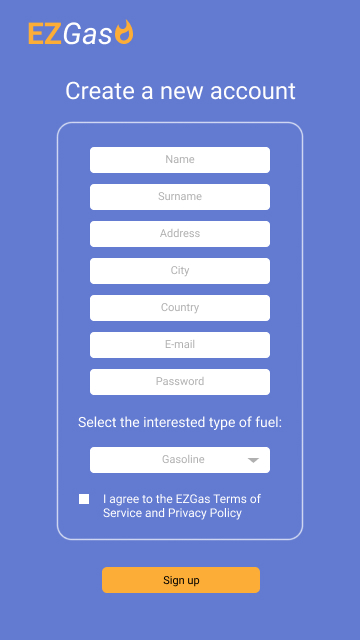

### Use case 2, UC2 - FR1.2 Login to EZGas
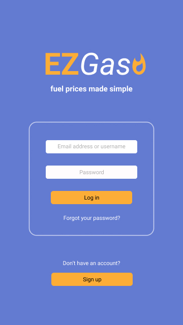

### Use case 3, UC3 - FR1.3 Logout
This is the homepage that appears after the successful login.
In order to logout, the User should press the Logout icon on the top right of the screen.

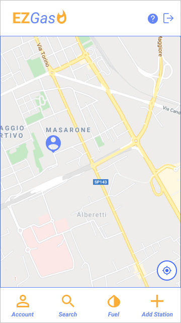

### Use case 4, UC4 - FR1.4 Change account details
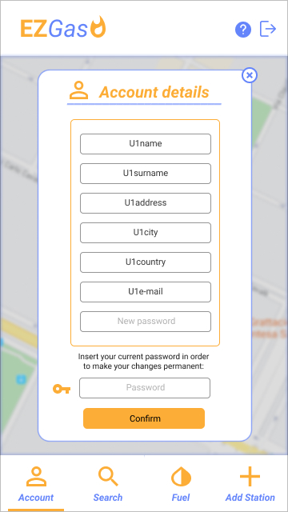

### Use case 5, UC5 - FR1.5 Reset forgotten password
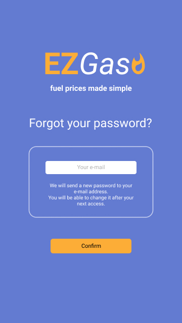

### Use case 6, FR2 Search for the closest gas stations (optionally based on maximum distance and/or price)
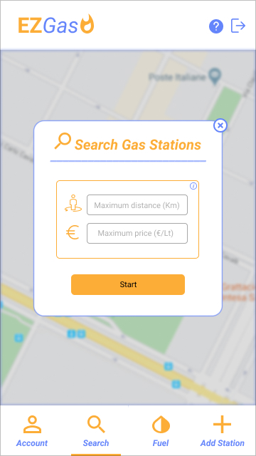
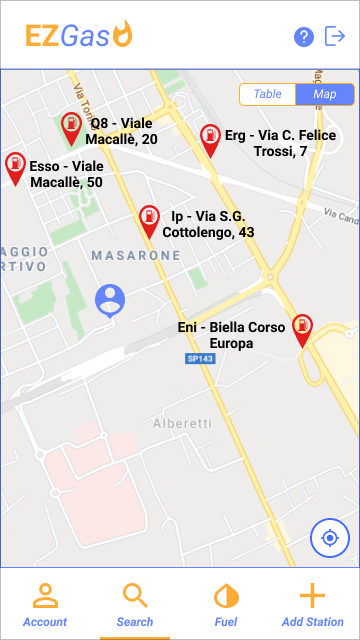
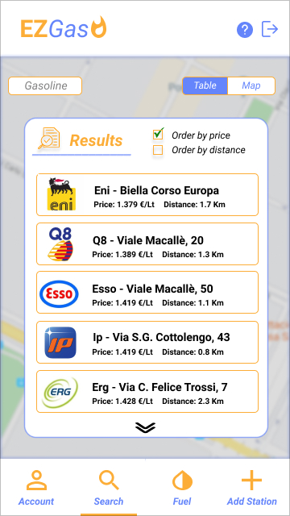

### Use case 7, UC7 - FR3 Report a new price
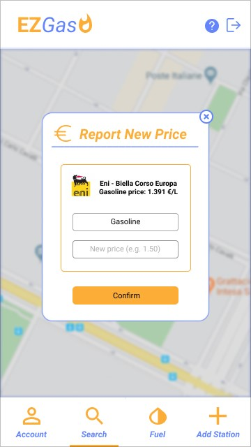

### Use case 8, UC8 - FR4 Change fuel type
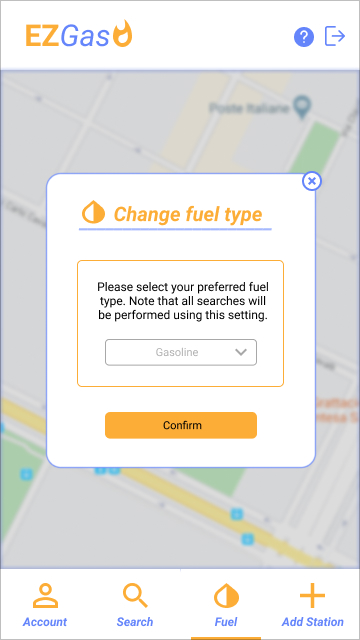

### Use case 9, UC9 - FR5 Report a new gas station to be added
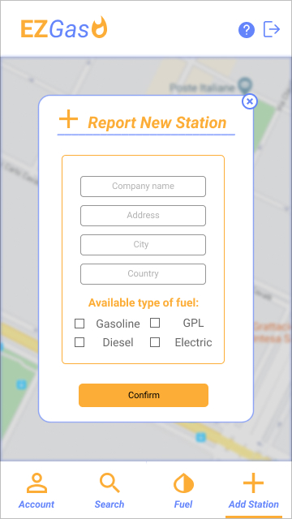

### Use case 10, UC10 - FR6. Keep trace of application usage
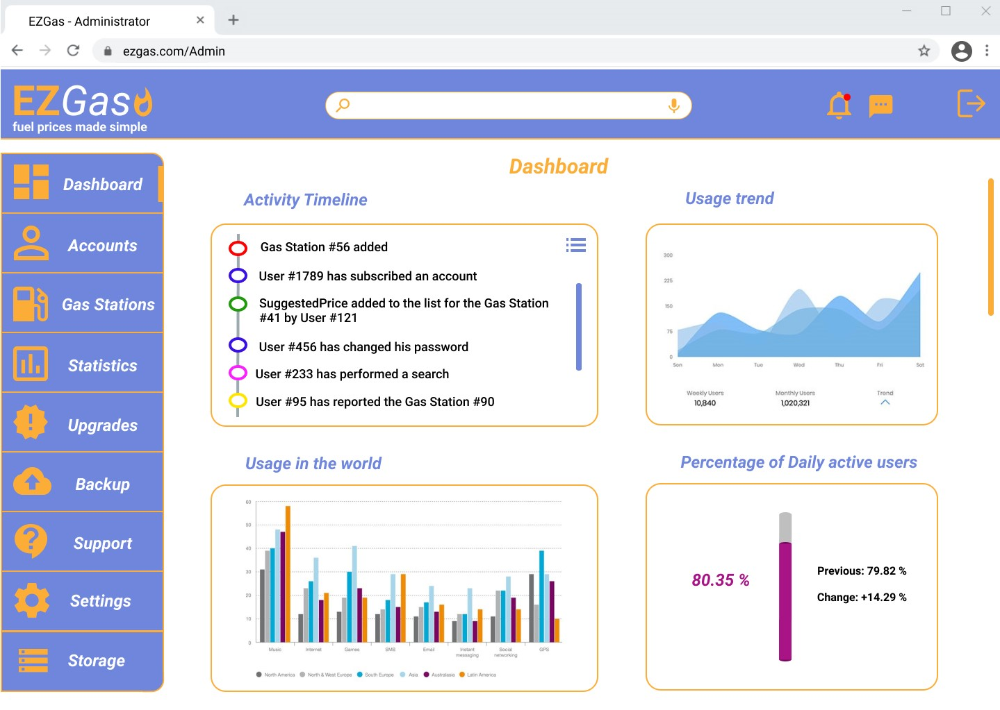
